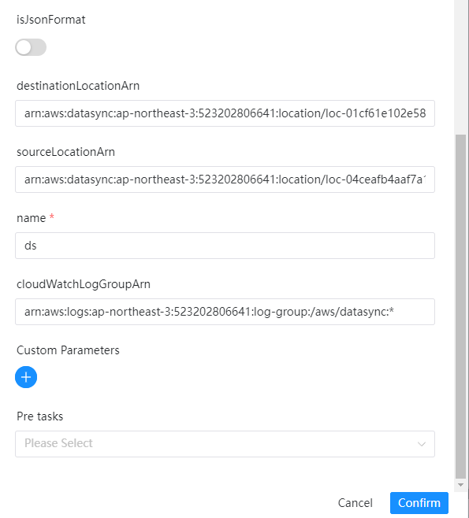

# DataSync 노드

## 개요

[AWS DataSync](https://console.aws.amazon.com/datasync/)는 온프레미스 스토리지 시스템과 AWS 스토리지 서비스 간, 그리고 AWS 스토리지 서비스 간 데이터 이동을 단순화, 자동화 및 가속화하는 온라인 데이터 전송 서비스입니다.

DataSync는 다음과 데이터를 복사할 수 있습니다.

- NFS(네트워크 파일 시스템) 파일 서버
- 서버 메시지 블록(SMB) 파일 서버
- 하둡 분산 파일 시스템(HDFS)
- 객체 스토리지 시스템
- Amazon Simple Storage Service(Amazon S3) 버킷
- Amazon EFS 파일 시스템
- Windows 파일 서버 파일 시스템용 Amazon FSx
- Lustre 파일 시스템용 Amazon FSx
- OpenZFS 파일 시스템용 Amazon FSx
- NetApp ONTAP 파일 시스템용 Amazon FSx
- AWS Snowcone 장치

다음은 DolphinScheduler DataSync 작업 플러그인 기능을 보여줍니다.

- AWS DataSync 작업을 생성하고 실행하며, 작업이 완료될 때까지 계속해서 실행 상태를 가져옵니다.

## 작업 생성

- `프로젝트 -> 관리-프로젝트 -> 이름-워크플로우 정의`를 클릭한 후 "워크플로우 생성" 버튼을 클릭하여 입력합니다.
DAG 편집 페이지.
- 도구 모음  작업 노드에서 캔버스로 드래그합니다.

## 작업 예

[//]: # (TODO: 웹사이트 템플릿이 이 구문을 지원하면 아래에 주석이 달린 앵커를 사용하세요)
[//]: # (- 기본 매개변수는 [DolphinScheduler 작업 매개변수 부록]&#40;appendix.md#default-task-parameters&#41; `기본 작업 매개변수` 섹션을 참조하세요.)

- 기본 매개변수는 [DolphinScheduler 작업 매개변수 부록](appendix.md) `기본 작업 매개변수` 섹션을 참조하세요.

DataSync 플러그인에 대한 몇 가지 특정 매개변수는 다음과 같습니다.

- **이름**: 작업 이름
- **destinationLocationArn**: AWS 스토리지 리소스 위치의 Amazon 리소스 이름(ARN)입니다.[AWS API](https://docs.aws.amazon.com/datasync/latest/userguide/API_CreateTask.html#DataSync-CreateTask-request-DestinationLocationArn)를 방문하세요.
- **sourceLocationArn**: 작업 소스 위치의 Amazon 리소스 이름(ARN)입니다.[AWS API](https://docs.aws.amazon.com/datasync/latest/userguide/API_CreateTask.html#DataSync-CreateTask-request-SourceLocationArn)를 방문하세요.
- **cloudWatchLogGroupArn**: 작업에서 이벤트를 모니터링하고 기록하는 데 사용되는 Amazon CloudWatch 로그 그룹의 Amazon 리소스 이름(ARN)입니다.[AWS API](https://docs.aws.amazon.com/datasync/latest/userguide/API_CreateTask.html#DataSync-CreateTask-request-CloudWatchLogGroupArn)를 방문하세요.

또는

- **json**: datasync 작업을 구성하기 위한 JSON 매개변수이며, 옵션 등과 같은 매개변수를 지원합니다. 방문: [AWS CreateTask API] 的 요청 구문 (https://docs.aws.amazon.com/datasync/latest/userguide/API_CreateTask.html)

- 다음은 작업 플러그인 예시입니다.



## 준비해야 할 환경

작업에 AWS 구성이 필요합니다. 'common.properties' 파일의 값을 수정하세요.```yaml
# Defines AWS access key and is required
resource.aws.access.key.id=<YOUR AWS ACCESS KEY>
# Defines AWS secret access key and is required
resource.aws.secret.access.key=<YOUR AWS SECRET KEY>
# Defines  AWS Region to use and is required
resource.aws.region=<AWS REGION>
````