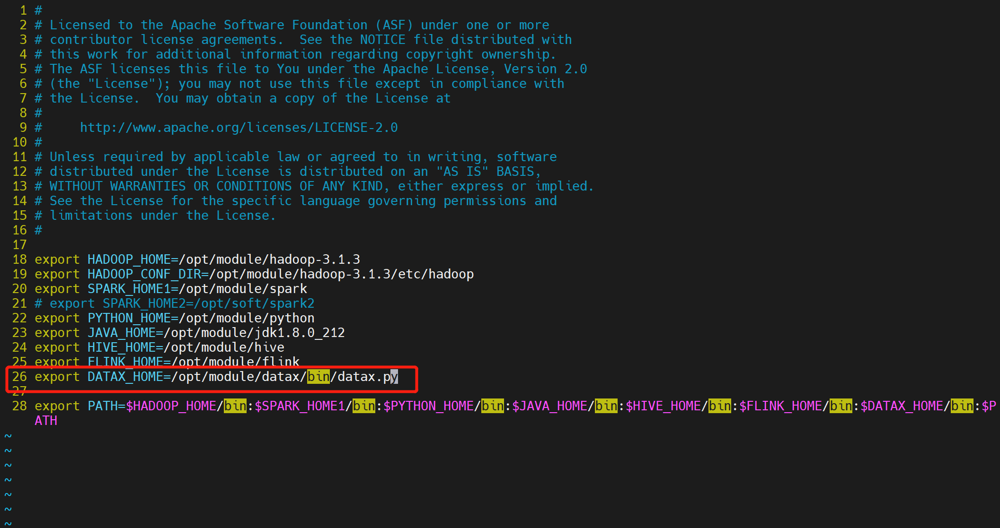
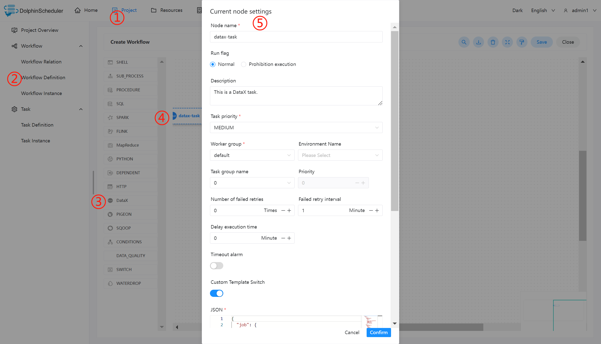
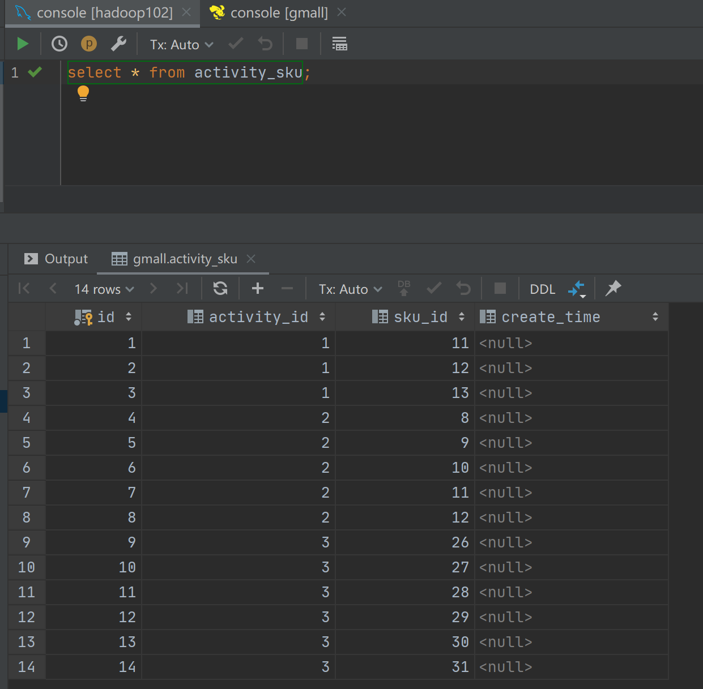

# 데이터X

## 개요

DataX 프로그램을 실행하기 위한 DataX 작업 유형입니다.DataX 노드의 경우 작업자는 `${DATAX_LAUNCHER}`를 실행하여 입력 json 파일을 분석합니다.

datax 작업을 실행하기 전에 `dolphinshceduler_env.sh`에서 환경 이름 `PYTHON_LAUNCHER` 및 `DATAX_LAUNCHER`를 설정하세요. 일부 datax 릴리스 버전은 `python2.7`만 지원합니다.

## 작업 생성

- '프로젝트 관리 -> 프로젝트 이름 -> 워크플로 정의'를 클릭한 후, '워크플로 생성' 버튼을 클릭하면 DAG 편집 페이지로 진입합니다.
- 툴바에서 를 드로잉 보드로 드래그합니다.

## 작업 매개변수

[//]: # (TODO: 웹사이트 템플릿이 이 구문을 지원하면 아래에 주석이 달린 앵커를 사용하세요)
[//]: # (- 기본 매개변수는 [DolphinScheduler 작업 매개변수 부록]&#40;appendix.md#default-task-parameters&#41; `기본 작업 매개변수` 섹션을 참조하세요.)

- 기본 매개변수는 [DolphinScheduler 작업 매개변수 부록](appendix.md) `기본 작업 매개변수` 섹션을 참조하세요.|**매개변수** |**설명** |
|--------------------------------|-----------------------------------------------------------------------------------------------------------------------------------------------------------------------------------------------------------------------------------------------------------------------------------------|
|사용자 정의 템플릿 |제공된 기본 데이터 소스가 필수 요구 사항을 충족하지 않는 경우 DataX 노드의 json 프로필 콘텐츠를 사용자 지정합니다.|
|JSON |DataX 동기화를 위한 json 구성 파일입니다.|
|자원 |사용자 정의 json을 사용할 때 클러스터에 kerberos 인증이 활성화되어 있고 datax가 hdfs 및 hbase와 같은 플러그인을 읽거나 쓸 때 관련 keytab, xml 파일 등을 사용해야 하는 경우 이 옵션을 사용할 수 있습니다.리소스 센터 - 파일 관리에서 업로드되거나 생성된 파일.|
|맞춤 매개변수 |SQL 작업 유형 및 저장 프로시저는 메서드에 대한 값을 설정하는 사용자 지정 매개 변수 순서입니다.사용자 정의 매개변수 유형 및 데이터 유형은 저장 프로시저 작업 유형과 동일합니다.차이점은 SQL 작업 유형 사용자 정의 매개변수가 SQL 문의 \${variable}을 대체한다는 것입니다.|
|데이터 소스 |데이터를 추출할 데이터 소스를 선택합니다.|
|SQL 문 |대상 데이터베이스에서 데이터를 추출하는 데 사용되는 sql 문은 노드가 실행될 때 sql 쿼리 열 이름이 자동으로 구문 분석되어 대상 테이블 동기화 열 이름에 매핑됩니다.원본 테이블과 대상 테이블의 컬럼 이름이 일치하지 않는 경우 컬럼 별칭으로 변환할 수 있습니다.|
|대상 라이브러리 |데이터 동기화를 위한 대상 라이브러리를 선택합니다.|
|SQL 이전 |Pre-sql은 sql 문(대상 라이브러리에서 실행) 이전에 실행됩니다.|
|SQL 이후 |Post-sql은 sql 문(대상 라이브러리에서 실행) 이후에 실행됩니다.|
|스트림 제한(바이트 수) |쿼리의 바이트 수를 제한합니다.|
|흐름 제한(레코드 수) |쿼리에 대한 레코드 수를 제한합니다.|
|러닝 메모리 |실제 생산 환경에 맞게 필요한 최소 및 최대 메모리를 구성할 수 있습니다.|## 작업 예

이 예에서는 Hive에서 MySQL로 데이터를 가져오는 방법을 보여줍니다.

### DolphinScheduler에서 DataX 환경 구성

프로덕션 환경에서 DataX 작업 유형을 사용하는 경우 먼저 필요한 환경을 구성해야 합니다.구성 파일은 `/dolphinscheduler/conf/env/dolphinscheduler_env.sh`입니다.

환경이 구성된 후에는 DolphinScheduler를 다시 시작해야 합니다.

### DataX 작업 노드 구성

기본 데이터 소스에는 Hive에서 읽을 데이터가 포함되어 있지 않으므로 사용자 정의 json이 필요합니다. [HDFS Writer](https://github.com/alibaba/DataX/blob/master/hdfswriter/doc/hdfswriter.md)를 참조하세요.참고: 파티션 디렉터리는 HDFS 경로에 존재합니다. 실제 상황에서 데이터를 가져올 때 파티셔닝은 사용자 지정 매개변수를 사용하여 매개변수로 전달하는 것이 좋습니다.

필수 json 파일을 작성한 후 아래 다이어그램의 단계에 따라 노드 콘텐츠를 구성할 수 있습니다.

### 실행 결과 보기

### 참고

제공된 기본 데이터 소스가 귀하의 요구 사항을 충족하지 않는 경우 https://github.com/alibaba/DataX에서 제공되는 사용자 정의 템플릿 옵션에서 실제 사용 환경에 따라 DataX의 작성자 및 리더를 구성할 수 있습니다.