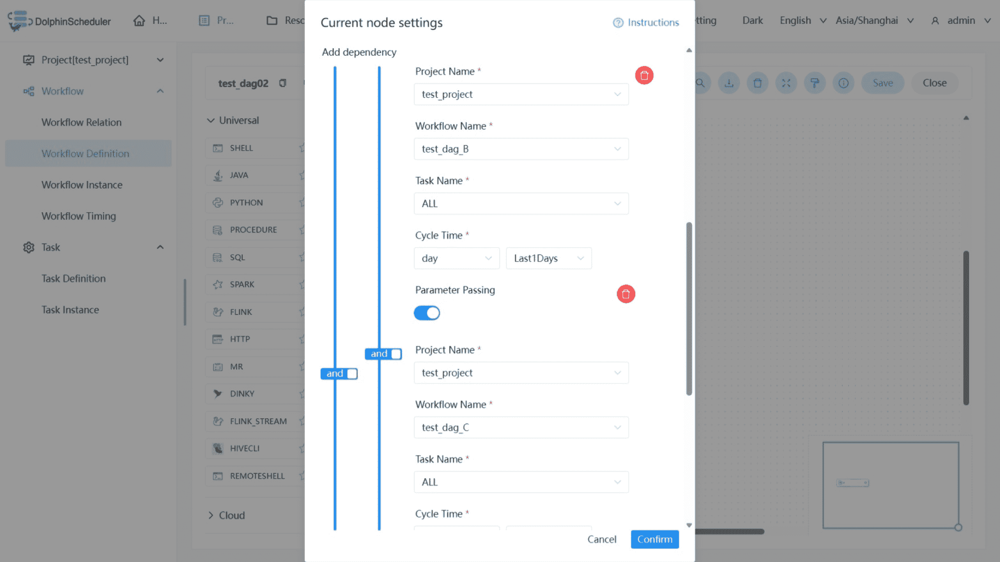
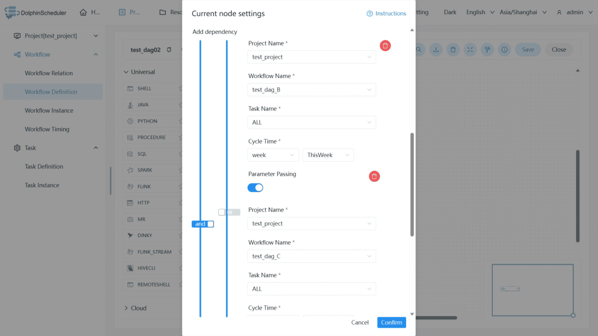
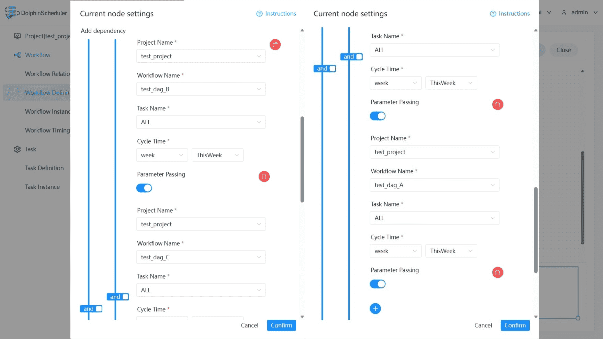

# 의존적

## 개요

종속 노드는 **종속성 검사 노드**입니다.예를 들어 프로세스 A는 어제부터 프로세스 B가 성공적으로 실행되었는지 여부에 따라 달라지며 종속 노드는 프로세스 B가 어제 성공적으로 실행되었는지 확인합니다.

## 작업 생성

- '프로젝트 관리 -> 프로젝트 이름 -> 워크플로 정의'를 클릭하고 '워크플로 만들기' 버튼을 클릭하여 DAG 편집 페이지로 들어갑니다.
- 도구 모음  작업 노드에서 캔버스로 드래그합니다.

## 작업 매개변수

[//]: # (TODO: 웹사이트 템플릿이 이 구문을 지원하면 아래에 주석이 달린 앵커를 사용하세요)
[//]: # (- 기본 매개변수는 [DolphinScheduler 작업 매개변수 부록]&#40;appendix.md#default-task-parameters&#41; `기본 작업 매개변수` 섹션을 참조하세요.)

- 기본 매개변수는 [DolphinScheduler 작업 매개변수 부록](appendix.md) `기본 작업 매개변수` 섹션을 참조하세요.

|**매개변수** |**설명** |
|---------------------------------|--------------------------------------------------------------------------------------------------------------------------------------------|
|종속성 추가 |종속 업스트림 작업을 구성합니다.|
|확인 간격 |종속 업스트림 작업 상태 간격을 확인하세요. 기본값은 10초입니다.|
|종속성 실패 정책 |실패: 종속 업스트림 작업 실패 및 현재 작업이 직접 실패합니다.대기: 종속 업스트림 작업이 실패하고 현재 작업이 계속 대기합니다.|
|종속성 실패 대기 시간 |종속성 실패 정책이 대기를 선택하는 경우 현재 작업 대기 시간입니다.|

## 작업 예

종속 노드는 논리에 따라 종속 노드의 실행을 감지할 수 있는 논리적 판단 기능을 제공합니다.

워크플로 종속 및 작업 종속을 포함하여 두 가지 종속성 모드가 지원됩니다.작업 종속 모드는 워크플로의 모든 작업에 의존하는 경우와 단일 작업에 의존하는 경우로 구분됩니다.
워크플로 종속 모드는 종속 워크플로의 상태를 확인합니다.모든 작업 종속 모드는 워크플로의 모든 작업 상태를 확인합니다.단일 작업 종속 모드는 종속 작업의 상태를 확인합니다.

종속 결과가 성공이고 매개변수 전달 옵션이 true인 경우 종속 노드는 종속성의 출력 매개변수를 다운스트림 작업에 출력합니다.여러 종속성의 매개변수 이름이 동일한 경우 매개변수의 우선순위가 관련됩니다.[매개변수 우선순위](../parameter/priority.md)도 참조하세요.

예를 들어 프로세스 A는 주간 작업이고, 프로세스 B와 C는 일일 작업이며, 작업 A는 지난 주에 작업 B와 C를 성공적으로 실행해야 합니다.

또 다른 예는 프로세스 A가 주간 보고서 작업이고, 프로세스 B와 C가 일일 작업이며, 작업 A가 지난 주에 성공적으로 실행되려면 작업 B 또는 C가 필요하다는 것입니다.

주간 보고서 A도 지난 화요일에 성공적으로 실행되어야 하는 경우:

> **참고**: 종속성 주기의 현재 주 및 월은 자연 주 및 월 내의 전체 주기를 나타냅니다. 즉, 현재 주는 월요일부터 일요일까지이고 이번 달은 1일부터 현재 날짜까지입니다.