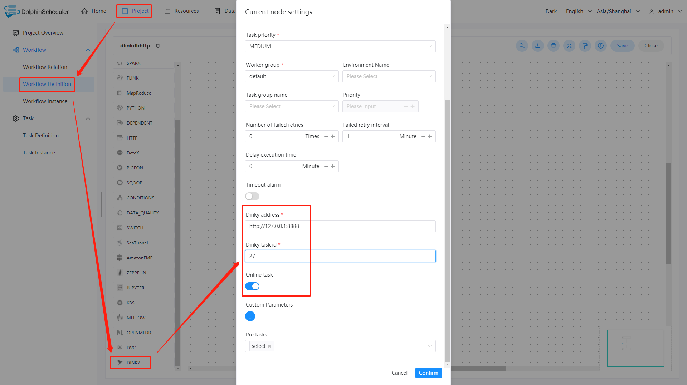
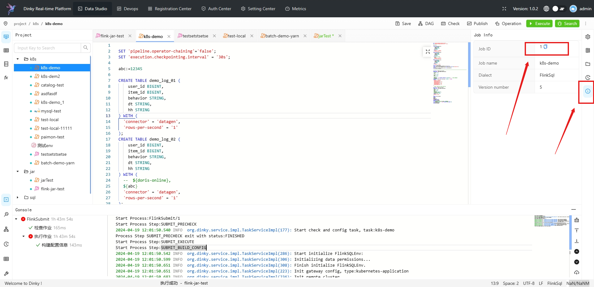

#딩키

## 개요

'Dinky Task'를 사용하여 dinky 유형의 작업을 생성하고 FlinkSql, Flink jar 및 SQL의 원스톱 개발, 디버깅, 운영 및 유지 관리를 지원합니다.작업자가 `Dinky Task`를 실행하면,
Dinky 작업을 트리거하기 위해 `Dinky API`를 호출합니다.'Dinky'에 대한 자세한 내용을 보려면 [여기](https://www.dinky.org.cn/)를 클릭하세요.

## 작업 생성

- 프로젝트 관리-프로젝트 이름-워크플로 정의를 클릭한 후, "워크플로 생성" 버튼을 클릭하면 DAG 편집 페이지로 진입합니다.
- 툴바에서 를 캔버스로 드래그합니다.

## 작업 매개변수

[//]: # (TODO: 웹사이트 템플릿이 이 구문을 지원하면 아래에 주석이 달린 앵커를 사용하세요)
[//]: # (- 기본 매개변수는 [DolphinScheduler 작업 매개변수 부록]&#40;appendix.md#default-task-parameters&#41; `기본 작업 매개변수` 섹션을 참조하세요.)

- 기본 매개변수는 [DolphinScheduler 작업 매개변수 부록](appendix.md) `기본 작업 매개변수` 섹션을 참조하세요.

|**매개변수** |**설명** |
|--------------------------------|-----------------------------------------------------------------------------------------------------------------------------------------------------------------------------------------------------------------------------|
|딩키 주소 |Dinky 서비스의 URL입니다(예: http://localhost:8888).|
|Dinky 작업 ID |dinky 작업의 고유 작업 ID입니다.|
|온라인 작업 |현재 Dinky 작업이 온라인인지 여부를 지정합니다.그렇다면 제출된 작업은 게시되고 실행 중인 해당 Flink 작업 인스턴스가 없는 경우에만 성공적으로 제출할 수 있습니다.|
|맞춤 매개변수 |Dinky 1.0부터 사용자 정의 매개변수 전달 지원이 가능합니다.현재 'IN' 유형 입력만 지원되며 'OUT' 유형 출력은 지원되지 않습니다.전역 또는 로컬 동적 매개변수를 검색하기 위한 `${param}` 구문을 지원합니다.|

## 작업 예

### Dinky 작업 예

이 예에서는 dinky 작업 노드를 생성하는 방법을 보여줍니다.

