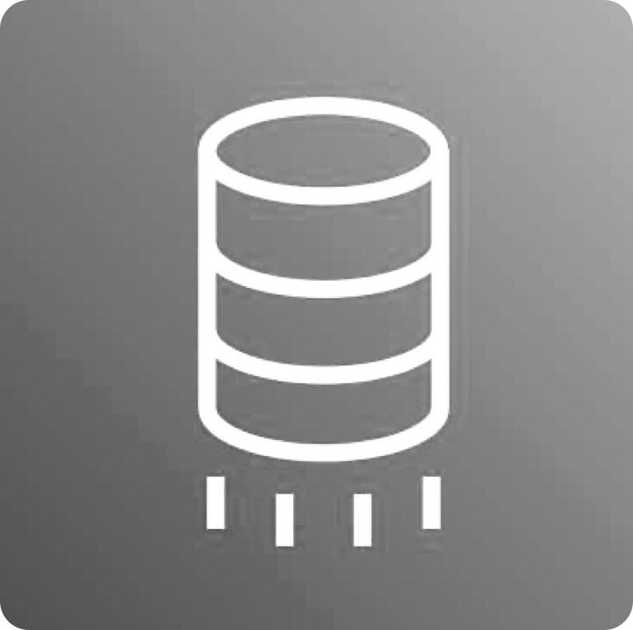
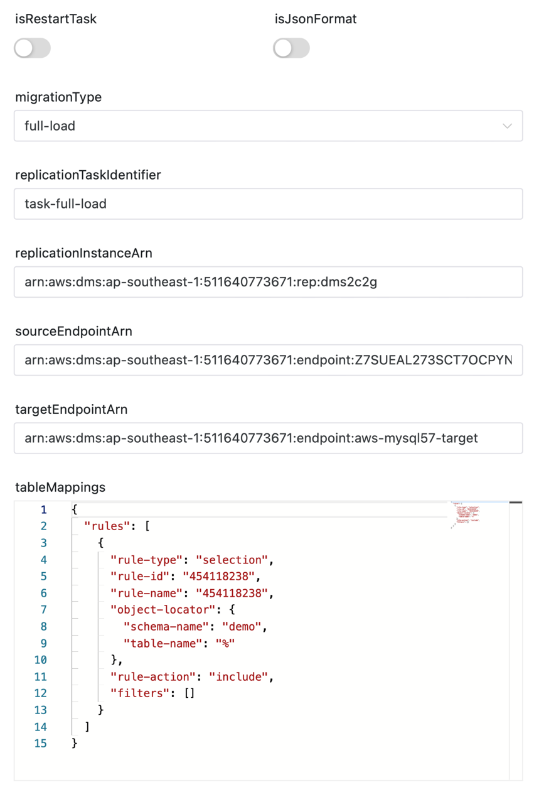
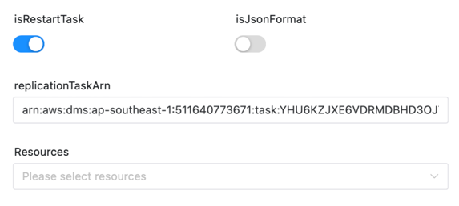
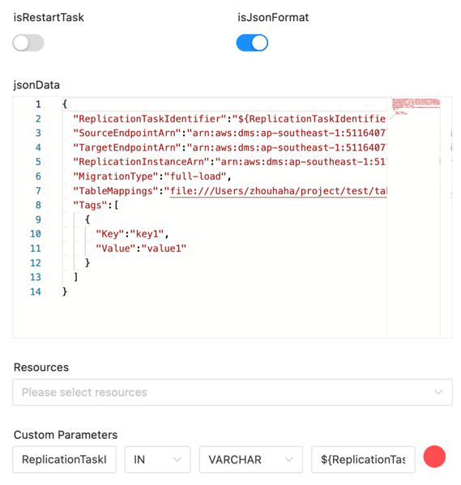
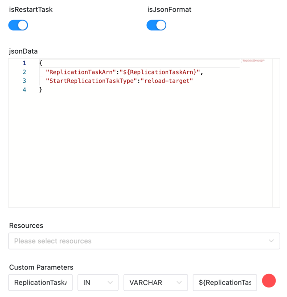

# DMS 노드

## 개요

[AWS Database Migration Service(AWS DMS)](https://aws.amazon.com/cn/dms)는 데이터베이스를 AWS로 빠르고 안전하게 마이그레이션하는 데 도움이 됩니다.
소스 데이터베이스는 마이그레이션 중에도 완벽하게 작동하므로 데이터베이스에 의존하는 애플리케이션의 가동 중지 시간이 최소화됩니다.
AWS Database Migration Service는 가장 널리 사용되는 상용 및 오픈 소스 데이터베이스 간에 데이터를 마이그레이션할 수 있습니다.

DMS 작업 플러그인은 사용자가 DolphinScheduler에서 DMS 작업을 보다 편리하게 생성하고 시작할 수 있도록 도와줍니다.

두 가지 기능이 포함되어 있습니다:
- DMS 작업 생성 및 DMS 작업 시작
- DMS 작업 다시 시작

다음 두 가지 방법으로 DMS 작업을 생성하고 DMS 작업을 시작할 수 있습니다.
- 인터페이스 사용
- JSON 데이터 사용

DolphinScheduler는 DMS 작업의 상태를 추적하고 DMS 작업이 완료되면 상태를 성공적으로 완료되도록 설정합니다.종료 시간이 없는 CDC 작업은 제외됩니다.

따라서 `migrationType`이 `cdc` 또는 `full-load-and-cdc`인 경우 `cdcStopPosition`이 설정되지 않으면 DolphinScheduler는 DMS 작업이 성공적으로 시작된 후 상태를 성공적으로 설정합니다.

## 작업 생성

- '프로젝트 관리 -> 프로젝트 이름 -> 워크플로 정의'를 클릭한 후, '워크플로 생성' 버튼을 클릭하면 DAG 편집 페이지로 진입합니다.
- 도구 모음에서 를 캔버스로 드래그합니다.

## 작업 예

태스크 플러그인 그림은 다음과 같습니다

**인터페이스별로 DMS 작업 생성 및 시작**



**인터페이스로 DMS 작업 다시 시작**



**JSON 데이터로 DMS 작업 생성 및 시작**



**JSON 데이터로 DMS 작업 다시 시작**



### 먼저 DolphinScheduler의 몇 가지 일반적인 매개변수를 소개합니다.

[//]: # (TODO: 웹사이트 템플릿이 이 구문을 지원하면 아래에 주석이 달린 앵커를 사용하세요)
[//]: # (- 기본 매개변수는 [DolphinScheduler 작업 매개변수 부록]&#40;appendix.md#default-task-parameters&#41; `기본 작업 매개변수` 섹션을 참조하세요.)

- 기본 매개변수는 [DolphinScheduler 작업 매개변수 부록](appendix.md) `기본 작업 매개변수` 섹션을 참조하세요.

### 다음은 DMS 플러그인에 대한 몇 가지 특정 매개변수입니다.

- **isRestartTask**: 작업을 다시 시작할지 여부입니다.true인 경우 작업이 다시 시작됩니다.false인 경우 작업이 생성되고 시작됩니다.
- **isJsonFormat**: JSON 데이터를 사용하여 작업을 생성하고 시작할지 여부입니다.true인 경우 JSON 데이터로 작업이 생성되고 시작됩니다.false인 경우 작업이 인터페이스에 의해 생성되고 시작됩니다.
- **jsonData**: 작업 생성 및 시작을 위한 JSON 데이터입니다.`isJsonFormat`이 true인 경우에만 이 매개변수가 유효합니다.

인터페이스별 작업 생성 및 시작 매개변수

- **migrationType**: 마이그레이션 유형입니다.값은 전체 로드, cdc, 전체 로드 및 cdc일 수 있습니다.
- **replicationTaskIdentifier**: 작업의 이름입니다.
- **replicationInstanceArn**: 복제 인스턴스의 ARN입니다.
- **sourceEndpointArn**: 소스 엔드포인트의 ARN입니다.
- **targetEndpointArn**: 대상 엔드포인트의 ARN입니다.
- **tableMappings**: 테이블의 매핑입니다.

인터페이스로 작업을 다시 시작하는 매개변수

- **replicationTaskArn**: 작업의 ARN입니다.

## 준비해야 할 환경

일부 AWS 구성이 필요합니다. `aws.yaml` 파일의 필드를 수정하세요.```yaml
dms:
  # The AWS credentials provider type. support: AWSStaticCredentialsProvider, InstanceProfileCredentialsProvider
  # AWSStaticCredentialsProvider: use the access key and secret key to authenticate
  # InstanceProfileCredentialsProvider: use the IAM role to authenticate
  credentials.provider.type: AWSStaticCredentialsProvider
  access.key.id: <access.key.id>
  access.key.secret: <access.key.secret>
  region: <region>
  endpoint: <endpoint>
````