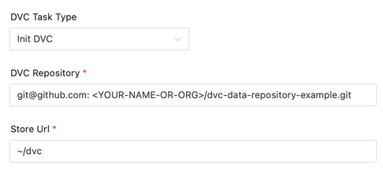
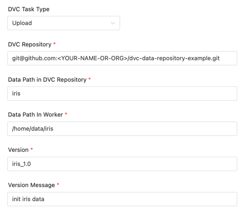
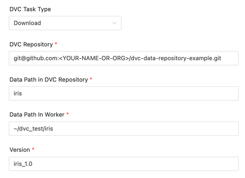
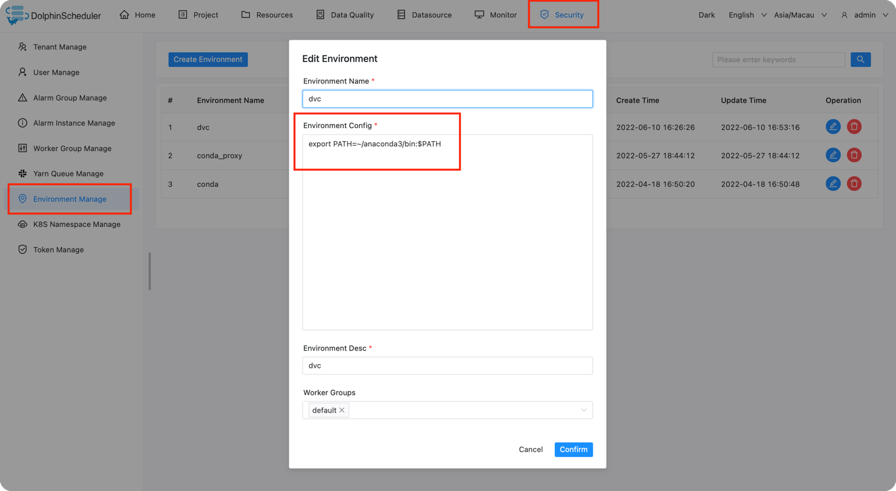
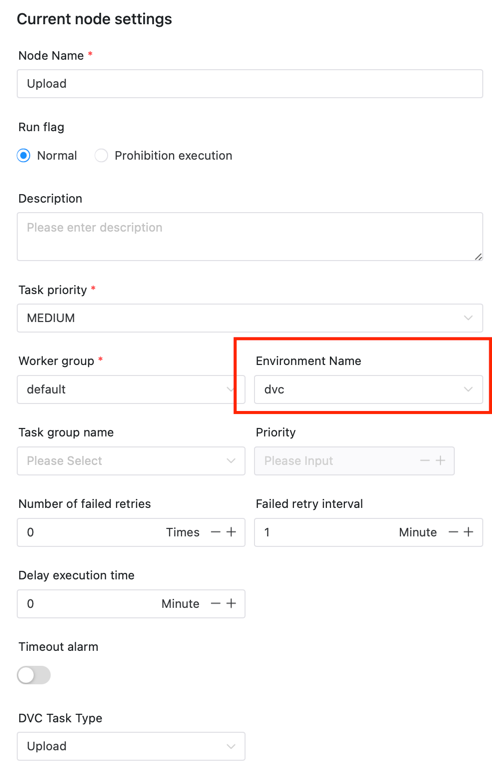

# DVC 노드

## 개요

[DVC(Data Version Control)](https://dvc.org)는 기계 학습 프로젝트를 위한 탁월한 오픈 소스 버전 제어 시스템입니다.

DVC 플러그인은 DolphinScheduler에서 DVC의 데이터 버전 관리 기능을 사용하여 사용자가 데이터 버전 관리를 쉽게 수행할 수 있도록 도와줍니다.

플러그인은 다음 세 가지 기능을 제공합니다.

- Init DVC: Git 저장소를 DVC 저장소로 초기화하고 데이터가 저장된 주소를 바인딩하여 실제 데이터를 저장합니다.
- 업로드: 저장소에 특정 데이터를 추가하거나 업데이트하고 버전 태그를 기록합니다.
- 다운로드: 저장소에서 특정 버전의 데이터를 다운로드합니다.

## 작업 생성

- `프로젝트 -> 관리-프로젝트 -> 이름-워크플로우 정의`를 클릭한 후 "워크플로우 생성" 버튼을 클릭하여 입력합니다.
DAG 편집 페이지.
- 도구 모음  작업 노드에서 캔버스로 드래그합니다.

## 작업 매개변수

[//]: # (TODO: 웹사이트 템플릿이 이 구문을 지원하면 아래에 주석이 달린 앵커를 사용하세요)
[//]: # (- 기본 매개변수는 [DolphinScheduler 작업 매개변수 부록]&#40;appendix.md#default-task-parameters&#41; `기본 작업 매개변수` 섹션을 참조하세요.)

- 기본 매개변수는 [DolphinScheduler 작업 매개변수 부록](appendix.md) `기본 작업 매개변수` 섹션을 참조하세요.

|**매개변수** |**설명** |
|----------------|----------------------------------------------------------------------------------------------------------------------------------------------------------------------------------|
|DVC 작업 유형 |DVC 업로드, 다운로드 또는 초기화。 |
|DVC 저장소 |작업 실행과 관련된 DVC 저장소 주소입니다.|
|원격 저장소 URL |실제 데이터는 해당 주소에 저장됩니다.[DVC 지원 저장소 유형](https://dvc.org/doc/command-reference/remote/add#supported-storage-types)에서 지원되는 저장소 유형에 대해 알아볼 수 있습니다.|
|DVC 저장소의 데이터 경로 |작업이 저장소에서 데이터를 업로드/다운로드하는 경로입니다.|
|작업자의 데이터 경로 |업로드할 데이터 경로입니다./ 파일을 로컬에 다운로드한 후 데이터를 저장하기 위한 경로 |
|버전 |데이터가 업로드되면 해당 데이터의 버전 태그가 `git tag`에 저장됩니다./ 다운로드할 데이터의 버전입니다.|
|버전 메시지 |버전 메시지.|

### DVC 초기화

Git 저장소를 DVC 저장소로 초기화하고 새 데이터 원격을 추가하여 데이터를 저장합니다.

프로젝트가 초기화된 후에도 여전히 Git 저장소이지만 DVC 기능이 추가됩니다.

데이터는 실제로 Git 저장소가 아닌 다른 곳에 저장되며, DVC는 데이터의 버전과 주소를 추적하고 이 관계를 처리합니다.

위의 예는 다음을 보여줍니다.
`git@github.com:<YOUR-NAME-OR-ORG>/dvc-data-repository-example.git` 저장소를 DVC 프로젝트로 초기화하고 원격 저장소 주소를 `~/dvc`에 바인딩합니다.

### 업로드

데이터를 업로드 및 업데이트하고 버전 번호를 기록하는 데 사용됩니다.



위의 예는 다음을 보여줍니다.

`git@github.com:<YOUR-NAME-OR-ORG>/dvc-data-repository-example.git` 저장소의 루트 디렉터리에 `/home/data/iris` 데이터를 업로드합니다.데이터가 담긴 파일이나 폴더의 이름은 'iris'입니다.

그런 다음 `git tag "iris_1.0" -m "init iris data"`를 실행하세요.버전 태그 'iris_1.0'과 버전 메시지 'inir iris data'를 기록합니다.

### 다운로드

특정 버전의 데이터를 다운로드하는 데 사용됩니다.



위의 예는 다음을 보여줍니다.

저장소 `git@github.com:<YOUR-NAME-OR-ORG>/dvc-data-repository-example.git`에 있는 `iris_1.0` 버전의 붓꽃 데이터에 대한 데이터를 `~/dvc_test/iris`에 다운로드합니다.

## 준비해야 할 환경

### DVC 설치

DVC가 설치되어 있는지 확인하세요. 그렇지 않은 경우 'pip install dvc' 명령을 실행하여 설치할 수 있습니다.

'dvc' 경로를 가져오고 환경 변수를 구성합니다.

Conda 환경이 예제로 사용됩니다.

Conda에 Python PIP를 설치하고 구성 요소가 'DVC' 명령을 올바르게 찾을 수 있도록 conda의 환경 변수를 구성합니다.```shell
which dvc
# >> ~/anaconda3/bin/dvc
````

Conda 환경 변수를 구성하려면 관리자 계정을 입력해야 합니다.
[아나콘다] 설치(https://docs.continuum.io/anaconda/install/)
또는 [miniconda](https://docs.conda.io/en/latest/miniconda.html#installing)를 미리 확인하세요).



참고 구성 작업 중에 위에서 생성한 Conda 환경을 선택합니다.그렇지 않으면 프로그램이 해당 항목을 찾을 수 없습니다.
콘다 환경.

