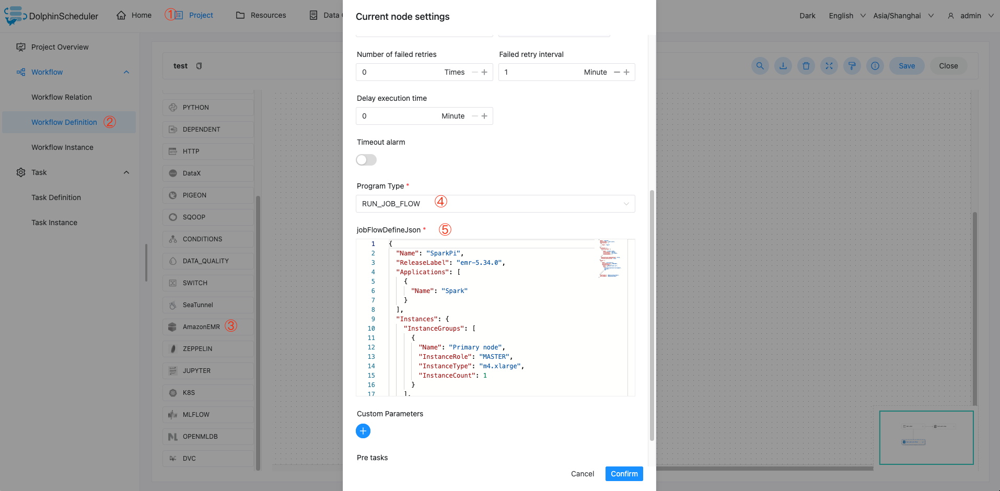
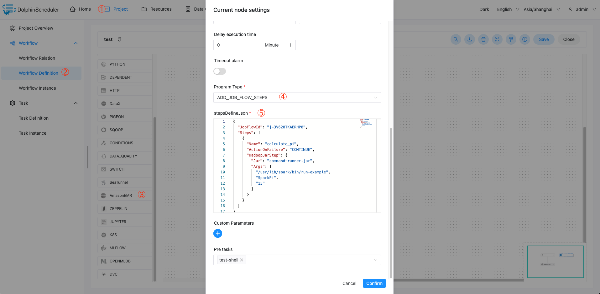
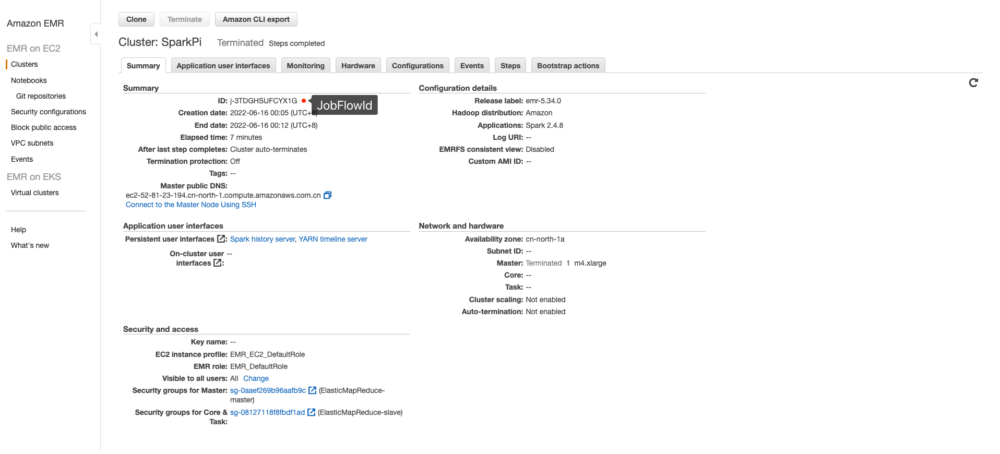

# 아마존 EMR

## 개요

AWS에서 EMR 클러스터를 운영하고 컴퓨팅 작업을 실행하기 위한 Amazon EMR 작업 유형입니다.
백그라운드 코드에서 [aws-java-sdk](https://aws.amazon.com/cn/sdk-for-java/)를 사용하여 JSON 매개변수를 작업 객체로 전송하고 AWS에 제출하려면 현재 두 가지 프로그램 유형이 지원됩니다.

* [API_RunJobFlow](https://docs.aws.amazon.com/emr/latest/APIReference/API_RunJobFlow.html#API_RunJobFlow_Examples)를 사용하여 `RUN_JOB_FLOW` 제출[RunJobFlowRequest](https://docs.aws.amazon.com/AWSJavaSDK/latest/javadoc/com/amazonaws/services/elasticmapreduce/model/RunJobFlowRequest.html) 객체
* [API_AddJobFlowSteps](https://docs.aws.amazon.com/emr/latest/APIReference/API_AddJobFlowSteps.html#API_AddJobFlowSteps_Examples)를 사용하여 `ADD_JOB_FLOW_STEPS` 제출[AddJobFlowStepsRequest](https://docs.aws.amazon.com/AWSJavaSDK/latest/javadoc/com/amazonaws/services/elasticmapreduce/model/AddJobFlowStepsRequest.html) 객체

## 작업 생성

* `프로젝트 관리 -> 프로젝트 이름 -> 워크플로 정의`를 클릭한 후 `워크플로 생성` 버튼을 클릭하여 DAG 편집 페이지로 들어갑니다.
* 'AmazonEMR' 작업을 도구 모음에서 아트보드로 끌어서 생성을 완료합니다.

## 작업 매개변수

[//]: # (TODO: 웹사이트 템플릿이 이 구문을 지원하면 아래에 주석이 달린 앵커를 사용하세요)
[//]: # (- 기본 매개변수는 [DolphinScheduler 작업 매개변수 부록]&#40;appendix.md#default-task-parameters&#41; `기본 작업 매개변수` 섹션을 참조하세요.)

- 기본 매개변수는 [DolphinScheduler 작업 매개변수 부록](appendix.md) `기본 작업 매개변수` 섹션을 참조하세요.

|**매개변수** |**설명** |
|--------------------------------|----------------------------------------------------------------------------------------------------------------------------------------------------------------------------------------------------------------------------------------------------------------------------------------------------------------------------------|
|프로그램 유형 |프로그램 종류를 선택하세요.`RUN_JOB_FLOW`인 경우 `jobFlowDefineJson`을 입력해야 하고 `ADD_JOB_FLOW_STEPS`인 경우 `stepsDefineJson`을 입력해야 합니다.|
|jobFlowDefineJson |[RunJobFlowRequest](https://docs.aws.amazon.com/AWSJavaSDK/latest/javadoc/com/amazonaws/services/elasticmapreduce/model/RunJobFlowRequest.html) 객체에 해당하는 JSON. 자세한 내용은 다음을 참조하세요.[API_RunJobFlow_Examples](https://docs.aws.amazon.com/emr/latest/APIReference/API_RunJobFlow.html#API_RunJobFlow_Examples).|
|단계DefineJson |[AddJobFlowStepsRequest](https://docs.aws.amazon.com/AWSJavaSDK/latest/javadoc/com/amazonaws/services/elasticmapreduce/model/AddJobFlowStepsRequest.html) 객체에 해당하는 JSON. 자세한 내용은 다음을 참조하세요.[API_AddJobFlowSteps_Examples](https://docs.aws.amazon.com/emr/latest/APIReference/API_AddJobFlowSteps.html#API_AddJobFlowSteps_Examples).|

## 작업 예

### EMR 클러스터 생성 및 Steps 실행

이 예에서는 `RUN_JOB_FLOW` 유형의 `EMR` 작업 노드를 생성하는 방법을 보여줍니다.'SparkPi' 실행을 예로 들면, 작업은 'EMR' 클러스터를 생성하고 'SparkPi' 샘플 프로그램을 실행합니다.


jobFlowDefineJson 예```json
{
  "Name": "SparkPi",
  "ReleaseLabel": "emr-5.34.0",
  "Applications": [
    {
      "Name": "Spark"
    }
  ],
  "Instances": {
    "InstanceGroups": [
      {
        "Name": "Primary node",
        "InstanceRole": "MASTER",
        "InstanceType": "m4.xlarge",
        "InstanceCount": 1
      }
    ],
    "KeepJobFlowAliveWhenNoSteps": false,
    "TerminationProtected": false
  },
  "Steps": [
    {
      "Name": "calculate_pi",
      "ActionOnFailure": "CONTINUE",
      "HadoopJarStep": {
        "Jar": "command-runner.jar",
        "Args": [
          "/usr/lib/spark/bin/run-example",
          "SparkPi",
          "15"
        ]
      }
    }
  ],
  "JobFlowRole": "EMR_EC2_DefaultRole",
  "ServiceRole": "EMR_DefaultRole"
}
````

### 실행 중인 EMR 클러스터에 단계 추가

이 예에서는 `ADD_JOB_FLOW_STEPS` 유형의 `EMR` 작업 노드를 생성하는 방법을 보여줍니다.'SparkPi' 실행을 예로 들면, 작업은 실행 중인 'EMR' 클러스터에 'SparkPi' 샘플 프로그램을 추가합니다.



단계DefineJson 예```json
{
  "JobFlowId": "j-3V628TKAERHP8",
  "Steps": [
    {
      "Name": "calculate_pi",
      "ActionOnFailure": "CONTINUE",
      "HadoopJarStep": {
        "Jar": "command-runner.jar",
        "Args": [
          "/usr/lib/spark/bin/run-example",
          "SparkPi",
          "15"
        ]
      }
    }
  ]
}
````

## 공지사항

- EMR 작업 유형에 대한 장애 조치가 구현되지 않았습니다.현재 DolphinScheduler는 Yarn 작업 유형에 대한 장애 조치만 지원합니다.EMR 작업, k8s 작업과 같은 다른 작업 유형은 아직 준비되지 않았습니다.
- `stepsDefineJson` 작업 정의는 단일 단계의 연결만 지원하므로 작업 상태의 안정성을 더 잘 보장할 수 있습니다.