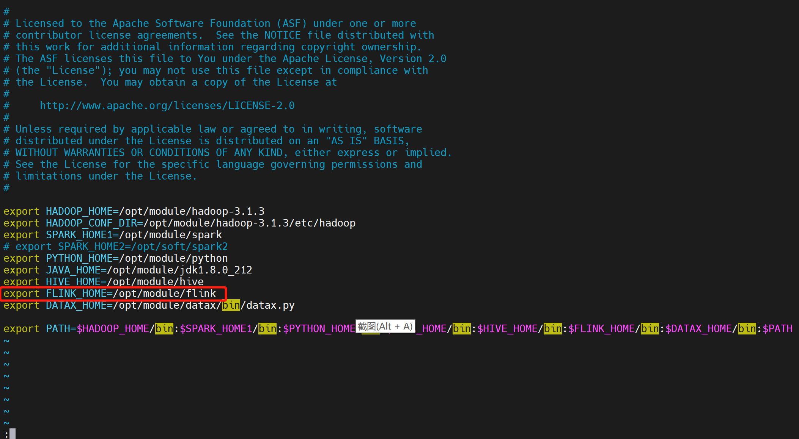
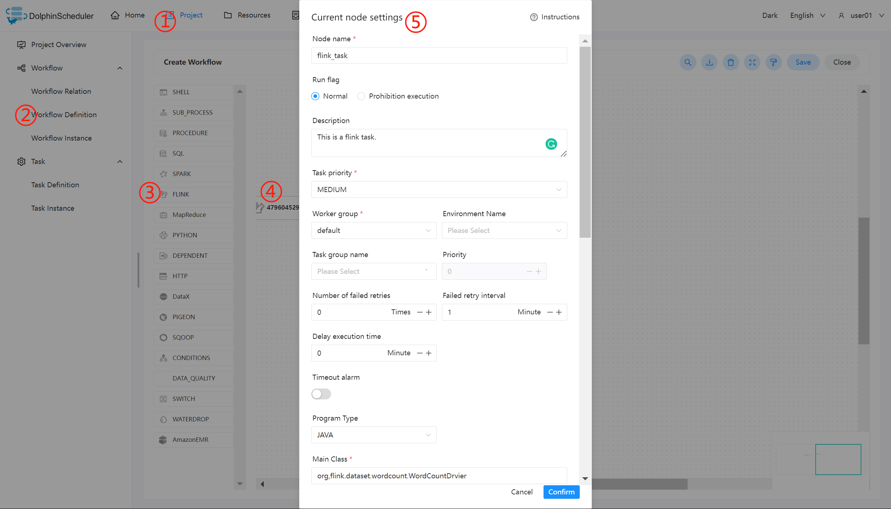
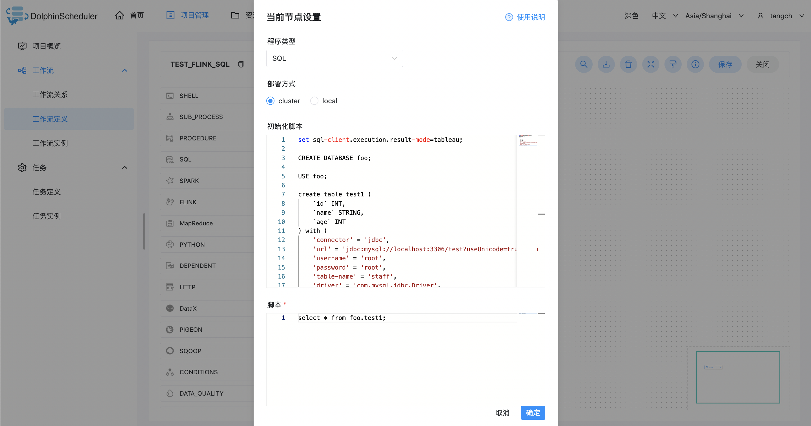

# 플링크 노드

## 개요

Flink 프로그램을 실행하는 데 사용되는 Flink 작업 유형입니다.Flink 노드의 경우:

1. 프로그램 유형이 Java, Scala 또는 Python인 경우 작업자는 Flink 명령을 사용하여 'flink run' 작업을 제출합니다.자세한 내용은 [flink cli](https://nightlies.apache.org/flink/flink-docs-release-1.14/docs/deployment/cli/)를 참조하세요.

2. 프로그램 유형이 SQL인 경우 작업자는 `sql-client.sh`를 사용하여 작업을 제출합니다.자세한 내용은 [flink SQL 클라이언트](https://nightlies.apache.org/flink/flink-docs-master/docs/dev/table/sqlclient/)를 참조하세요.

## 작업 생성

- '프로젝트 관리 -> 프로젝트 이름 -> 워크플로 정의'를 클릭한 후, '워크플로 생성' 버튼을 클릭하면 DAG 편집 페이지로 진입합니다.
- 도구 모음 작업 노드에서 캔버스로 드래그합니다.

## 작업 매개변수

[//]: # (TODO: 웹사이트 템플릿이 이 구문을 지원하면 아래에 주석이 달린 앵커를 사용하세요)
[//]: # (- 기본 매개변수는 [DolphinScheduler 작업 매개변수 부록]&#40;appendix.md#default-task-parameters&#41; `기본 작업 매개변수` 섹션을 참조하세요.)

- 기본 매개변수는 [DolphinScheduler 작업 매개변수 부록](appendix.md) `기본 작업 매개변수` 섹션을 참조하세요.|      **Parameter**      |                                                                                                                             **Description**                                                                                                                             |
|-------------------------|-------------------------------------------------------------------------------------------------------------------------------------------------------------------------------------------------------------------------------------------------------------------------|
| Program type            | Support Java, Scala, Python and SQL four languages.                                                                                                                                                                                                                     |
| Class of main function  | The **full path** of Main Class, the entry point of the Flink program.                                                                                                                                                                                                  |
| Main jar package        | The jar package of the Flink program (upload by Resource Center).                                                                                                                                                                                                       |
| Deployment mode         | Support 3 deployment modes: cluster, local and application (Flink 1.11 and later. See also [Run an application in Application Mode](https://nightlies.apache.org/flink/flink-docs-release-1.11/ops/deployment/yarn_setup.html#run-an-application-in-application-mode)). |
| Initialization script   | Script file to initialize session context.                                                                                                                                                                                                                              |
| Script                  | The sql script file developed by the user that should be executed.                                                                                                                                                                                                      |
| Flink version           | Select version according to the execution environment.                                                                                                                                                                                                                  |
| Task name               | Flink task name.                                                                                                                                                                                                                                                        |
| JobManager memory size  | Used to set the size of jobManager memories, which can be set according to the actual production environment.                                                                                                                                                           |
| Number of slots         | Used to set the number of slots, which can be set according to the actual production environment.                                                                                                                                                                       |
| TaskManager memory size | Used to set the size of taskManager memories, which can be set according to the actual production environment.                                                                                                                                                          |
| Number of TaskManager   | Used to set the number of taskManagers, which can be set according to the actual production environment.                                                                                                                                                                |
| Parallelism             | Used to set the degree of parallelism for executing Flink tasks.                                                                                                                                                                                                        |
| Yarn queue              | Used to set the yarn queue, use `default` queue by default.                                                                                                                                                                                                             |
| Main program parameters | Set the input parameters for the Flink program and support the substitution of custom parameter variables.                                                                                                                                                              |
| Optional parameters     | Set the flink command options, such as `-D`, `-C`, `-yt`.                                                                                                                                                                                                               |
| Custom parameter        | It is a local user-defined parameter for Flink, and will replace the content with `${variable}` in the script.                                                                                                                                                          |## 작업 예

### WordCount 프로그램 실행

이는 MapReduce, Flink 및 Spark와 같은 컴퓨팅 프레임워크에 자주 적용되는 빅 데이터 생태계의 일반적인 입문 사례입니다.주요 목적은 입력 텍스트에서 동일한 단어의 수를 계산하는 것입니다.(Flink의 릴리스에는 이 예제 작업이 첨부되어 있습니다)

#### DolphinScheduler에서 flink 환경 구성

프로덕션 환경에서 flink 작업 유형을 사용하는 경우 먼저 필요한 환경을 구성해야 합니다.다음은 구성 파일입니다: `bin/env/dolphinscheduler_env.sh`.

#### 메인 패키지 업로드

Flink 작업 노드를 사용하는 경우 실행을 위해 jar 패키지를 리소스 센터에 업로드해야 합니다. [리소스 센터](../resource/configuration.md)를 참조하세요.

리소스 센터 구성을 마친 후 필요한 대상 파일을 드래그 앤 드롭으로 직접 업로드하세요.

#### Flink 노드 구성

위의 매개변수 설명에 따라 필수 콘텐츠를 구성합니다.

### FlinkSQL 프로그램 실행

위의 매개변수 설명에 따라 필수 콘텐츠를 구성합니다.

## 참고

- JAVA, Scala는 식별용으로만 사용되며 차이는 없습니다.Python을 사용하여 Flink를 개발하는 경우 주요 기능의 클래스가 없으며 나머지는 동일합니다.

- SQL을 사용하여 Flink SQL 작업을 실행합니다. 현재 Flink 1.13 이상만 지원됩니다.