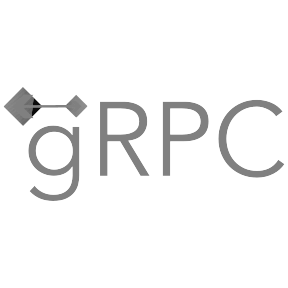
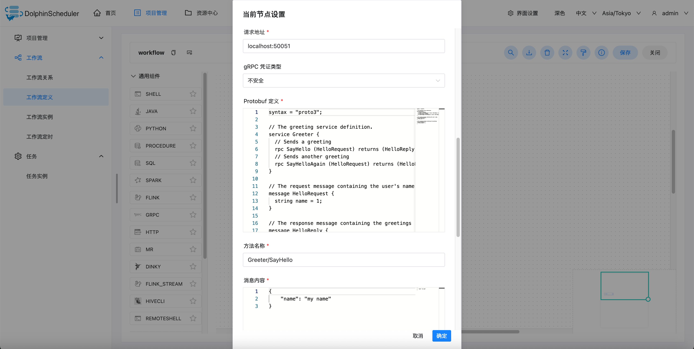
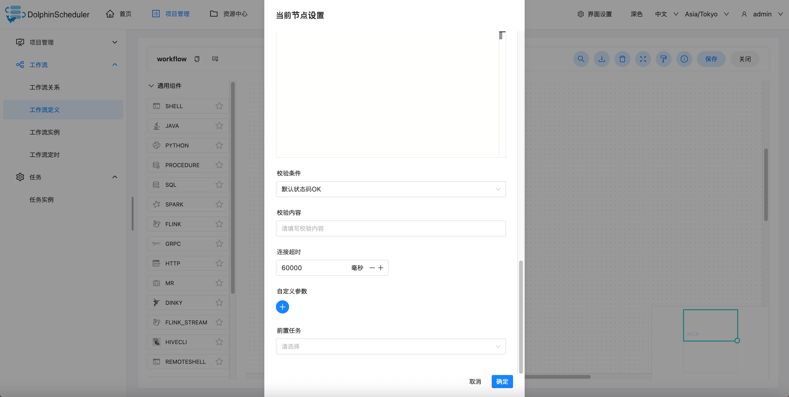

# GRPC 노드

## 개요

이 노드는 gRPC 작업을 실행하는 데 사용되며 gRPC 상태 코드, SSL/TLS 및 기타 기능 확인을 지원합니다.

## 작업 생성

- 프로젝트 관리 -> 프로젝트 이름 -> 워크플로 정의를 클릭한 다음 "워크플로 만들기" 버튼을 클릭하여 DAG 편집 페이지로 들어갑니다.

-  작업 노드를 도구 모음에서 캔버스로 드래그합니다.

## 작업 매개변수

[//]: # (TODO: 웹사이트 템플릿이 이 구문을 지원하면 아래에 주석이 달린 앵커를 사용하세요)
[//]: # (- 기본 매개변수 설명은 `기본 작업 매개변수` 아래 [DolphinScheduler 작업 매개변수 부록]&#40;appendix.md#默认任务参数&#41;를 참조하세요.)

- 기본 매개변수 설명은 [DolphinScheduler 작업 매개변수 부록](appendix.md) `기본 작업 매개변수`를 참조하세요.

|**작업 매개변수** |**설명** |
|------------------------------------------------|-------------------------------------------------------------------------------------------------------------------------|
|gRPC URL |gRPC 요청 URL은 '호스트 이름:포트' 형식을 사용해야 합니다 |
|gRPC 자격 증명 유형 |없음(안전하지 않음) 및 클라이언트 기본 SSL/TLS 자격 증명 유형 지원 |
|프로토부프 정의 |`.proto` 파일에 서비스를 정의하는 Protobuf 코드는 저장 시 JSON 설명자로 변환됩니다 |
|gRPC 방법 |호출할 rpc 메소드는 `Greeter/SayHello` 형식으로 작성된 서비스 정의에 정의되어야 합니다 |
|메시지 내용 |JSON에 정의된 요청 메시지는 요청 시 서비스 정의에 병합됩니다.
|gRPC 확인 조건 |기본 gRPC 상태 코드(OK), 사용자 정의 상태 코드 지원 |
|gRPC 조건 |확인 조건이 사용자 지정 응답 코드로 설정된 경우 유효성 검사 내용을 입력해야 하며 [gRPC 상태 코드](https://grpc.io/docs/guides/status-codes/)와 일치해야 합니다 |
|맞춤 매개변수 |gRPC에 로컬인 사용자 정의 매개변수는 ${variable} |

## 작업 출력 매개변수

|**작업 매개변수** |**설명** |
|----------------------|--------------------------------------------------|
|응답 |VARCHAR, ProtoJS 형식 준수, gRPC 요청의 반환 결과 |

${taskName.response}를 사용하여 다운스트림 작업에서 작업 출력 매개변수를 참조할 수 있습니다.

예를 들어 현재 task1이 gRPC 작업인 경우 다운스트림 작업은 `${task1.response}`를 사용하여 task1의 출력 매개변수를 참조할 수 있습니다.

## 작업 예

gRPC 정의
주요 구성 매개변수는 다음과 같습니다(모든 매개변수는 내장 매개변수로 대체 가능).

- gRPC Url: 대상 gRPC 서비스의 주소입니다. 여기서는 로컬 50051 포트입니다.
- gRPC 자격 증명 유형: 안전하지 않음
- Protobuf 정의: gRPC 서비스에서 사용하는 protobuf 정의
- gRPC 메소드: `Greeter/SayHello` 형식으로 호출할 rpc 메소드
- 메시지: JSON에 정의된 요청 메시지
- gRPC 확인 조건: 기본 gRPC 상태 코드 OK, 사용자 정의 상태 코드
- gRPC 조건: 유효성 검사 조건이 사용자 지정 상태 코드인 경우 유효성 검사 내용을 입력해야 하며, 이는 gRPC 상태 코드 문자열과 정확히 일치해야 합니다.
