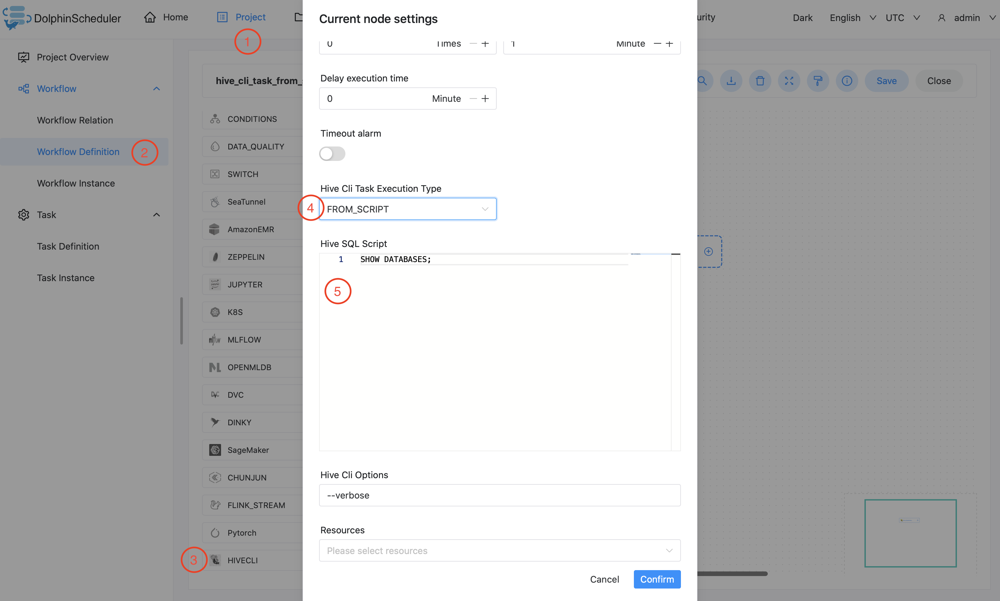
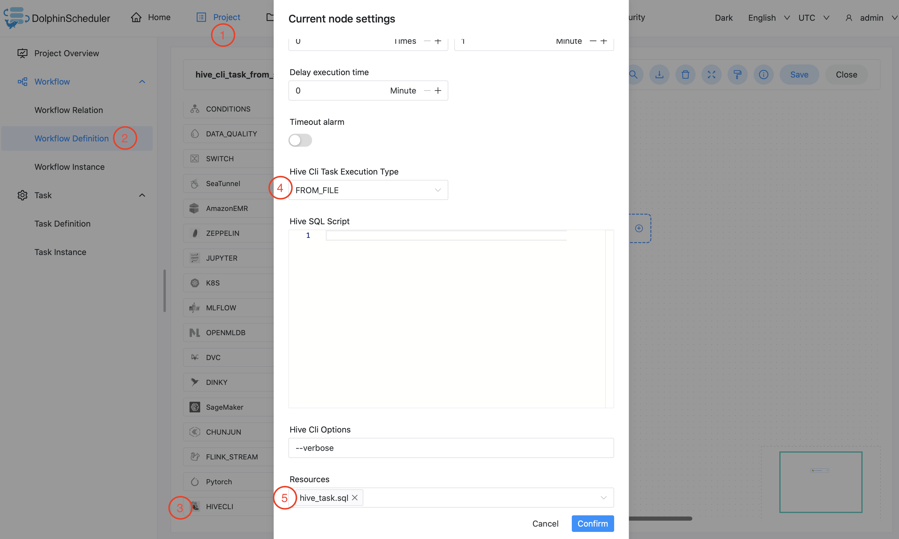

# 하이브 CLI

## 개요

`Hive Cli Task`를 사용하여 `Hive Cli` 유형의 작업을 생성하고 스크립트나 파일에서 Hive SQL을 실행합니다.
작업자는 `hive -e`를 실행하여 스크립트에서 hive sql을 실행하거나 `hive -f`를 실행하여 `Resource Center`의 파일에서 실행합니다.

## Hive CLI 작업과 Hive 데이터 소스를 사용한 SQL 작업 비교

DolphinScheduler에는 다양한 시나리오를 위한 'Hive CLI 작업'과 'Hive 데이터 소스를 사용한 SQL 작업'이 모두 있습니다.
필요에 따라 이 두 가지 중에서 선택할 수 있습니다.

- `Hive CLI` 작업 플러그인은 하이브 작업 실행을 위해 `HDFS` 및 `Hive Metastore`에 직접 연결됩니다.
이를 위해서는 작업자가 관련 `Hive` 라이브러리, `Hive` 및 `HDFS` 구성 파일과 같은 서비스에 액세스할 수 있어야 합니다.
그러나 'Hive CLI Task'는 프로덕션 일정 예약에 있어 더 나은 안정성을 제공합니다.
- `Hive 데이터 소스를 사용한 SQL 작업`에는 `Hive` 라이브러리, `Hive` 및
`HDFS` 구성 파일을 사용하고 인증을 위해 `Kerberos`를 지원합니다.그러나 'HiveServer2' 오류가 발생할 수 있습니다.
하이브 SQL 작업 예약으로 인해 상당한 부담이 가해지는 경우.

## 작업 생성

- '프로젝트 관리-프로젝트 이름-워크플로 정의'를 클릭한 후, '워크플로 생성' 버튼을 클릭하면 DAG 편집 페이지로 진입합니다.
- 도구 모음에서 를 캔버스로 드래그합니다.

## 작업 매개변수

[//]: # (TODO: 웹사이트 템플릿이 이 구문을 지원하면 아래에 주석이 달린 앵커를 사용하세요)
[//]: # (- 기본 매개변수는 [DolphinScheduler 작업 매개변수 부록]&#40;appendix.md#default-task-parameters&#41; `기본 작업 매개변수` 섹션을 참조하세요.)

- 기본 매개변수는 [DolphinScheduler 작업 매개변수 부록](appendix.md) `기본 작업 매개변수` 섹션을 참조하세요.

|**매개변수** |**설명** |
|------------------|-----------------------------------------------------------------------------------------|
|Hive Cli 작업 실행 유형 |Hive CLI 작업 실행 유형은 'FROM_SCRIPT' 또는 'FROM_FILE'을 선택합니다.|
|하이브 SQL 스크립트 |`Hive Cli 작업 실행 유형`으로 `FROM_SCRIPT`를 선택한 경우 SQL 스크립트를 입력해야 합니다.|
|Hive Cli 옵션 |실행 결과를 확인하기 위한 `--verbose`와 같은 Hive cli에 대한 추가 옵션입니다.|
|자원 |`Hive Cli Task Execution Type`으로 `FROM_FILE`을 선택한 경우 SQL 파일을 선택해야 합니다.|

## 작업 예

### Hive Cli 작업 예

아래 예에서는 'Hive CLI' 작업 노드를 생성하고 스크립트에서 Hive SQL을 실행하는 방법을 보여줍니다.

아래 예에서는 'Hive CLI' 작업 노드를 생성하고 파일에서 Hive SQL을 실행하는 방법을 보여줍니다.

