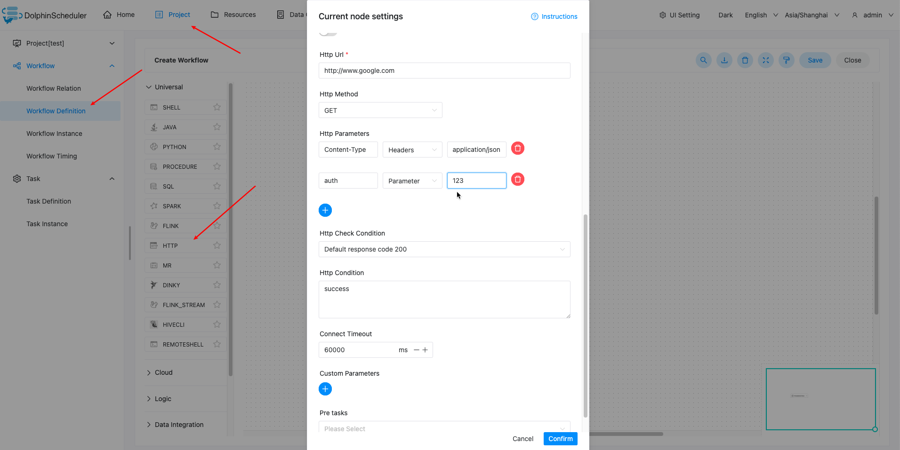
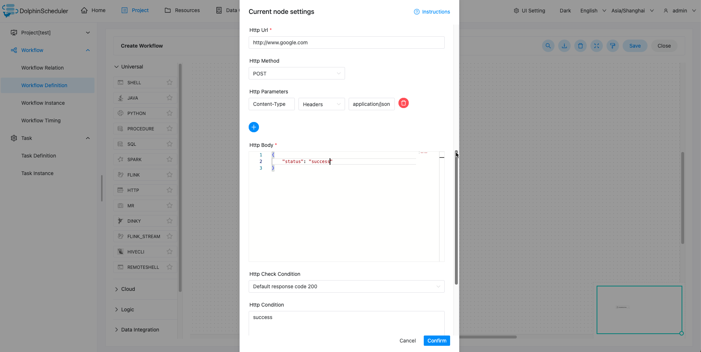

# HTTP 노드

## 개요

이 노드는 http 유형 작업을 수행하는 데 사용되며 http 요청 유효성 검사 및 기타 기능도 지원합니다.

## 작업 생성

- '프로젝트 관리 -> 프로젝트 이름 -> 워크플로 정의'를 클릭한 후, '워크플로 생성' 버튼을 클릭하면 DAG 편집 페이지로 진입합니다.
- 툴바에서 를 드로잉 보드로 드래그합니다.

## 작업 매개변수

[//]: # (TODO: 웹사이트 템플릿이 이 구문을 지원하면 아래에 주석이 달린 앵커를 사용하세요)
[//]: # (- 기본 매개변수는 [DolphinScheduler 작업 매개변수 부록]&#40;appendix.md#default-task-parameters&#41; `기본 작업 매개변수` 섹션을 참조하세요.)

- 기본 매개변수는 [DolphinScheduler 작업 매개변수 부록](appendix.md) `기본 작업 매개변수` 섹션을 참조하세요.

|**매개변수** |**설명** |
|--------------------------------------|--------------------------------------------------------------------------------------------------------------------------------------------------|
|주소 요청 |HTTP 요청 URL.|
|요청 유형 |GET, POST, PUT, DELETE 지원 |
|요청 매개변수 |매개변수, 본문, 헤더를 지원합니다.|
|검증조건 |기본 응답 코드, 사용자 정의 응답 코드, 포함된 콘텐츠, 포함되지 않은 콘텐츠를 지원합니다.|
|검증 내용 |확인 조건에서 사용자 정의 응답 코드를 선택한 경우 내용이 포함되어 있고 내용이 포함되어 있지 않은 경우 확인 내용이 필요합니다.|
|맞춤 매개변수 |http 부분의 사용자 정의 매개변수로, 스크립트에서 내용을 `${variable}`로 대체합니다.|

## 작업 출력 매개변수

|**작업 매개변수** |**설명** |
|-------|-----------|
|응답 |VARCHAR, http 요청 반환 결과 |

`${taskName.response}`를 사용하여 다운스트림 작업의 작업 출력 매개변수를 참조할 수 있습니다.

예를 들어 현재 task1이 http 작업인 경우 다운스트림 작업은 `${task1.response}`를 사용하여 task1의 출력 매개변수를 참조할 수 있습니다.

## 예

HTTP는 서버와 상호 작용하는 다양한 방법을 정의하며 가장 기본적인 방법은 GET, POST, PUT, DELETE입니다.여기서는 http 작업 노드를 사용하여 POST를 사용하여 시스템의 로그인 페이지에 데이터 제출 요청을 보내는 방법을 보여줍니다.

주요 구성 매개변수는 다음과 같습니다(모든 매개변수는 내장 매개변수로 대체 가능):

- URL: 대상 리소스에 접근하기 위한 주소입니다.다음은 시스템의 로그인 페이지입니다.
- 요청 유형: GET, POST, PUT, DELETE
- 헤더: 헤더 정보를 요청합니다. 현재는 application/json, application/x-www-form-urlencoded 형식만 지원합니다.다른 형식을 입력하면 기본적으로 application/json 형식이 사용됩니다.
- HTTP 매개변수: GET, DELETE 요청 매개변수.
- HTTP 본문: POST, PUT 요청 매개변수.
- 확인 조건 : 기본 응답 코드 200, 맞춤 응답 코드, 콘텐츠 포함, 콘텐츠 미포함.
- 검증 내용 : 검증 조건이 사용자 정의 응답 코드인 경우, 내용 포함, 내용 없음, 검증 내용이 필수이며, 검증 내용이 퍼지 일치합니다.

