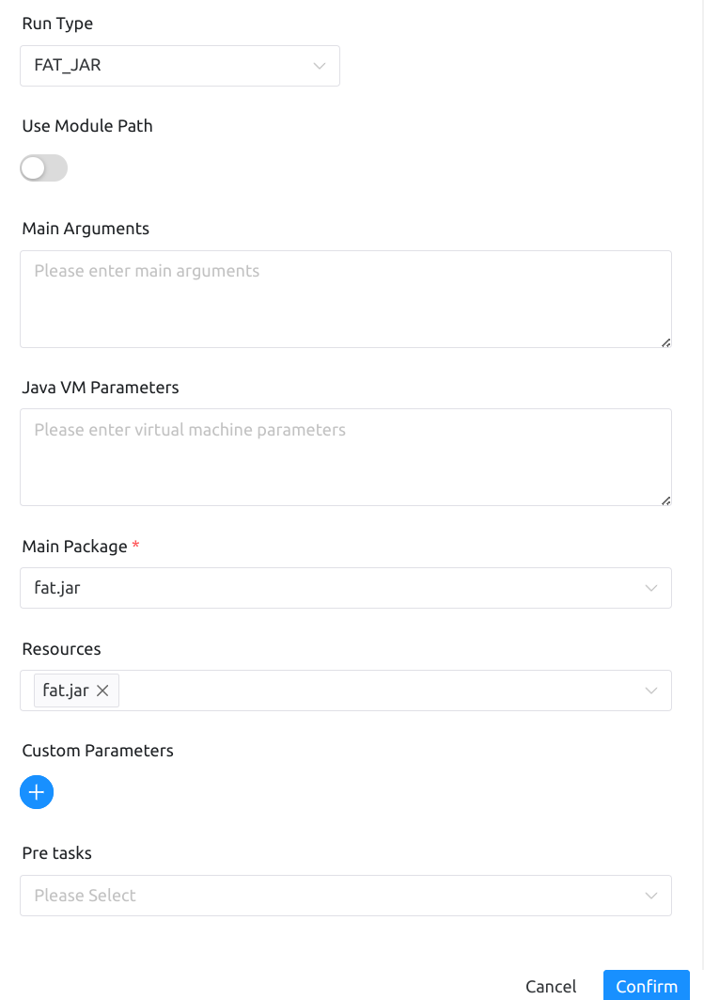
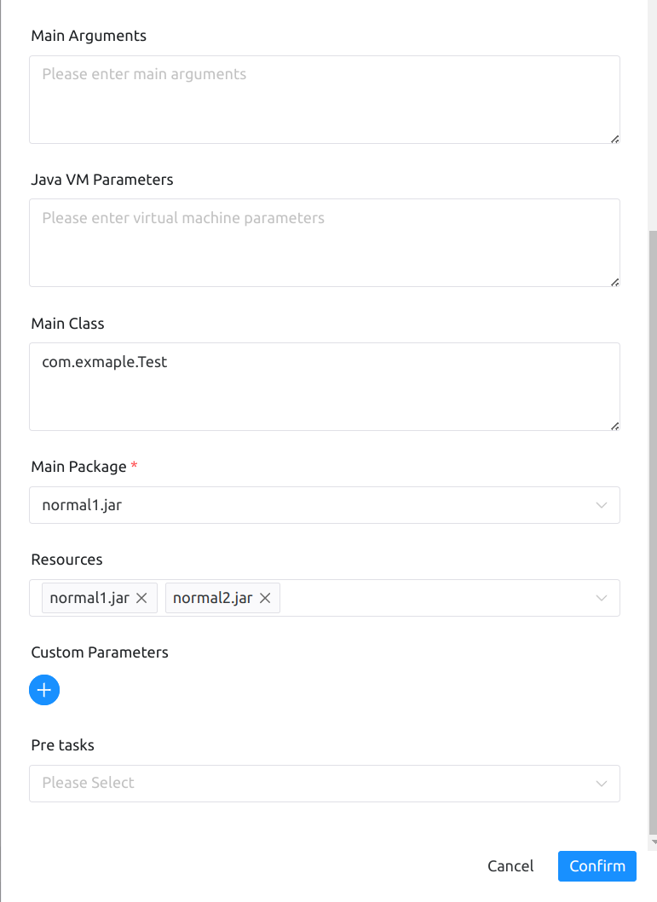

# 개요

이 노드는 `Java` 유형의 작업을 실행하는 데 사용되며 `FAT_JAR` 및 `NORMAL_JAR` 유형의 `jar` 패키지 실행을 지원합니다.

# 작업 생성

- `프로젝트 관리` -> `프로젝트 이름` -> `워크플로 정의`를 클릭하고 "워크플로 만들기" 버튼을 클릭한 후 DAG 편집 페이지로 이동합니다.

- 도구 모음의 Java 작업 노드를 팔레트로 드래그합니다.

# 작업 매개변수

[//]: # (TODO: 웹사이트 템플릿이 이 구문을 지원하면 아래에 주석이 달린 앵커를 사용하세요)
[//]: # (- 기본 매개변수는 [DolphinScheduler 작업 매개변수 부록]&#40;appendix.md#default-task-parameters&#41; `기본 작업 매개변수` 섹션을 참조하세요.)

- 기본 매개변수는 [DolphinScheduler 작업 매개변수 부록](appendix.md) `기본 작업 매개변수` 섹션을 참조하세요.

|**매개변수** |**설명** |
|--------------------|----------------------------------------------------------------------------------------------------------------------------------|
|모듈 경로 |Java 9 +의 모듈성 기능을 선택하고, 모든 리소스를 모듈 경로에 넣고, 작업자의 JDK 버전이 모듈성을 지원하도록 요구합니다.|
|주요 매개변수 |Java 프로그램 기본 메소드 항목 매개변수입니다.|
|Java VM 매개변수 |JVM 시작 매개변수.|
|메인 클래스 이름 |메인 클래스의 정규화된 이름(선택 사항) |
|메인 패키지 |애플리케이션을 실행하려면 기본 프로그램 패키지를 선택하세요.|
|자원 |클래스 경로나 모듈 경로에 추가되고 JAVA 스크립트에서 쉽게 검색할 수 있는 외부 JAR 패키지 또는 기타 리소스 파일입니다.|

## 예

Java 작업 유형에는 두 가지 실행 모드가 있으며 여기서는 별도로 설명합니다.

주요 구성 매개변수는 다음과 같습니다.
- 실행 유형
- 모듈 경로
- 주요 매개변수
- Java VM 매개변수
- 메인 패키지
- 자원

그림과 같습니다.

- FAT_JAR

`FAT_JAR`은 `uber-jar`로도 알려져 있으며, 종속성과 코드가 동일한 `jar` 내에 포함되어 있습니다.이 `jar` 하나만 선택하면 됩니다.

- NORMAL_JAR

`normal1.jar`은 프로그램의 진입점이고 `normal2.jar`에는 필수 종속성이 포함되어 있습니다.프로그램의 진입점은 기본 프로그램 패키지에 지정되어야 하며, 프로그램 항목 'jar' 파일과 함께 모든 종속성은 올바른 실행을 보장하기 위해 리소스 파일에서 선택되어야 합니다.

## 참고

1. 보안상의 이유로 JAVA 작업 실행 시 환경관리 모듈을 이용하여 `JAVA_HOME` 및 기타 환경변수 등 JDK 환경을 구성해 주시기 바랍니다.
2. NORMAL_JAR은 기본 클래스 이름을 제공해야 하며(선택 사항), FAT_JAR은 기본 클래스 이름을 제공할 필요가 없습니다.