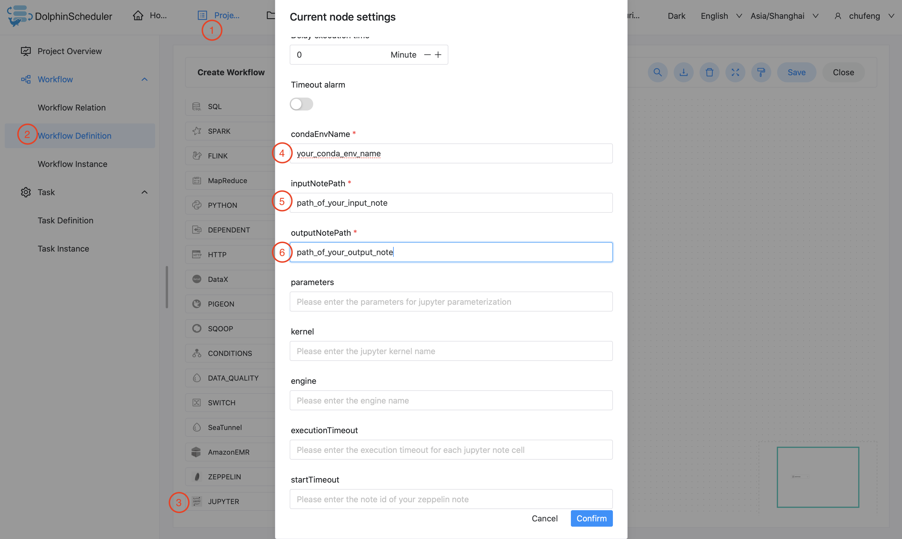

# 주피터

## 개요

jupyter 유형의 작업을 생성하고 jupyter 노트를 실행하려면 'Jupyter Task'를 사용하세요.작업자가 'Jupyter Task'를 실행하면,
jupyter 노트를 평가하기 위해 `papermill`을 사용할 것입니다.`papermill`에 대한 자세한 내용을 보려면 [여기](https://papermill.readthedocs.io/en/latest/)를 클릭하세요.

## 콘다 구성

- `common.properties`의 `conda.path`를 `conda.sh` 경로로 구성합니다. 이 경로는 `papermill` 및 `jupyter`의 Python 환경을 관리하는 데 사용하는 것과 동일한 `conda`여야 합니다.
`conda`에 대한 자세한 내용을 보려면 [여기](https://docs.conda.io/en/latest/)를 클릭하세요.
- `conda.path`는 기본적으로 `/opt/anaconda3/etc/profile.d/conda.sh`로 설정됩니다.`conda`가 어디에 있는지 모른다면 `conda info |grep -i '기본 환경'`.

> 참고: 'Jupyter Task Plugin'은 'source' 명령을 사용하여 conda 환경을 활성화합니다.
> 테넌트에 `source` 사용 권한이 없으면 `Jupyter Task Plugin`이 작동하지 않습니다.

## Python 종속성 관리

### 사전 설치된 Conda 환경 사용

1. 대상 작업자에서 `셸 작업`을 사용하거나 수동으로 Conda 환경을 만듭니다.
2. `jupyter task`에서 `condaEnvName`을 방금 생성한 conda 환경의 이름으로 설정합니다.

### 압축된 Conda 환경 사용

1. [Conda-Pack](https://conda.github.io/conda-pack/)을 사용하여 Conda 환경을 `tarball`에 압축합니다.
2. 압축된 conda 환경을 '리소스 센터'에 업로드합니다.
3. `jupyter task`에서 압축된 conda 환경의 이름으로 `condaEnvName`을 설정합니다.`jupyter_env.tar.gz`.
4. `jupyter task`에서 압축된 conda 환경을 `resource`로 선택합니다.`jupyter_env.tar.gz`.

> 참고: [Conda-Pack](https://conda.github.io/conda-pack/) 공식 지침을 따르십시오.
> 압축된 conda 환경의 압축을 풀면 디렉터리 구조는 아래와 같아야 합니다.```
.
├── bin
├── conda-meta
├── etc
├── include
├── lib
├── share
└── ssl
```

> NOTICE: Please follow the `conda pack` instructions above strictly, and DO NOT modify `bin/activate`.
> `Jupyter Task Plugin` uses `source` command to activate your packed conda environment.
> If you are concerned about using `source`, choose other options to manage your python dependency.

### Construct From Requirements

1. Upload or create a `.txt` file of requirements with your python dependencies in `Resource Center`.
2. Set `condaEnvName` as the name of your file of requirements in your `jupyter task`, e.g. `requirements.txt`.
3. Select your file of requirements as `resource` in your `jupyter task`, e.g. `requirements.txt`.

Here is an example file of requirements, from which `jupyter task plugin` will automatically
construct your python dependencies, run your python code and finally tear down the environment:

```text
fastjsonschema==2.15.3
fonttools==4.33.3
geojson==2.5.0
identify==2.4.11
idna==3.3
importlib-metadata==4.11.3
importlib-resources==5.7.1
ipykernel==5.5.6
ipython==8.2.0
ipython-genutils==0.2.0
jedi==0.18.1
Jinja2==3.1.1
json5==0.9.6
jsonschema==4.4.0
jupyter-client==7.3.0
jupyter-core==4.10.0
jupyter-server==1.17.0
jupyterlab==3.3.4
jupyterlab-pygments==0.2.2
jupyterlab-server==2.13.0
kiwisolver==1.4.2
MarkupSafe==2.1.1
matplotlib==3.5.2
matplotlib-inline==0.1.3
mistune==0.8.4
nbclassic==0.3.7
nbclient==0.6.0
nbconvert==6.5.0
nbformat==5.3.0
nest-asyncio==1.5.5
notebook==6.4.11
notebook-shim==0.1.0
numpy==1.22.3
packaging==21.3
pandas==1.4.2
pandocfilters==1.5.0
papermill==2.3.4
````

## 작업 생성

- '프로젝트 관리-프로젝트 이름-워크플로 정의'를 클릭한 후, '워크플로 생성' 버튼을 클릭하면 DAG 편집 페이지로 진입합니다.
- 도구 모음에서 를 캔버스로 드래그합니다.

## 작업 매개변수

[//]: # (TODO: 웹사이트 템플릿이 이 구문을 지원하면 아래에 주석이 달린 앵커를 사용하세요)
[//]: # (- 기본 매개변수는 [DolphinScheduler 작업 매개변수 부록]&#40;appendix.md#default-task-parameters&#41; `기본 작업 매개변수` 섹션을 참조하세요.)

- 기본 매개변수는 [DolphinScheduler 작업 매개변수 부록](appendix.md) `기본 작업 매개변수` 섹션을 참조하세요.

|**매개변수** |**설명** |
|---------------|-----------------------------------------|
|Conda 환경 이름 |Conda 환경 또는 압축된 Conda 환경 tarball의 이름입니다.|
|노트 경로 입력 |입력 Jupyter 메모 템플릿의 경로입니다.|
|아웃 노트 경로 |출력 노트의 경로입니다.|
|Jupyter 매개변수 |jupyter note 매개변수화에 사용되는 json 형식의 매개변수입니다.|
|커널 |Jupyter 노트북 커널.|
|엔진 |jupyter 노트를 평가하는 엔진입니다.|
|Jupyter 실행 시간 초과 |각 jupyter 노트북 셀에 대해 시간 제한이 설정되었습니다.|
|Jupyter 시작 시간 초과 |jupyter 노트북 커널에 대한 시간 초과가 설정되었습니다.|
|기타 |제지공장의 기타 명령 옵션입니다.|

## 작업 예

### Jupyter 작업 예

이 예에서는 jupyter 작업 노드를 생성하는 방법을 보여줍니다.

