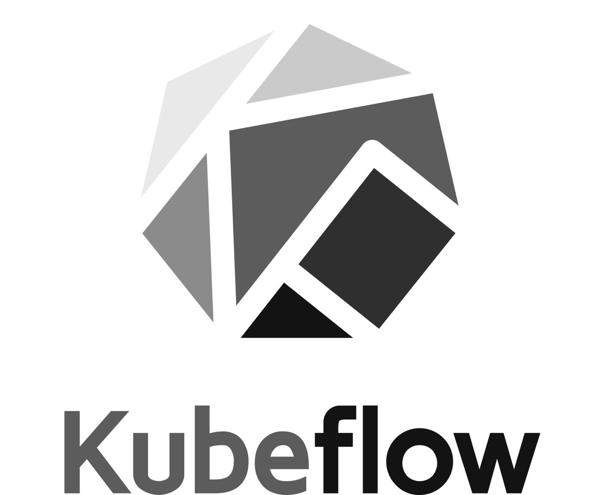
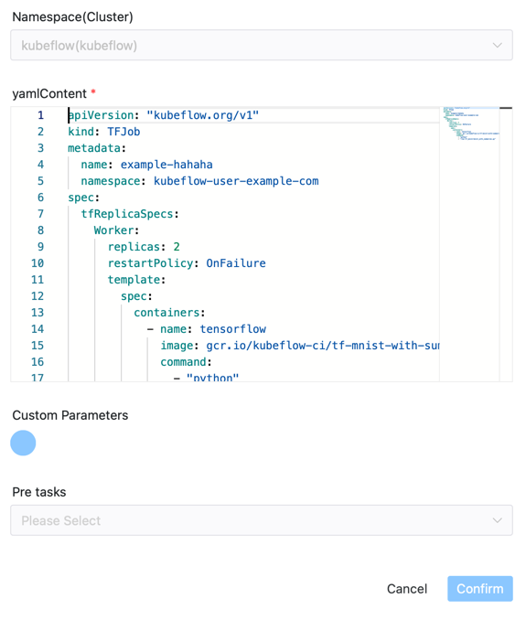

# Kubeflow 노드

## 개요

[Kubeflow](https://www.kubeflow.org) 작업 유형은 Kubeflow에서 작업을 생성하는 데 사용됩니다.

백엔드는 주로 `kubectl` 명령을 사용하여 kubeflow 작업을 생성하고 작업이 완료될 때까지 Kubeflow에서 리소스 상태를 계속 모니터링합니다.

이제 yaml 파일을 사용하여 kubeflow 작업 생성을 주로 지원합니다.`kubeflow Pipeline` 작업을 게시해야 하는 경우 [Python 작업 유형](./python.md)을 사용할 수 있습니다.

## 작업 생성

- '프로젝트 관리 -> 프로젝트 이름 -> 워크플로 정의'를 클릭한 후, '워크플로 생성' 버튼을 클릭하면 DAG 편집 페이지로 진입합니다.
- 툴바에서 를 캔버스로 드래그합니다.

## 작업 예

태스크 플러그인 그림은 다음과 같습니다



### 먼저 DolphinScheduler의 몇 가지 일반적인 매개변수를 소개합니다.

- 기본 매개변수는 [DolphinScheduler 작업 매개변수 부록](appendix.md) `기본 작업 매개변수` 섹션을 참조하세요.

### 다음은 Kubeflow 플러그인에 대한 몇 가지 특정 매개변수입니다.

- **네임스페이스**: 클러스터의 네임스페이스 매개변수
- **yamlContent**: CRD YAML 파일 콘텐츠, 예:```yaml
apiVersion: "kubeflow.org/v1"
kind: TFJob
metadata:
  name: tfjob-simple
  namespace: kubeflow-user-example-com
spec:
  tfReplicaSpecs:
    Worker:
      replicas: 2
      restartPolicy: OnFailure
      template:
        metadata:
          annotations:
            sidecar.istio.io/inject: "false"
        spec:
          containers:
            - name: tensorflow
              image: gcr.io/kubeflow-ci/tf-mnist-with-summaries:1.0
              command:
                - "python"
                - "/var/tf_mnist/mnist_with_summaries.py"
````

## 환경 구성

**Kubernetes 환경 구성**

[클러스터 관리 및 네임스페이스 관리](../security/security.md)를 참조하세요.

필수 필드만 입력하면 되고 나머지는 입력할 필요가 없습니다. 리소스 관리는 특정 Job의 YAML 파일 정의에 따라 다릅니다.

**kubectl**

[kubectl](https://kubernetes.io/docs/tasks/tools/install-kubectl-linux/)을 설치하고 `kubectl`이 정상적으로 kubeflow에 작업을 제출할 수 있는지 확인하세요.