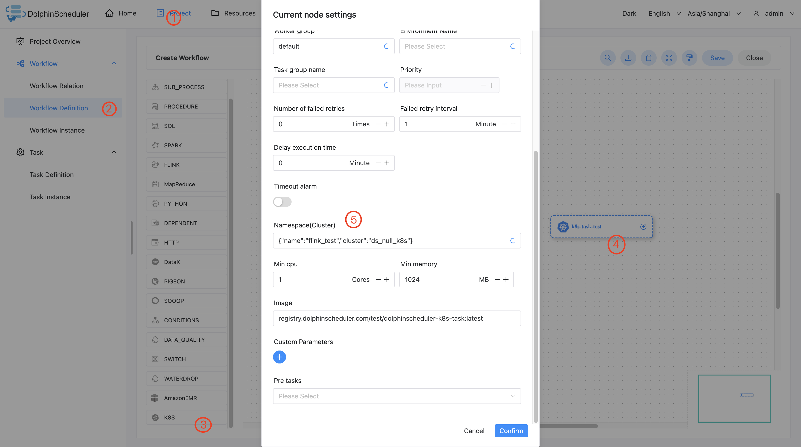

# K8S 노드

## 개요

일괄 작업을 실행하는 데 사용되는 K8S 작업 유형입니다.이 작업에서 작업자는 k8s 클라이언트를 사용하여 작업을 제출합니다.

## 작업 생성

- '프로젝트 관리 -> 프로젝트 이름 -> 워크플로 정의'를 클릭한 후, '워크플로 생성' 버튼을 클릭하면 DAG 편집 페이지로 진입합니다.
- 툴바 에서 캔버스로 드래그합니다.

## 작업 매개변수

[//]: # (TODO: 웹사이트 템플릿이 이 구문을 지원하면 아래에 주석이 달린 앵커를 사용하세요)
[//]: # (- 기본 매개변수는 [DolphinScheduler 작업 매개변수 부록]&#40;appendix.md#default-task-parameters&#41; `기본 작업 매개변수` 섹션을 참조하세요.)

- 기본 매개변수는 [DolphinScheduler 작업 매개변수 부록](appendix.md) `기본 작업 매개변수` 섹션을 참조하세요.|**매개변수** |**설명** |
|--------------------------------|---------------------------------------------------------------------------------------------------------------------------------------------------------------------------------------------------------------------------------------------------------|
|네임스페이스 |k8s 작업을 실행하기 위한 네임스페이스입니다.|
|최소 CPU |k8s 작업을 실행하기 위한 최소 CPU 요구 사항입니다.|
|최소 메모리 |k8s 작업을 실행하기 위한 최소 메모리 요구 사항입니다.|
|이미지 |이미지의 레지스트리 URL입니다.|
|이미지 가져오기 정책 |이미지에 대한 이미지 가져오기 정책입니다.|
|명령 |컨테이너 실행 명령(yaml 스타일 배열)(예: ["printenv"] |
|인수 |실행 명령의 인수(yaml 스타일 배열), 예: ["HOSTNAME", "KUBERNETES_PORT"] |
|맞춤 라벨 |k8s 작업에 대한 맞춤형 라벨입니다.|
|노드 선택기 |k8s Pod를 실행하기 위한 라벨 선택기입니다.값 세트의 다른 값은 쉼표로 구분해야 합니다(예: `value1,value2`).다양한 연산자 구성은 https://kubernetes.io/docs/reference/kubernetes-api/common-definitions/node-selector-requirement/를 참조할 수 있습니다.|
|맞춤 매개변수 |K8S 작업을 위한 로컬 사용자 정의 매개변수이며, 이러한 매개변수는 환경 변수로 컨테이너에 전달됩니다.|

## 작업 예

### DolphinScheduler에서 K8S 환경 구성

프로덕션 환경에서 K8S 작업 유형을 사용하는 경우 K8S 클러스터 환경이 필요합니다.

### K8S 노드 구성위의 매개변수 설명에 따라 필수 콘텐츠를 구성합니다.

## 참고

작업 이름에는 소문자 영숫자 또는 '-'만 포함됩니다.