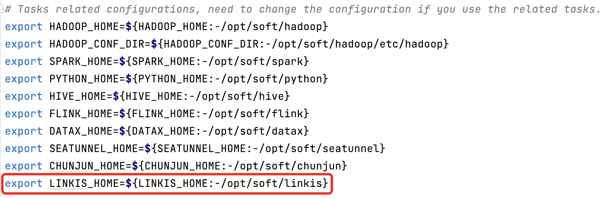
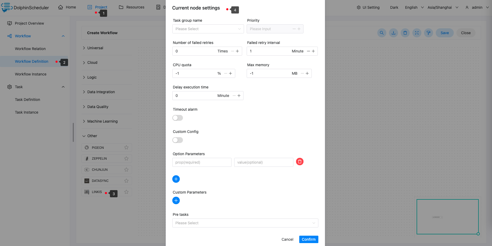

# 아파치 링키스

## 개요

`Linkis` 작업을 생성하고 실행하기 위한 `Linkis` 작업 유형입니다.작업자가 이 작업을 실행하면 `linkis-cli` 명령을 통해 셸 매개변수를 구문 분석합니다.
`Apache Linkis`에 대한 자세한 내용을 보려면 [여기](https://linkis.apache.org/)를 클릭하세요.

## 작업 생성

- 프로젝트 관리 -> 프로젝트 이름 -> 워크플로 정의를 클릭한 후 '워크플로 생성' 버튼을 클릭하면 DAG 편집 페이지로 진입합니다.
- 도구 모음에서 를 드로잉 보드로 드래그합니다.

## 작업 매개변수

[//]: # (TODO: 웹사이트 템플릿이 이 구문을 지원하면 아래에 주석이 달린 앵커를 사용하세요)
[//]: # (- 기본 매개변수는 [DolphinScheduler 작업 매개변수 부록]&#40;appendix.md#default-task-parameters&#41; `기본 작업 매개변수` 섹션을 참조하세요.)

- 기본 매개변수는 [DolphinScheduler 작업 매개변수 부록](appendix.md) `기본 작업 매개변수` 섹션을 참조하세요.
- Linkis 매개변수는 [Linkis-Cli 작업 매개변수](https://linkis.apache.org/zh-CN/docs/latest/user-guide/linkiscli-manual) `Linkis 지원 매개변수` 섹션을 참조하세요.

## 작업 예

이 샘플은 Spark 엔진을 사용하여 SQL 스크립트를 실행하는 방법을 보여줍니다.

### DolphinScheduler에서 Linkis 환경 구성

프로덕션 환경에서 Linkis 작업 유형을 사용하려면 먼저 필요한 환경을 구성해야 합니다.구성 파일은 `/dolphinscheduler/conf/env/dolphinscheduler_env.sh`입니다.



### Linkis 작업 노드 구성

위의 매개변수 설명에 따라 필요한 내용을 구성합니다.



### 구성 예```

sh ./bin/linkis-cli -engineType spark-2.4.3 -codeType sql -code "select count(*) from testdb.test;"  -submitUser hadoop -proxyUser hadoop 

````

### 주의

- 구성 열에 'sh ./bin/linkis-cli'를 입력할 필요가 없습니다. 미리 구성되어 있기 때문입니다.
- 기본 구성은 비동기 제출입니다.`--async` 매개변수를 구성할 필요가 없습니다.