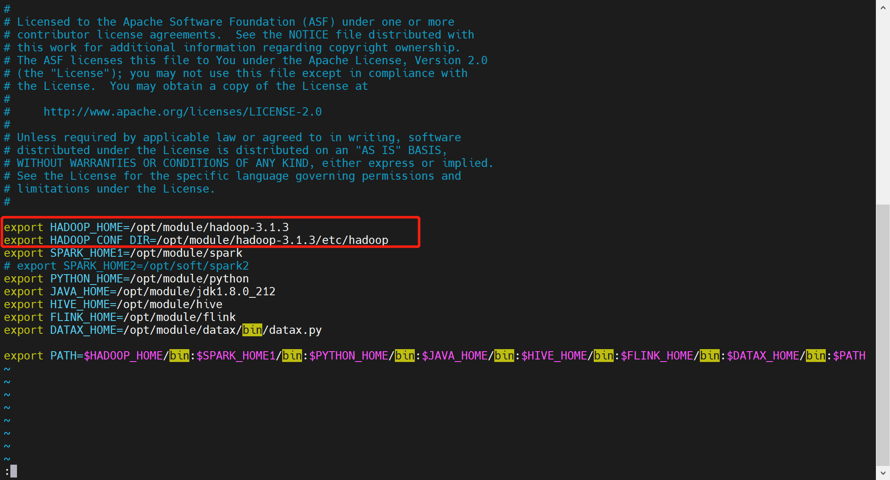
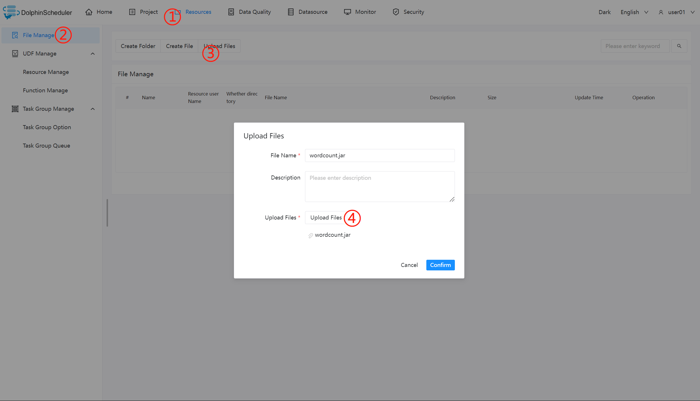
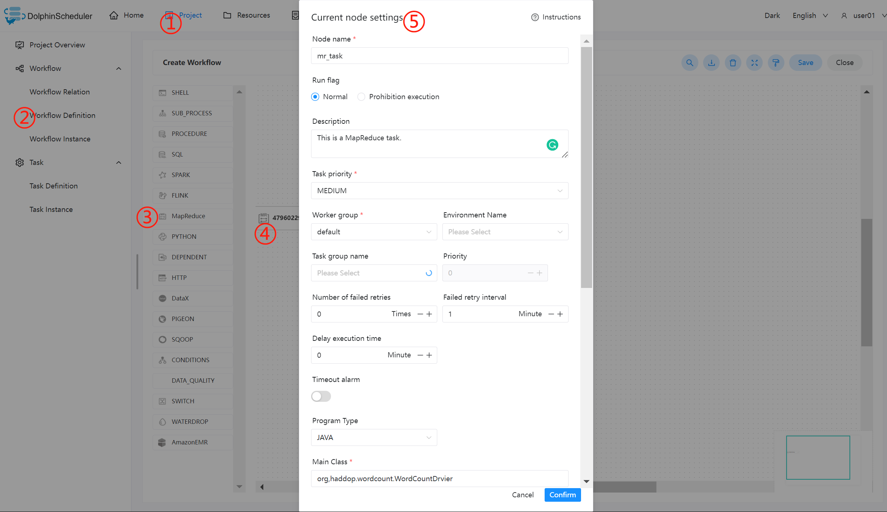

# 맵리듀스 노드

## 개요

MapReduce(MR) 작업 유형은 MapReduce 프로그램 실행에 사용됩니다.MapReduce 노드의 경우 작업자는 Hadoop 명령 'hadoop jar'를 사용하여 작업을 제출합니다.자세한 내용은 [Hadoop 명령 매뉴얼](https://hadoop.apache.org/docs/r3.2.4/hadoop-project-dist/hadoop-common/CommandsManual.html#jar)을 참조하세요.

## 작업 생성

- '프로젝트 관리 -> 프로젝트 이름 -> 워크플로 정의'를 클릭한 후, '워크플로 생성' 버튼을 클릭하면 DAG 편집 페이지로 진입합니다.
- 도구 모음 에서 캔버스로 드래그합니다.

## 작업 매개변수

[//]: # (TODO: 웹사이트 템플릿이 이 구문을 지원하면 아래에 주석이 달린 앵커를 사용하세요)
[//]: # (- 기본 매개변수는 [DolphinScheduler 작업 매개변수 부록]&#40;appendix.md#default-task-parameters&#41; `기본 작업 매개변수` 섹션을 참조하세요.)

- 기본 매개변수는 [DolphinScheduler 작업 매개변수 부록](appendix.md) `기본 작업 매개변수` 섹션을 참조하세요.

### 일반

|**매개변수** |**설명** |
|--------------------------------|-----------------------------------------------------------------------------------------|
|맞춤 매개변수 |MapReduce에 대한 로컬 사용자 정의 매개변수이며 스크립트에서 내용을 `${variable}`로 대체합니다.|

### JAVA 또는 SCALA 프로그램

|**매개변수** |**설명** |
|--------------------------------|-----------------------------------------------------------------------------------------|
|프로그램 유형 |JAVA 또는 SCALA 프로그램을 선택하세요.|
|주요 함수의 클래스 |MapReduce 프로그램의 진입점인 Main Class의 **전체 경로**입니다.|
|주요 항아리 패키지 |MapReduce 프로그램의 jar 패키지입니다.|
|작업 이름 |MapReduce 작업 이름입니다.|
|원사 대기열 |원사 대기열을 설정하는 데 사용되며 기본적으로 '기본' 대기열을 사용합니다.|
|명령줄 매개변수 |MapReduce 프로그램의 입력 매개변수를 설정하고 사용자 정의 매개변수 변수의 대체를 지원합니다.|
|기타 매개변수 |`-D`, `-files`, `-libjars`, `-archives` 형식을 지원합니다.|
|사용자 정의 매개변수 |MapReduce에 대한 로컬 사용자 정의 매개변수이며 스크립트에서 내용을 `${variable}`로 대체합니다.|

### 파이썬 프로그램|**매개변수** |**설명** |
|--------------------------------------|------------------------------------------------------------------------------------------------------------------------------------------------------------------------------------------------------------------------------------------------------------------------------------------------------------------------------------------------------------------------------------------------------|
|프로그램 유형 |Python 언어를 선택합니다.|
|주요 항아리 패키지 |MapReduce를 실행하기 위한 Python jar 패키지입니다.|
|기타 매개변수 |`-D`, `-mapper`, `-reducer,` `-input` `-output` 형식을 지원하고 다음과 같은 사용자 정의 매개변수의 입력을 설정할 수 있습니다.<ul><li>`-mapper "mapper.py 1"` `-file mapper.py` `-reducer Reducer.py` `-file Reducer.py` `–input /journey/words.txt` `-output/journey/out/mr/${currentTimeMillis}`</li><li>`-mapper` 뒤의 `mapper.py 1`은 두 개의 매개변수이며 첫 번째 매개변수는 `mapper.py`이고 두 번째 매개변수는 `1`입니다.</li></ul> |
|사용자 정의 매개변수 |MapReduce에 대한 로컬 사용자 정의 매개변수이며 스크립트에서 내용을 `${variable}`로 대체합니다.|

## 작업 예

### WordCount 프로그램 실행

이 예는 입력 텍스트에서 동일한 단어 수를 계산하는 데 사용되는 MapReduce 애플리케이션의 일반적인 입문 유형입니다.

#### DolphinScheduler에서 MapReduce 환경 구성

프로덕션 환경에서 MapReduce 작업 유형을 사용하는 경우 먼저 필요한 환경을 구성해야 합니다.다음은 구성 파일입니다: `bin/env/dolphinscheduler_env.sh`.

#### 메인 패키지 업로드

MapReduce 작업 노드를 사용하는 경우 리소스 센터를 사용하여 실행을 위한 jar 패키지를 업로드해야 합니다.[리소스 센터](../resource/configuration.md)를 참조하세요.

리소스 센터 구성을 마친 후 필요한 대상 파일을 드래그 앤 드롭으로 직접 업로드하세요.

#### MapReduce 노드 구성

위의 매개변수 설명에 따라 필수 콘텐츠를 구성합니다.

