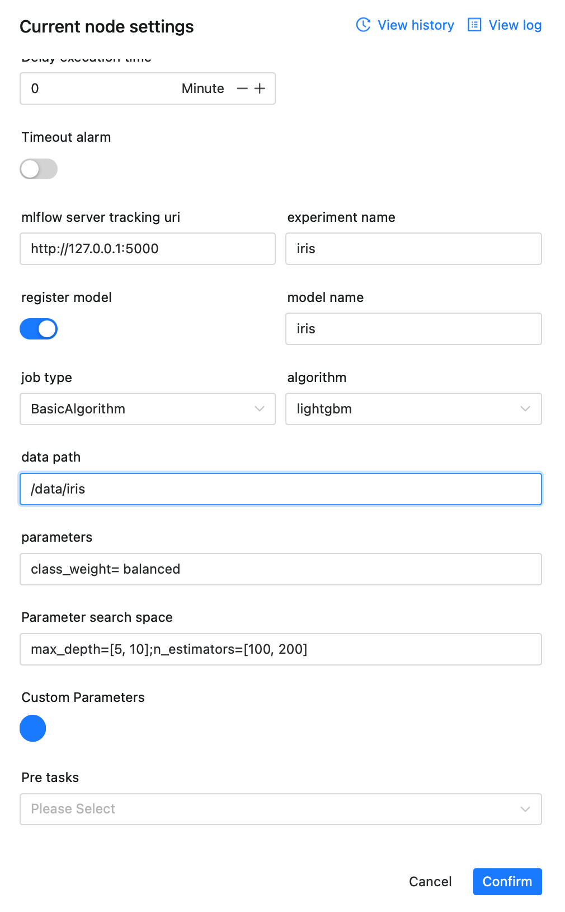
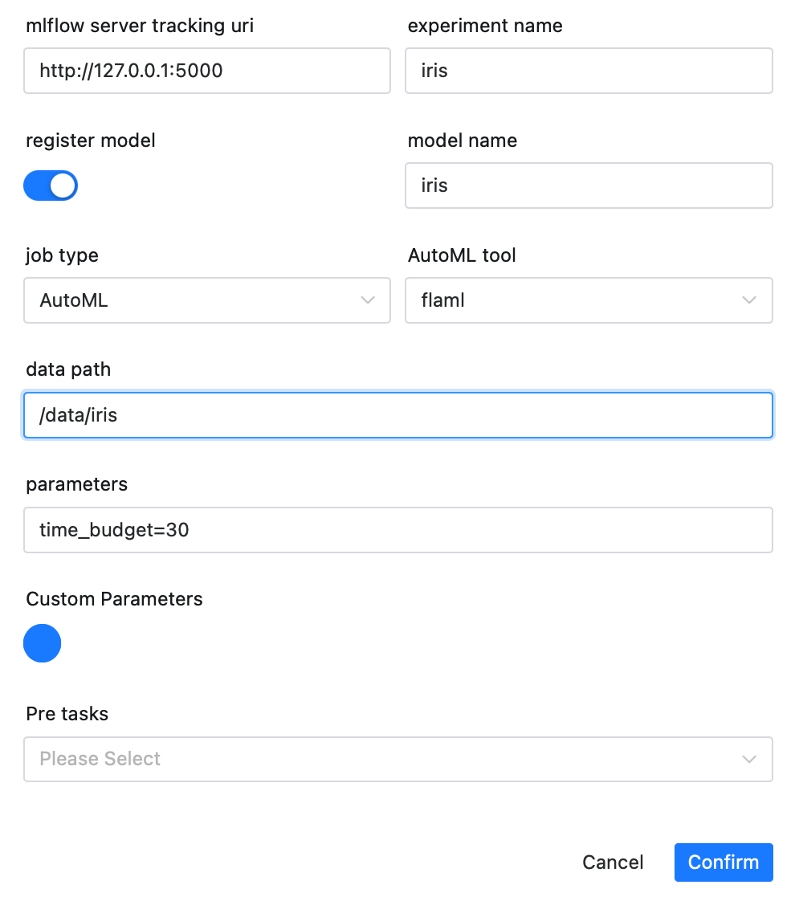
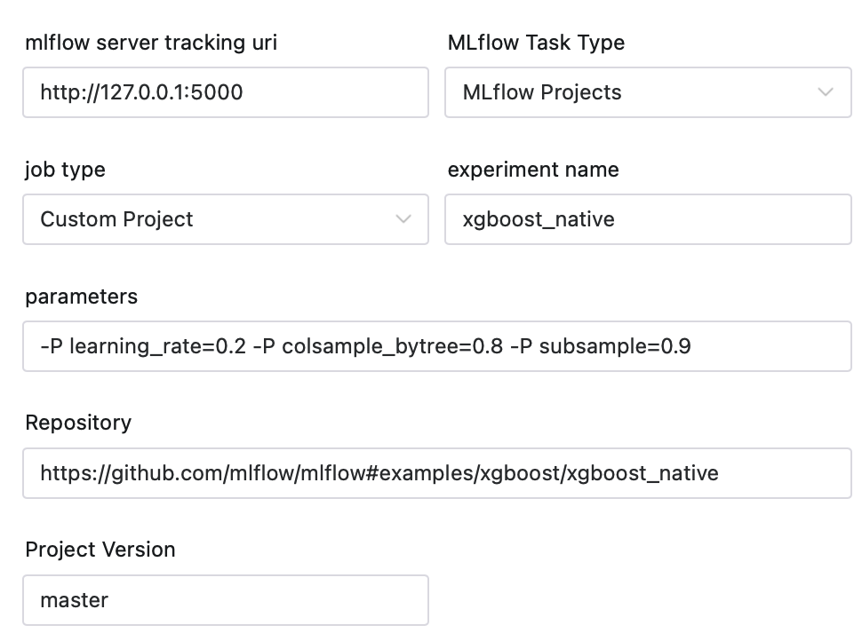
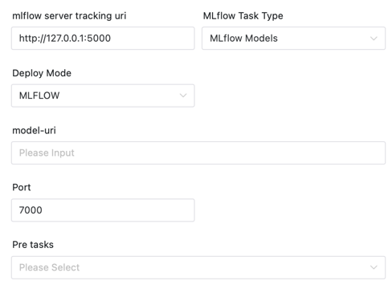
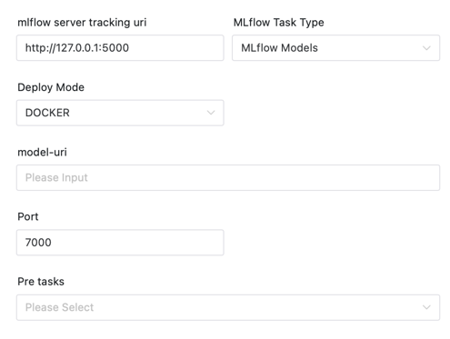
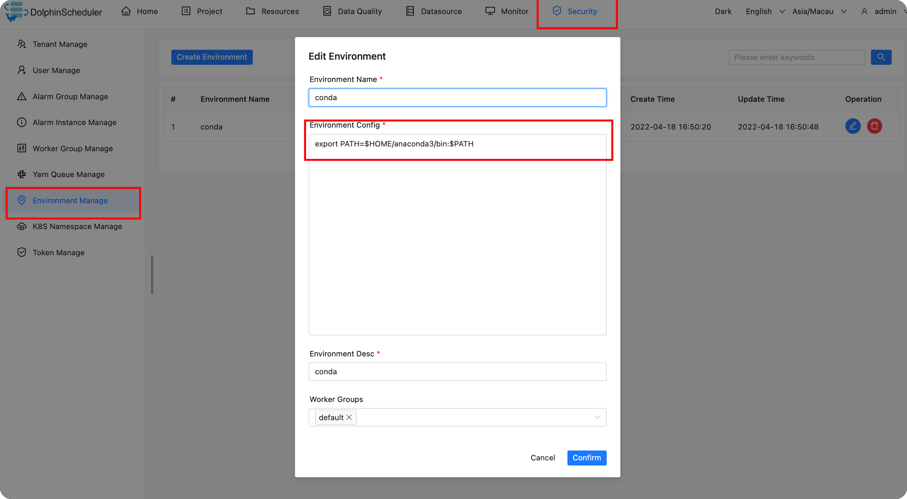
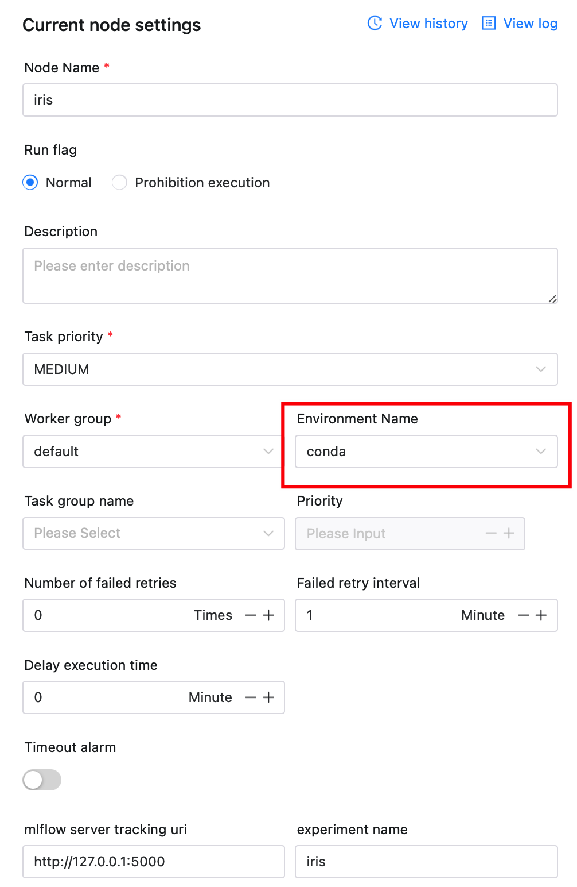
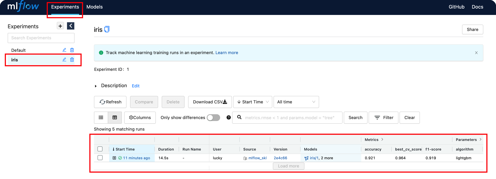

# MLflow 노드

## 개요

[MLflow](https://mlflow.org)는 실험,
재현성, 배포 및 중앙 모델 레지스트리.

MLflow 작업을 실행하는 데 사용되는 MLflow 작업 플러그인에는 현재 MLflow 프로젝트 및 MLflow 모델이 포함되어 있습니다.(모델 레지스트리는 곧 지원에 대한 보상을 받을 예정입니다)

- MLflow 프로젝트: 모든 플랫폼에서 실행을 재현할 수 있는 형식으로 데이터 과학 코드를 패키지합니다.
- MLflow 모델: 다양한 서비스 환경에 기계 학습 모델을 배포합니다.
- 모델 레지스트리: 중앙 저장소에서 모델을 저장하고, 주석을 달고, 검색하고, 관리합니다.

MLflow 플러그인은 현재 다음을 지원하며 앞으로도 지원할 예정입니다.

- MLflow 프로젝트
- 기본 알고리즘: LogisticRegression, svm, lightgbm, xgboost 포함
- AutoML: AutoML 도구, autosklean, flaml 포함
- 사용자 정의 프로젝트: 자체 MLflow 프로젝트 실행 지원
- MLflow 모델
- MLFLOW: 'MLflow models Serve'를 사용하여 모델 서비스 배포
- Docker: Docker 이미지를 패키징한 후 컨테이너를 실행합니다.

## 작업 생성

- '프로젝트 관리 -> 프로젝트 이름 -> 워크플로 정의'를 클릭한 후, '워크플로 생성' 버튼을 클릭하면 DAG 편집 페이지로 진입합니다.
- 도구 모음  작업 노드에서 캔버스로 드래그합니다.

## 작업 매개변수 및 예

[//]: # (TODO: 웹사이트 템플릿이 이 구문을 지원하면 아래에 주석이 달린 앵커를 사용하세요)
[//]: # (- 기본 매개변수는 [DolphinScheduler 작업 매개변수 부록]&#40;appendix.md#default-task-parameters&#41; `기본 작업 매개변수` 섹션을 참조하세요.)

- 기본 매개변수는 [DolphinScheduler 작업 매개변수 부록](appendix.md) `기본 작업 매개변수` 섹션을 참조하세요.

|**매개변수** |**설명** |
|---------------|-----------------------------------------------------------------------------------------------------------------------------------------|
|MLflow 추적 서버 URI |MLflow 추적 서버 URI, 기본값은 http://localhost:5000입니다.|
|실험명 |실험이 존재하지 않는 경우 작업이 실행 중인 실험을 만듭니다.이름이 비어 있으면 MLflow와 동일하게 `Default`로 설정됩니다.|

### MLflow 프로젝트

#### 기본 알고리즘



**작업 매개변수**|     **Parameter**      |                                                                                                                                                                                                                                                                                                                                                                                                                                                                 **Description**                                                                                                                                                                                                                                                                                                                                                                                                                                                                 |
|------------------------|-------------------------------------------------------------------------------------------------------------------------------------------------------------------------------------------------------------------------------------------------------------------------------------------------------------------------------------------------------------------------------------------------------------------------------------------------------------------------------------------------------------------------------------------------------------------------------------------------------------------------------------------------------------------------------------------------------------------------------------------------------------------------------------------------------------------------------------------------------------------------------------------------------------------------------------------------|
| Register Model         | Register the model or not. If register is selected, the following parameters are expanded.                                                                                                                                                                                                                                                                                                                                                                                                                                                                                                                                                                                                                                                                                                                                                                                                                                                      |
| Model Name             | The registered model name is added to the original model version and registered as Production.                                                                                                                                                                                                                                                                                                                                                                                                                                                                                                                                                                                                                                                                                                                                                                                                                                                  |
| Data Path              | The absolute path of the file or folder. Ends with .csv for file or contain train.csv and test.csv for folder（In the suggested way, users should build their own test sets for model evaluation.                                                                                                                                                                                                                                                                                                                                                                                                                                                                                                                                                                                                                                                                                                                                                |
| Parameters             | Parameter when initializing the algorithm/AutoML model, which can be empty. For example, parameters `"time_budget=30;estimator_list=['lgbm']"` for flaml. The convention will be passed with '; ' shards each parameter, using the name before the equal sign as the parameter name, and using the name after the equal sign to get the corresponding parameter value through `python eval()`. <ul><li>[Logistic Regression](https://scikit-learn.org/stable/modules/generated/sklearn.linear_model.LogisticRegression.html#sklearn.linear_model.LogisticRegression)</li><li>[SVM](https://scikit-learn.org/stable/modules/generated/sklearn.svm.SVC.html?highlight=svc#sklearn.svm.SVC)</li><li>[lightgbm](https://lightgbm.readthedocs.io/en/latest/pythonapi/lightgbm.LGBMClassifier.html#lightgbm.LGBMClassifier)</li><li>[xgboost](https://xgboost.readthedocs.io/en/release_3.0.0/python/python_api.html#xgboost.XGBClassifier)</li></ul> |
| Algorithm              | The selected algorithm currently supports `LR`, `SVM`, `LightGBM` and `XGboost` based on [scikit-learn](https://scikit-learn.org/) form.                                                                                                                                                                                                                                                                                                                                                                                                                                                                                                                                                                                                                                                                                                                                                                                                        |
| Parameter Search Space | Parameter search space when running the corresponding algorithm, which can be empty. For example, the parameter `max_depth=[5, 10];n_estimators=[100, 200]` for lightgbm. The convention will be passed with '; 'shards each parameter, using the name before the equal sign as the parameter name, and using the name after the equal sign to get the corresponding parameter value through `python eval()`.                                                                                                                                                                                                                                                                                                                                                                                                                                                                                                                                   |#### AutoML



**작업 매개변수**|**매개변수** |**설명** |
|----------------|-----------------------------------------------------------------------------------------------------------------------------------------------------------------------------------------------------------------------------------------------------------------------------------------------------------------------------------------------------------------------------------------------------------------------------------------------------------------------------------------------------------------------------------------|
|모델 등록 |모델 등록 여부.레지스터를 선택하면 다음 매개변수가 확장됩니다.|
|모델 이름 |등록된 모델명이 원본 모델 버전에 추가되어 제작으로 등록됩니다.|
|데이터 경로 |파일이나 폴더의 절대 경로입니다.파일의 경우 .csv로 끝나거나 폴더의 경우 train.csv 및 test.csv를 포함합니다(제안된 방법에서는 사용자가 모델 평가를 위해 자체 테스트 세트를 구축해야 함).|
|매개변수 |알고리즘/AutoML 모델을 초기화할 때의 매개변수이며 비어 있을 수 있습니다.예를 들어 flaml의 경우 매개변수 `n_estimators=200;learning_rate=0.2`입니다.규칙은 ';'는 등호 앞의 이름을 매개변수 이름으로 사용하고, 등호 뒤의 이름을 사용하여 `python eval()`을 통해 해당 매개변수 값을 가져오는 방식으로 각 매개변수를 샤딩합니다.자세한 매개변수 목록은 다음과 같습니다. <ul><li>[flaml](https://microsoft.github.io/FLAML/docs/Use-Cases/Task-Oriented-AutoML)</li><li>[autosklearn](https://automl.github.io/auto-sklearn/master/api.html)</li></ul> |
|AutoML 도구 |사용된 AutoML 도구는 현재 [autosklearn](https://github.com/automl/auto-sklearn) 및 [flaml](https://github.com/microsoft/FLAML)을 지원합니다.|#### 맞춤 프로젝트



**작업 매개변수**

|**매개변수** |**설명** |
|-----------------|-------------------------------------------------------------------------------------------------------------------------------------------------------------------------------------------------------------------------------|
|매개변수 |`mlflow run`의 `--param-list`.예를 들어 `-P learning_rate=0.2 -P colsample_bytree=0.8 -P subsample=0.9`입니다.|
|저장소 |MLflow 프로젝트의 리포지토리 URL, 작업자의 Git 주소 및 디렉터리를 지원합니다.하위 디렉터리에 있는 경우 이를 지원하기 위해 `#`을 추가합니다(`mlflow run`과 동일). 예: `https://github.com/mlflow/mlflow#examples/xgboost/xgboost_native`.|
|프로젝트 버전 |프로젝트 버전, 기본 마스터.|

이제 이 기능을 사용하여 GitHub에서 모든 MLFlow 프로젝트를 실행할 수 있습니다(예: [MLflow 예제](https://github.com/mlflow/mlflow/tree/master/examples) ).또한 자신만의 기계 학습 라이브러리를 만들어 작업을 재사용한 다음 DolphinScheduler를 사용하여 한 번의 클릭으로 라이브러리를 사용할 수도 있습니다.

### MLflow 모델

**일반 매개변수**

|**매개변수** |**설명** |
|---------------|----------------------------------------------------------------------------------------------------------------------------|
|모델-URI |MLflow의 모델-URI는 `models:/<model_name>/suffix` 형식과 `runs:/` 형식을 지원합니다.https://mlflow.org/docs/latest/tracking.html#artifact-stores |
|포트 |수신할 포트입니다.|

#### MLflow



#### 도커



## 준비해야 할 환경

### 콘다 환경

[anaconda](https://docs.continuum.io/anaconda/install/) 또는 [miniconda](https://docs.conda.io/en/latest/miniconda.html#installing)를 미리 설치해 주세요.

**방법 A:**

`/dolphinscheduler/conf/env/dolphinscheduler_env.sh`에서 아나콘다 환경을 구성합니다.

파일에 다음 콘텐츠를 추가합니다.```bash
# config anaconda environment
export PATH=/opt/anaconda3/bin:$PATH
````

**방법 B:**

Conda 환경 변수를 구성하려면 관리자 계정을 입력해야 합니다.



참고 구성 작업 중에 위에서 생성한 Conda 환경을 선택합니다.그렇지 않으면 프로그램이 해당 항목을 찾을 수 없습니다.
콘다 환경.



### MLflow 서비스 시작

'pip install mlflow'를 사용하여 MLflow를 설치했는지 확인하세요.

실험과 모델을 저장할 폴더를 만들고 MLflow 서비스를 시작하세요.```sh
mkdir mlflow
cd mlflow
mlflow server -h 0.0.0.0 -p 5000 --serve-artifacts --backend-store-uri sqlite:///mlflow.db
````

실행 후 MLflow 서비스가 시작됩니다.

그런 다음 MLflow 서비스(`http://localhost:5000`) 페이지를 방문하여 실험과 모델을 볼 수 있습니다.



### 사전 설정된 알고리즘 저장소 구성

github에 액세스할 수 없는 경우 `common.properties` 구성 파일에서 다음 필드를 수정하여 github 주소를 액세스 가능한 주소로 바꿀 수 있습니다.```yaml
# mlflow task plugin preset repository
ml.mlflow.preset_repository=https://github.com/apache/dolphinscheduler-mlflow
# mlflow task plugin preset repository version
ml.mlflow.preset_repository_version="main"
````