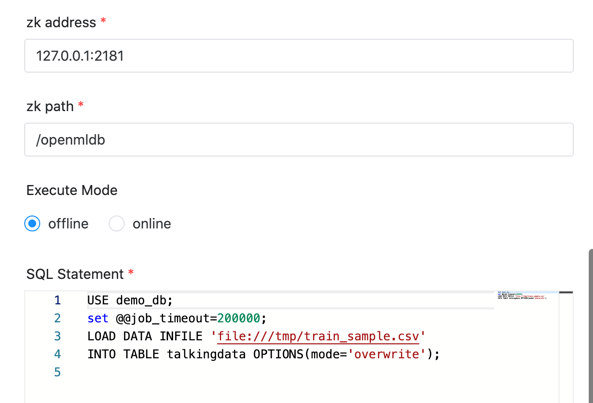
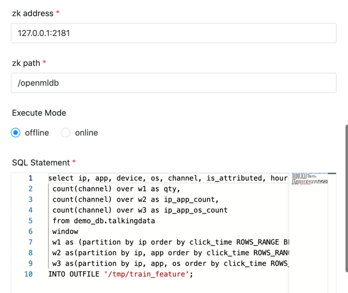

# OpenMLDB 노드

## 개요

[OpenMLDB](https://openmldb.ai/)는 풀스택을 제공하는 뛰어난 오픈소스 기계 학습 데이터베이스입니다.
프로덕션을 위한 FeatureOps 솔루션입니다.

OpenMLDB 클러스터에서 작업을 실행하는 데 사용되는 OpenMLDB 작업 플러그인입니다.

## 작업 생성

- '프로젝트 관리 -> 프로젝트 이름 -> 워크플로 정의'를 클릭한 후, '워크플로 생성' 버튼을 클릭하면 DAG 편집 페이지로 진입합니다.
- 도구 모음  작업 노드에서 캔버스로 드래그합니다.

## 작업 매개변수

[//]: # (TODO: 웹사이트 템플릿이 이 구문을 지원하면 아래에 주석이 달린 앵커를 사용하세요)
[//]: # (- 기본 매개변수는 [DolphinScheduler 작업 매개변수 부록]&#40;appendix.md#default-task-parameters&#41; `기본 작업 매개변수` 섹션을 참조하세요.)

- 기본 매개변수는 [DolphinScheduler 작업 매개변수 부록](appendix.md) `기본 작업 매개변수` 섹션을 참조하세요.

|**매개변수** |**설명** |
|------|-----------------------------------------------------------------------------------|
|사육사 |OpenMLDB 클러스터 사육사 주소(예:127.0.0.1:2181.|
|사육사 경로 |OpenMLDB 클러스터 사육사 경로(예:/openmldb.|
|실행 모드 |초기화 모드(오프라인 또는 온라인)를 결정합니다.SQL 문에서 전환할 수 있습니다.|
|SQL문 |SQL문.|
|맞춤 매개변수 |스크립트의 내용을 \${variable} 로 바꾸는 Python의 사용자 정의 매개변수입니다.|

## 작업 예

### 데이터 로드

우리는 'LOAD DATA'를 사용하여 OpenMLDB 클러스터에 데이터를 로드합니다.여기서 '오프라인'을 선택하면 오프라인 저장소에 로드됩니다.

### 특징 추출

특징 추출을 위해 `SELECT INTO`를 사용합니다.여기서는 `오프라인`을 선택하므로 오프라인 엔진에서 SQL이 실행됩니다.

### 준비해야 할 환경

#### OpenMLDB 클러스터 시작

먼저 OpenMLDB 클러스터를 생성해야 합니다.프로덕션 환경인 경우 [OpenMLDB 배포](https://openmldb.ai/docs/en/v0.5/deploy/install_deploy.html)를 확인하세요.

[docker에서 OpenMLDB 실행](https://openmldb.ai/docs/zh/v0.5/quickstart/openmldb_quickstart.html#id11)을 따를 수 있습니다.
빠른 시작을 위해.

#### Python 환경

OpenMLDB 작업은 OpenMLDB Python SDK를 사용하여 OpenMLDB 클러스터를 연결합니다.따라서 Python 환경이 있어야 합니다.

기본적으로 `python3`을 사용하겠습니다.사용자 정의 Python 환경을 사용하도록 `PYTHON_LAUNCHER`를 설정할 수 있습니다.

`pip install openmldb`를 사용하여 작업자 서버가 실행 중인 호스트에 OpenMLDB Python SDK를 설치했는지 확인하세요.