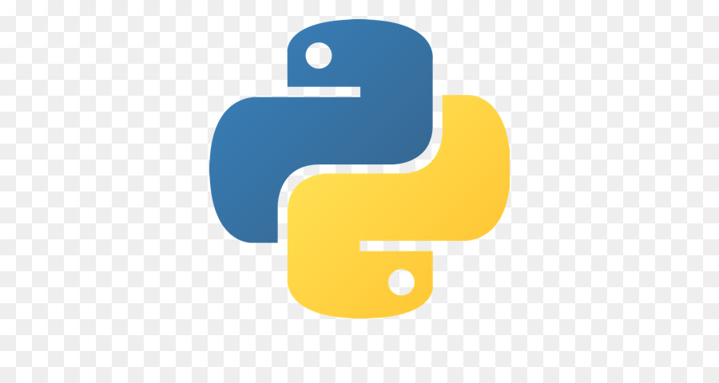
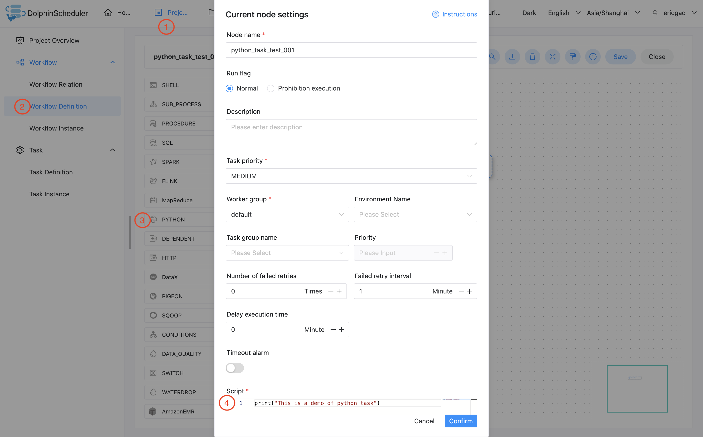
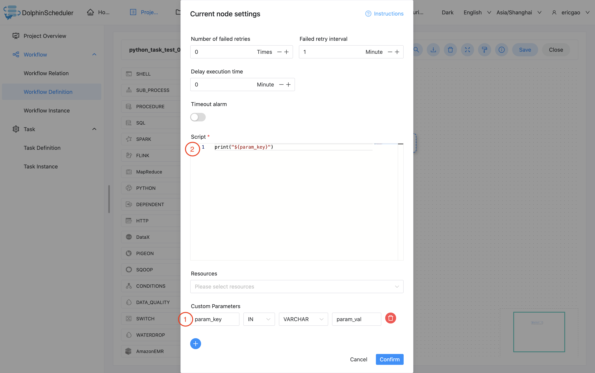

# 파이썬 노드

## 개요

`Python Task`를 사용하여 Python 유형의 작업을 생성하고 Python 스크립트를 실행합니다.작업자가 `Python Task`를 실행하면,
임시 Python 스크립트를 생성하고 테넌트와 동일한 이름을 가진 Linux 사용자가 스크립트를 실행합니다.

## 작업 생성

- '프로젝트 관리 -> 프로젝트 이름 -> 워크플로 정의'를 클릭한 후, '워크플로 생성' 버튼을 클릭하면 DAG 편집 페이지로 진입합니다.
- 도구 모음에서 를 캔버스로 드래그합니다.

## 작업 매개변수

[//]: # (TODO: 웹사이트 템플릿이 이 구문을 지원하면 아래에 주석이 달린 앵커를 사용하세요)
[//]: # (- 기본 매개변수는 [DolphinScheduler 작업 매개변수 부록]&#40;appendix.md#default-task-parameters&#41; `기본 작업 매개변수` 섹션을 참조하세요.)

- 기본 매개변수는 [DolphinScheduler 작업 매개변수 부록](appendix.md) `기본 작업 매개변수` 섹션을 참조하세요.

|**매개변수** |**설명** |
|------|-----------------------------------------------------------------------------------|
|스크립트 |사용자가 개발한 Python 프로그램입니다.|
|맞춤 매개변수 |스크립트의 내용을 \${variable} 로 바꾸는 Python의 사용자 정의 매개변수입니다.|

## 작업 예

### 간단히 인쇄하기

이 예에서는 간단한 명령으로 실행되는 일반적인 작업을 시뮬레이션합니다.예는 다음 그림과 같이 로그 파일의 한 줄을 인쇄하는 것입니다.
"이것은 Python 작업의 데모입니다."

```python
print("This is a demo of python task")
````

### 맞춤 매개변수

이 예에서는 사용자 지정 매개변수 작업을 시뮬레이션합니다.기존 작업을 템플릿으로 재사용하거나 동적 작업에 대처하기 위해 매개변수를 사용합니다.이 경우,
"param_val" 값을 사용하여 "param_key"라는 사용자 정의 매개변수를 선언합니다.그런 다음 echo를 사용하여 방금 선언한 "${param_key}" 매개변수를 인쇄합니다.
이 예제를 실행하면 로그에 "param_val"이 인쇄되는 것을 볼 수 있습니다.

```python
print("${param_key}")
````