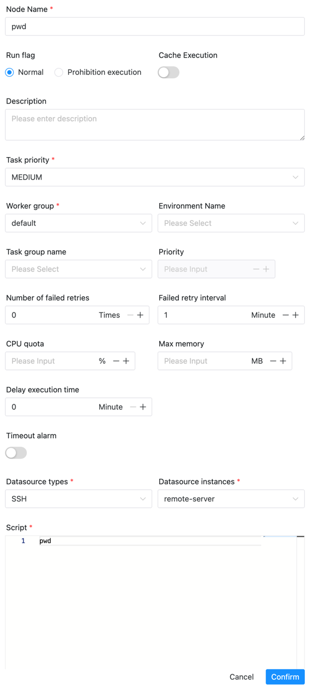

# 리모트쉘

## 개요

RemoteShell 작업 유형은 원격 서버에서 명령을 실행하는 데 사용됩니다.

## 작업 생성

- 프로젝트 관리-프로젝트 이름-워크플로 정의를 클릭한 후 "워크플로 생성" 버튼을 클릭하면 DAG 편집 페이지로 진입합니다.

- 툴바에서 를 캔버스로 드래그하여 생성을 완료합니다.

## 작업 매개변수

[//]: # (TODO: 웹사이트 템플릿이 이 구문을 지원하면 아래에 주석이 달린 앵커를 사용하세요)
[//]: # (- 기본 매개변수는 [DolphinScheduler 작업 매개변수 부록]&#40;appendix.md#default-task-parameters&#41; `기본 작업 매개변수` 섹션을 참조하세요.)

- 기본 매개변수는 [DolphinScheduler 작업 매개변수 부록](appendix.md) `기본 작업 매개변수` 섹션을 참조하세요.
- SSH 데이터 소스: SSH 데이터 소스를 선택합니다.

## 작업 예

### 원격 서버의 경로 보기(remote-server)

## 주의사항

작업이 서버에 연결된 후에는 bashrc 및 기타 파일을 자동으로 소스로 제공하지 않습니다.필수 환경 변수는 다음과 같은 방법으로 가져올 수 있습니다.
- 보안센터-환경관리에서 환경변수를 생성한 후, 작업 정의의 환경 옵션을 통해 가져옵니다.
- 해당 환경변수를 스크립트에 직접 입력