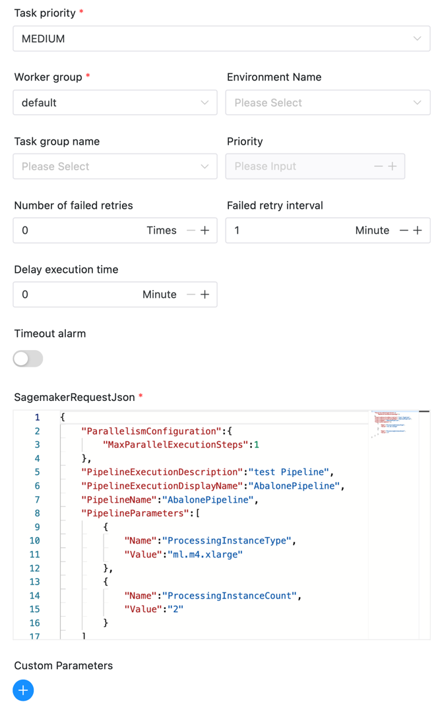

# SageMaker 노드

## 개요

[Amazon SageMaker](https://docs.aws.amazon.com/sagemaker/index.html)는 완전 관리형 기계 학습 서비스입니다.Amazon SageMaker를 사용하면 데이터 과학자와 개발자는 기계 학습 모델을 신속하게 구축 및 훈련한 다음 이를 프로덕션에 바로 사용할 수 있는 호스팅 환경에 배포할 수 있습니다.

[Amazon SageMaker 모델 구축 파이프라인](https://docs.aws.amazon.com/sagemaker/latest/dg/pipelines.html)은 SageMaker 직접 통합을 활용하는 기계 학습 파이프라인을 구축하기 위한 도구입니다.

빅 데이터 및 기계 학습을 사용하는 사용자의 경우 SageMaker 작업 플러그인은 사용자가 빅 데이터 워크플로를 SageMaker 사용 시나리오와 연결하는 데 도움이 됩니다.

DolphinScheduler SageMaker 작업 플러그인 기능은 다음과 같습니다.

- SageMaker 파이프라인 실행을 시작합니다.파이프라인 실행이 완료될 때까지 계속해서 실행 상태를 가져옵니다.

## 작업 생성

- `프로젝트 -> 관리-프로젝트 -> 이름-워크플로우 정의`를 클릭한 후 "워크플로우 생성" 버튼을 클릭하여 입력합니다.
DAG 편집 페이지.
- 도구 모음  작업 노드에서 캔버스로 드래그합니다.

## 작업 예

[//]: # (TODO: 웹사이트 템플릿이 이 구문을 지원하면 아래에 주석이 달린 앵커를 사용하세요)
[//]: # (- 기본 매개변수는 [DolphinScheduler 작업 매개변수 부록]&#40;appendix.md#default-task-parameters&#41; `기본 작업 매개변수` 섹션을 참조하세요.)

- 기본 매개변수는 [DolphinScheduler 작업 매개변수 부록](appendix.md) `기본 작업 매개변수` 섹션을 참조하세요.

다음은 SagaMaker 플러그인에 대한 몇 가지 특정 매개변수입니다.

- **SagemakerRequestJson**: StartPipelineExecution의 요청 매개변수, [AWS API](https://docs.aws.amazon.com/sagemaker/latest/APIReference/API_StartPipelineExecution.html)도 참조하세요.

작업 플러그인은 다음과 같이 표시됩니다.



## 준비해야 할 환경

일부 AWS 구성이 필요합니다. `aws.yaml` 파일의 필드를 수정하세요.```yaml
sagemaker:
  # The AWS credentials provider type. support: AWSStaticCredentialsProvider, InstanceProfileCredentialsProvider
  # AWSStaticCredentialsProvider: use the access key and secret key to authenticate
  # InstanceProfileCredentialsProvider: use the IAM role to authenticate
  credentials.provider.type: AWSStaticCredentialsProvider
  access.key.id: <access.key.id>
  access.key.secret: <access.key.secret>
  region: <region>
  endpoint: <endpoint>
````