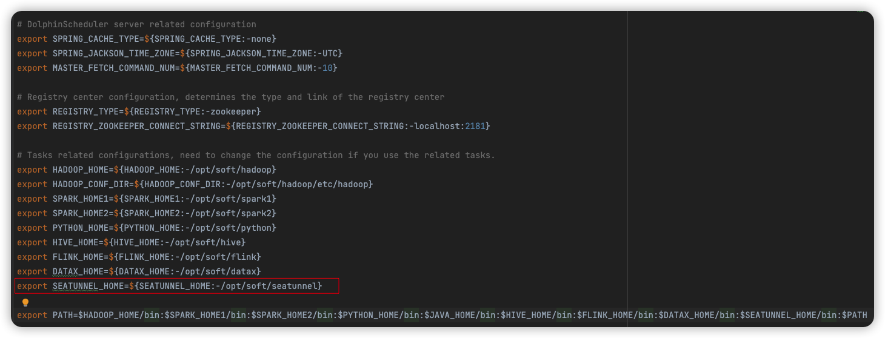
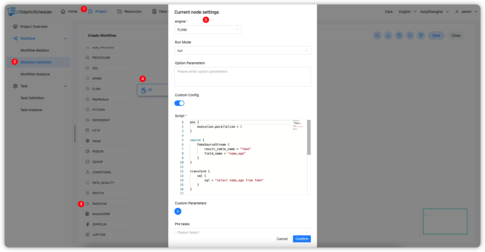

# 아파치 SeaTunnel

## 개요

`SeaTunnel` 작업을 생성하고 실행하기 위한 `SeaTunnel` 작업 유형입니다.작업자가 이 작업을 실행하면 'start-seatunnel-spark.sh', 'start-seatunnel-flink.sh' 또는 'seatunnel.sh' 명령을 통해 구성 파일을 구문 분석합니다.
`Apache SeaTunnel`에 대한 자세한 내용을 보려면 [여기](https://seatunnel.apache.org/)를 클릭하세요.

## 작업 생성

- 프로젝트 관리 -> 프로젝트 이름 -> 워크플로 정의를 클릭한 후 '워크플로 생성' 버튼을 클릭하면 DAG 편집 페이지로 진입합니다.
- 도구 모음에서 를 드로잉 보드로 드래그합니다.

## 작업 매개변수

[//]: # (TODO: 웹사이트 템플릿이 이 구문을 지원하면 아래에 주석이 달린 앵커를 사용하세요)
[//]: # (- 기본 매개변수는 [DolphinScheduler 작업 매개변수 부록]&#40;appendix.md#default-task-parameters&#41; `기본 작업 매개변수` 섹션을 참조하세요.)

- 기본 매개변수는 [DolphinScheduler 작업 매개변수 부록](appendix.md) `기본 작업 매개변수` 섹션을 참조하세요.
- 시작 스크립트: `seatunnel.sh`, `start-seatunnel-flink-13-connector-v2.sh`, `start-seatunnel-flink-15-connector-v2.sh`, `start-seatunnel-flink-connector-v2.sh`, `start-seatunnel-flink.sh`를 포함하여 작업을 시작하는 스크립트 이름을 선택합니다.`start-seatunnel-spark-2-connector-v2.sh`, `start-seatunnel-spark-3-connector-v2.sh`, `start-seatunnel-spark-connector-v2.sh`, `start-seatunnel-spark.sh`
- 플링크
- 실행 모델: 'run' 및 'run-application' 모드 지원
- 옵션 매개변수: `-m Yarn-cluster -ynm Seatunnel`과 같은 Flink 엔진의 매개변수를 추가하는 데 사용됩니다.
- 스파크
- 배포 모드: 배포 모드 `cluster` `client`를 지정합니다.
- 마스터: `Master` 모델, `yarn` `local` `spark` `mesos`를 지정합니다. 여기서 `spark` 및 `mesos`는 `Master` 서비스 주소를 지정해야 합니다(예: 127.0.0.1:7077).
- SEATUNNEL_ENGINE
- 배포 모드: 배포 모드 `cluster` `local`을 지정합니다.

> Apache SeaTunnel 명령어 사용법에 대한 자세한 내용을 보려면 [여기](https://seatunnel.apache.org/docs/command/usage)를 클릭하세요.

- 사용자 정의 구성: 사용자 정의 구성을 지원하거나 리소스 센터에서 구성 파일을 선택합니다.

> `Apache SeaTunnel config` 파일에 대한 자세한 내용을 보려면 [여기](https://seatunnel.apache.org/docs/concept/config)를 클릭하세요.

- 스크립트: `env` `source` `transform` `sink` 네 부분을 포함하여 작업 노드에 대한 구성 정보를 사용자 지정합니다.
- 사용자 정의 매개변수/전역 매개변수: 사용자 정의 매개변수/전역 매개변수가 정의되면 해당 매개변수가 SeaTunnel 작업으로 전달되며, SeaTunnel 작업에서 `${}`로 매개변수를 참조하여 작업 실행 중에 매개변수 값을 동적으로 대체할 수 있습니다.

> `Apache SeaTunnel 변수 대체`에 대한 자세한 내용은 [여기](https://seatunnel.apache.org/docs/concept/config/#config-variable-substitution)를 클릭하세요.

## 작업 예

이 샘플은 Flink 엔진을 사용하여 가짜 소스에서 데이터를 읽고 콘솔에 인쇄하는 방법을 보여줍니다.

### DolphinScheduler에서 SeaTunnel 환경 구성

프로덕션 환경에서 SeaTunnel 작업 유형을 사용하려면 먼저 필요한 환경을 구성해야 합니다.구성 파일은 `/dolphinscheduler/conf/env/dolphinscheduler_env.sh`입니다.



### SeaTunnel 작업 노드 구성

위의 매개변수 설명에 따라 필요한 내용을 구성합니다.



### 구성 예```Config

env {
  execution.parallelism = 1
}

source {
  FakeSource {
    result_table_name = "fake"
    field_name = "name,age"
  }
}

transform {
  sql {
    sql = "select name,age from fake"
  }
}

sink {
  ConsoleSink {}
}

````

### SeaTunnel 버전 지원

- v2.3.1
- v2.3.2
- v2.3.3