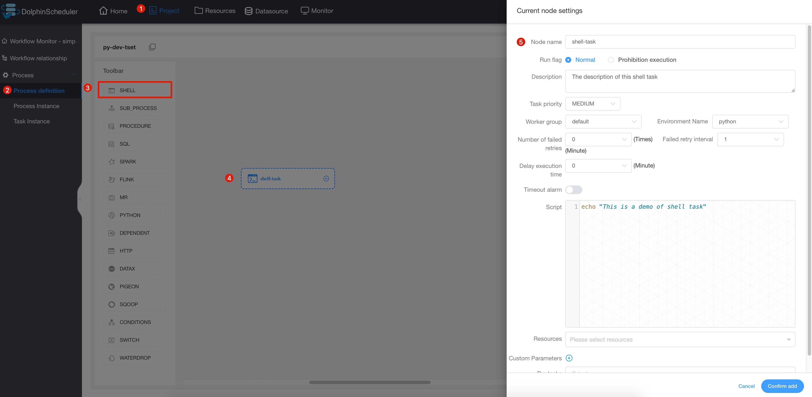
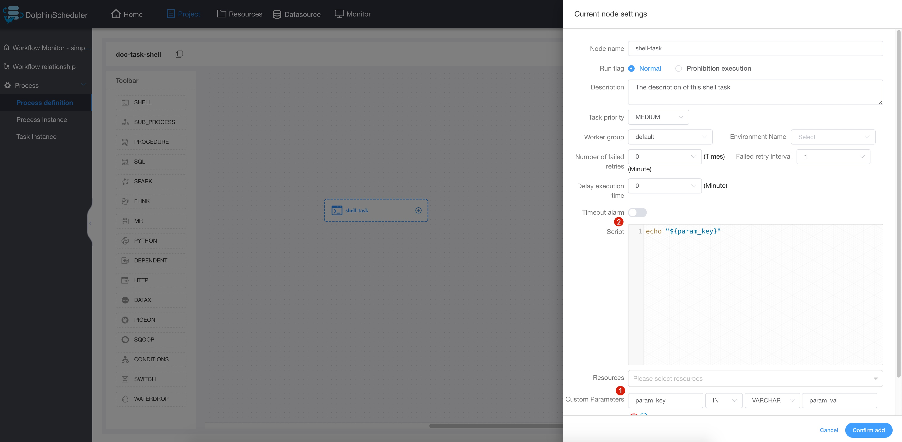

# 쉘

## 개요

셸 유형 작업을 생성하고 일련의 셸 스크립트를 실행하는 데 사용되는 셸 작업 유형입니다.작업자가 이 작업을 실행하면 임시 셸 스크립트가 생성되고 테넌트와 동일한 이름을 가진 Linux 사용자를 사용하여 실행됩니다.

## 작업 생성

- '프로젝트 관리 -> 프로젝트 이름 -> 워크플로 정의'를 클릭한 후, '워크플로 생성' 버튼을 클릭하면 DAG 편집 페이지로 진입합니다.
- 도구 모음 에서 캔버스로 드래그합니다.

## 작업 매개변수

[//]: # (TODO: 웹사이트 템플릿이 이 구문을 지원하면 아래에 주석이 달린 앵커를 사용하세요)
[//]: # (- 기본 매개변수는 [DolphinScheduler 작업 매개변수 부록]&#40;appendix.md#default-task-parameters&#41; `기본 작업 매개변수` 섹션을 참조하세요.)

- 기본 매개변수는 [DolphinScheduler 작업 매개변수 부록](appendix.md) `기본 작업 매개변수` 섹션을 참조하세요.

|**매개변수** |**설명** |
|------------|--------------------------------------------------------------------------------------------|
|스크립트 |사용자가 개발한 SHELL 프로그램입니다.|
|사용자 정의 매개변수 |이는 스크립트의 내용을 `${variable}`로 대체하는 Shell의 사용자 정의 매개변수입니다.|

## 작업 예

### 라인 인쇄

이 예에서는 하나 이상의 간단한 명령줄을 사용하여 간단한 작업을 시뮬레이션하는 방법을 보여줍니다.이 예에서는 로그 파일의 한 줄을 인쇄하는 방법을 살펴보겠습니다.



### 맞춤 매개변수 사용

이 예에서는 사용자 지정 매개변수 작업을 시뮬레이션합니다.기존 작업을 보다 편리하게 재사용하거나 동적 요구 사항에 직면할 때 변수를 사용하여 스크립트의 재사용성을 보장할 것입니다.이 예에서는 먼저 사용자 정의 스크립트에서 "param_key" 매개변수를 정의하고 해당 값을 "param_val"로 설정합니다.그런 다음 echo 명령이 "script"에 선언되고 "param_key" 매개변수가 인쇄됩니다.작업을 저장하고 실행하면 "param_key" 매개변수에 해당하는 "param_val" 값이 출력되는 것을 로그에서 확인할 수 있습니다.



## 참고

셸 작업 유형은 작업 로그에 ```application_xxx_xxx``가 포함되어 있는지 확인하여 원사 작업인지 확인합니다.그렇다면 해당 응용 프로그램
현재 쉘 노드의 실행 상태를 판단하는 데 사용됩니다.이때 워크플로의 작업이 중지되면 해당 ```application_id``가
죽을 것이다.

셸 작업에서 리소스 파일을 사용하려면 리소스 센터를 통해 해당 파일을 업로드한 후 셸 작업에서 해당 리소스를 사용할 수 있습니다.참조: [파일 관리](../resource/file-manage.md).