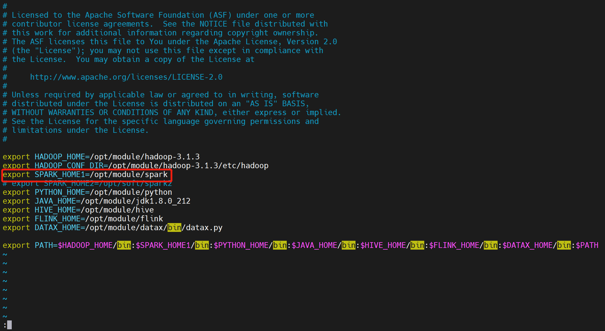
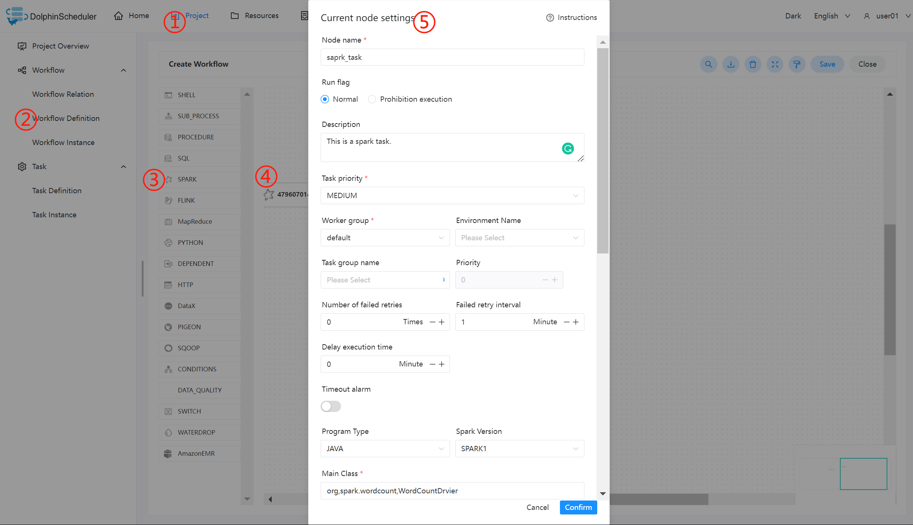

# 스파크 노드

## 개요

Spark 애플리케이션을 실행하기 위한 Spark 작업 유형입니다.Spark 작업을 실행할 때 작업자는 다음 명령을 사용하여 Spark 클러스터에 작업을 제출합니다.

(1) 'spark submit' 방식으로 작업을 제출합니다.자세한 내용은 [spark-submit](https://archive.apache.org/dist/spark/docs/3.2.1/#running-the-examples-and-shell)을 참조하세요.

(2) `spark sql` 방법으로 작업을 제출합니다.자세한 내용은 [spark sql](https://archive.apache.org/dist/spark/docs/3.2.1/api/sql/index.html)을 참조하세요.

## 작업 생성

- '프로젝트 관리 -> 프로젝트 이름 -> 워크플로 정의'를 클릭한 후, '워크플로 생성' 버튼을 클릭하면 DAG 편집 페이지로 진입합니다.
- 도구 모음 에서 캔버스로 드래그합니다.

## 작업 매개변수

[//]: # (TODO: 웹사이트 템플릿이 이 구문을 지원하면 아래에 주석이 달린 앵커를 사용하세요)
[//]: # (- 기본 매개변수는 [DolphinScheduler 작업 매개변수 부록]&#40;appendix.md#default-task-parameters&#41; `기본 작업 매개변수` 섹션을 참조하세요.)

- 기본 매개변수는 [DolphinScheduler 작업 매개변수 부록](appendix.md) `기본 작업 매개변수` 섹션을 참조하세요.|**매개변수** |**설명** |
|---------------|---------------------------------------------------------------------------------------------------------|
|프로그램 유형 |Java, Scala, Python 및 SQL을 지원합니다.|
|주요 기능의 클래스 |Spark 프로그램의 진입점인 메인 클래스의 **전체 경로**입니다.|
|석사 |클러스터의 마스터 URL입니다.|
|주요 항아리 패키지 |Spark jar 패키지(리소스 센터에서 업로드)|
|SQL 스크립트 |Spark SQL이 실행하는 .sql 파일의 SQL 문입니다.|
|배포 모드 |<ul><li>spark submit은 클러스터, 클라이언트, 로컬의 세 가지 모드를 지원합니다.</li><li>spark sql은 클라이언트 및 로컬 모드를 지원합니다.</li></ul> |
|네임스페이스(클러스터) |네임스페이스를 선택하고 네이티브 kubernetes에 애플리케이션을 제출한 다음, 대신 Yarn 클러스터(기본값)에 제출하세요.|
|작업 이름 |스파크 작업 이름.|
|드라이버 코어 수 |실제 생산 환경에 맞게 설정할 수 있는 드라이버 코어 수를 설정합니다.|
|드라이버 메모리 크기 |실제 생산 환경에 맞게 설정할 수 있는 드라이버 메모리의 크기를 설정합니다.|
|집행자 수 |실제 제작 환경에 맞게 설정할 수 있는 Executor 개수를 설정합니다.|
|실행자 메모리 크기 |실제 제작 환경에 맞게 설정할 수 있는 Executor 메모리의 크기를 설정합니다.|
|원사 대기열 |원사 대기열을 설정하고 기본적으로 '기본' 대기열을 사용합니다.|
|주요 프로그램 매개변수 |Spark 프로그램의 입력 매개변수를 설정하고 사용자 정의 매개변수 변수 대체를 지원합니다.|
|선택적 매개변수 |`--jars`, `--files`, ` --archives`, `--conf`와 같은 스파크 명령 옵션을 설정합니다.|
|자원 |매개변수가 리소스 파일을 참조하는 경우 `Resource`에 리소스 파일을 지정합니다.|
|맞춤 매개변수 |이는 Spark용 로컬 사용자 정의 매개변수이며 스크립트에서 내용을 `${variable}`로 대체합니다.|
|전임자 과제 |현재 작업에 대한 선행 작업을 선택하면 선택한 선행 작업이 현재 작업의 업스트림으로 설정됩니다.|

## 작업 예

### 스파크 제출

#### WordCount 프로그램 실행

이는 MapReduce, Flink 및 Spark와 같은 컴퓨팅 프레임워크에 자주 적용되는 빅 데이터 생태계의 일반적인 입문 사례입니다.주요 목적은 입력 텍스트에서 동일한 단어의 수를 계산하는 것입니다.(Flink의 릴리스에는 이 예제 작업이 첨부되어 있습니다)

##### DolphinScheduler에서 Spark 환경 구성

프로덕션 환경에서 Spark 작업 유형을 사용하는 경우 먼저 필요한 환경을 구성해야 합니다.다음은 구성 파일입니다: `bin/env/dolphinscheduler_env.sh`.

##### 메인 패키지 업로드Spark 작업 노드를 사용하는 경우 실행을 위해 jar 패키지를 리소스 센터에 업로드해야 합니다. [리소스 센터](../resource/configuration.md)를 참조하세요.

리소스 센터 구성을 마친 후 필요한 대상 파일을 드래그 앤 드롭으로 직접 업로드하세요.

##### Spark 노드 구성

위의 매개변수 설명에 따라 필수 콘텐츠를 구성합니다.

### 스파크 SQL

#### DDL 및 DML 문 실행

이 경우는 뷰 테이블 용어를 생성하고 세 행의 데이터와 테이블 wc를 Parquet 형식으로 작성하고 테이블이 존재하는지 확인하는 것입니다.프로그램 유형은 SQL입니다.뷰 테이블 용어의 데이터를 쪽모이 세공 형식으로 테이블 wc에 삽입합니다.

## 참고

JAVA와 Scala는 식별용으로만 사용되며, Spark 태스크를 사용할 때에는 차이가 없습니다.애플리케이션이 Python으로 개발된 경우 양식에서 **Main Class** 매개변수를 무시하면 됩니다.매개변수 **SQL 스크립트**는 SQL 유형에만 해당되며 JAVA, Scala 및 Python에서는 무시될 수 있습니다.

SQL은 현재 클러스터 모드를 지원하지 않습니다.