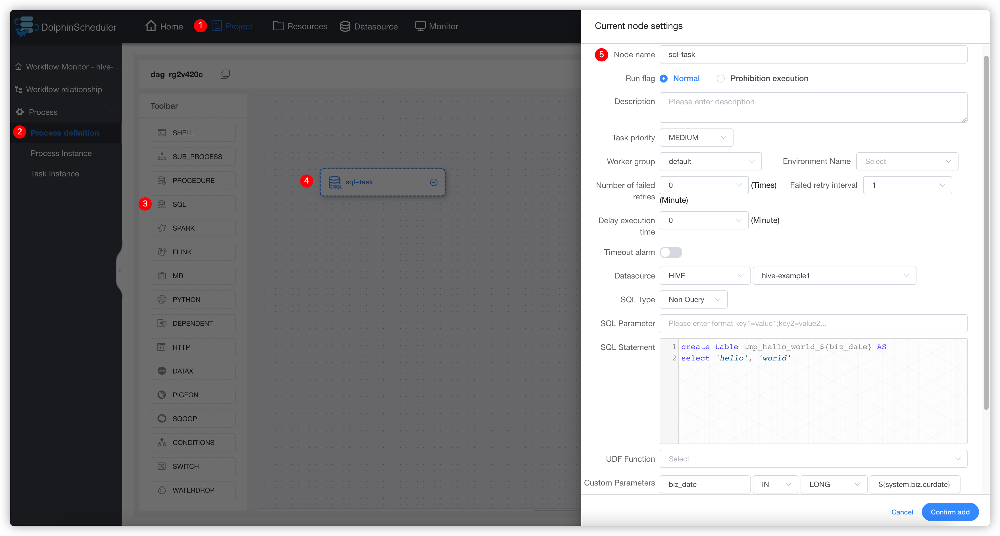
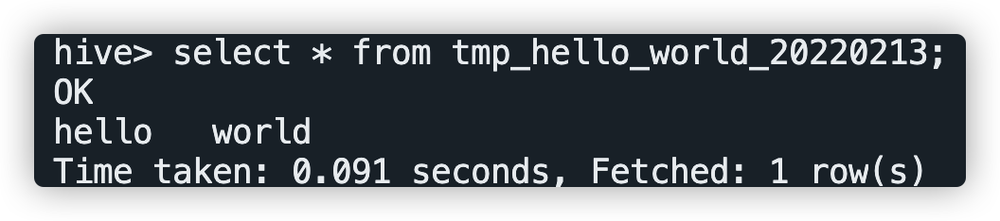
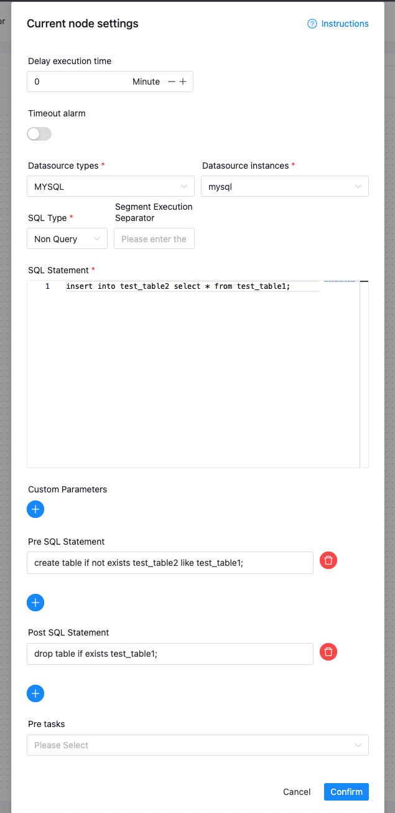

# SQL

## 개요

데이터베이스에 연결하고 SQL을 실행하는 데 사용되는 SQL 작업 유형입니다.

## 데이터소스 생성

[datasource-setting](../installation/datasource-setting.md) `DataSource Center` 섹션을 참조하세요.

## 작업 생성

- '프로젝트 관리 -> 프로젝트 이름 -> 워크플로 정의'를 클릭한 후, '워크플로 생성' 버튼을 클릭하면 DAG 편집 페이지로 진입합니다.
- 도구 모음 에서 캔버스로 드래그합니다.

## 작업 매개변수

[//]: # (TODO: 웹사이트 템플릿이 이 구문을 지원하면 아래에 주석이 달린 앵커를 사용하세요)
[//]: # (- 기본 매개변수는 [DolphinScheduler 작업 매개변수 부록]&#40;appendix.md#default-task-parameters&#41; `기본 작업 매개변수` 섹션을 참조하세요.)

- 기본 매개변수는 [DolphinScheduler 작업 매개변수 부록](appendix.md) `기본 작업 매개변수` 섹션을 참조하세요.|   **Parameter**   |                                                                                                                                                                                                                                                                                                                                                                                                                                                                                                           **Description**                                                                                                                                                                                                                                                                                                                                                                                                                                                                                                            |
|-------------------|--------------------------------------------------------------------------------------------------------------------------------------------------------------------------------------------------------------------------------------------------------------------------------------------------------------------------------------------------------------------------------------------------------------------------------------------------------------------------------------------------------------------------------------------------------------------------------------------------------------------------------------------------------------------------------------------------------------------------------------------------------------------------------------------------------------------------------------------------------------------------------------------------------------------------------------------------------------------------------------------------------------------------------------|---|
| Data source       | Select the corresponding DataSource.                                                                                                                                                                                                                                                                                                                                                                                                                                                                                                                                                                                                                                                                                                                                                                                                                                                                                                                                                                                                 |
| SQL type          | Supports query and non-query. <ul><li>Query: supports `DML select` type commands, which return a result set. You can specify three templates for email notification as form, attachment or form attachment;</li><li>Non-query: support `DDL` all commands and `DML update, delete, insert` three types of commands;<ul><li>Segmented execution symbol: When the data source does not support executing multiple SQL statements at a time, the symbol for splitting SQL statements is provided to call the data source execution method multiple times. Example: 1. When the Hive data source is selected as the data source, please do not use `;\n` due to Hive JDBC does not support executing multiple SQL statements at one time; 2. When the MySQL data source is selected as the data source, and multi-segment SQL statements are to be executed, this parameter needs to be filled in with a semicolon `;. Because the MySQL data source does not support executing multiple SQL statements at one time.</li></ul></li></ul> |
| SQL parameter     | The input parameter format is `key1=value1;key2=value2...`.                                                                                                                                                                                                                                                                                                                                                                                                                                                                                                                                                                                                                                                                                                                                                                                                                                                                                                                                                                          |
| SQL statement     | SQL statement.                                                                                                                                                                                                                                                                                                                                                                                                                                                                                                                                                                                                                                                                                                                                                                                                                                                                                                                                                                                                                       |   |
| Custom parameters | SQL task type, and stored procedure is a custom parameter order, to set customized parameter type and data type for the method is the same as the stored procedure task type. The difference is that the custom parameter of the SQL task type replaces the `${variable}` in the SQL statement.                                                                                                                                                                                                                                                                                                                                                                                                                                                                                                                                                                                                                                                                                                                                      |
| Pre-SQL           | Pre-SQL executes before the SQL statement.                                                                                                                                                                                                                                                                                                                                                                                                                                                                                                                                                                                                                                                                                                                                                                                                                                                                                                                                                                                           |
| Post-SQL          | Post-SQL executes after the SQL statement.                                                                                                                                                                                                                                                                                                                                                                                                                                                                                                                                                                                                                                                                                                                                                                                                                                                                                                                                                                                           |## 작업 예

### Hive 테이블 생성 예

#### Hive에서 임시 테이블 생성 및 데이터 쓰기

이 예에서는 Hive에 임시 테이블 'tmp_hello_world'를 만들고 데이터 행을 씁니다.임시 테이블을 생성하기 전에 해당 테이블이 존재하지 않는지 확인해야 합니다.따라서 우리는 실행할 때마다 사용자 지정 매개 변수를 사용하여 테이블 이름의 접미사로 하루 중 시간을 가져옵니다. 이 작업은 매일 실행할 수 있습니다.생성된 테이블 이름의 형식은 `tmp_hello_world_{yyyyMMdd}`입니다.
**참고**: SQL 실행을 위한 JDBC 기반 SQL 작업의 하이브 데이터 소스, SQL 문은 다중 문을 지원하지 않습니다. ';' 사용을 피하세요.성명 끝에.다중 문을 처리하려면 [Hive-Cli](./hive-cli.md) 작업을 사용하세요.

#### 작업을 성공적으로 실행한 후 Hive에서 결과 쿼리

빅데이터 클러스터에 로그인하고 'hive' 명령이나 'beeline' 또는 'JDBC' 및 기타 방법을 사용하여 쿼리를 위해 'Apache Hive'에 연결합니다.쿼리 SQL은 `select * from tmp_hello_world_{yyyyMMdd}`입니다. `{yyyyMMdd}`를 실행 날짜로 바꾸세요.다음은 쿼리 스크린샷을 보여줍니다.

### 사전 SQL 및 사후 SQL 예제 사용

Pre-SQL에서 생성된 테이블은 SQL 문에서 사용 후 Post-SQL에서 정리됩니다.

## 참고

SQL 유형 선택에 주의하세요.삽입 작업인 경우 "Non-Query" 유형으로 변경해야 합니다.