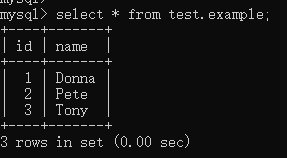
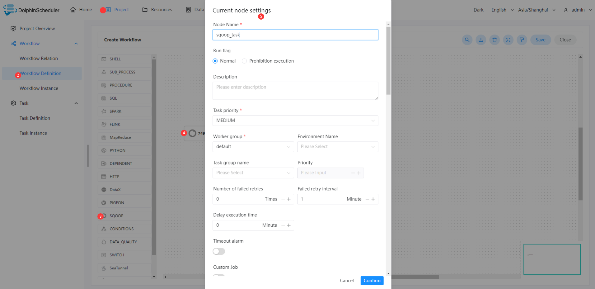
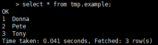

# 스쿠프 노드

## 개요

Sqoop 애플리케이션을 실행하기 위한 Sqoop 작업 유형입니다.작업자는 'sqoop'을 실행하여 sqoop 작업을 실행합니다.

## 작업 생성

- '프로젝트 관리 -> 프로젝트 이름 -> 워크플로 정의'를 클릭한 후, '워크플로 생성' 버튼을 클릭하면 DAG 편집 페이지로 진입합니다.
- 도구 모음 에서 캔버스로 드래그합니다.

## 작업 매개변수

[//]: # (TODO: 웹사이트 템플릿이 이 구문을 지원하면 아래에 주석이 달린 앵커를 사용하세요)
[//]: # (- 기본 매개변수는 [DolphinScheduler 작업 매개변수 부록]&#40;appendix.md#default-task-parameters&#41; `기본 작업 매개변수` 섹션을 참조하세요.)

- 기본 매개변수는 [DolphinScheduler 작업 매개변수 부록](appendix.md) `기본 작업 매개변수` 섹션을 참조하세요.|            **Parameter**            |                                                                              **Description**                                                                               |
|-------------------------------------|----------------------------------------------------------------------------------------------------------------------------------------------------------------------------|
| Job Name                            | map-reduce job name                                                                                                                                                        |
| Direct                              | (1) import:Imports an individual table from an RDBMS to HDFS or Hive.  (2) export:Exports a set of files from HDFS or Hive back to an RDBMS.                               |
| Hadoop Params                       | Hadoop custom param for sqoop job.                                                                                                                                         |
| Sqoop Advanced Parameters           | Sqoop advanced param for sqoop job.                                                                                                                                        |
| Data Source - Type                  | Select the corresponding data source type.                                                                                                                                 |
| Data Source - Datasource            | Select the corresponding DataSource.                                                                                                                                       |
| Data Source - ModelType             | (1) Form:Synchronize data from a table, need to fill in the `Table` and `ColumnType`. (2) SQL:Synchronize data of SQL queries result, need to fill in the `SQL Statement`. |
| Data Source - Table                 | Sets the table name to use when importing to Hive.                                                                                                                         |
| Data Source - ColumnType            | (1) All Columns:Import all fields in the selected table.  (2) Some Columns:Import the specified fields in the selected table, need to fill in the `Column`.                |
| Data Source - Column                | Fill in the field name, and separate with commas.                                                                                                                          |
| Data Source - SQL Statement         | Fill in SQL query statement.                                                                                                                                               |
| Data Source - Map Column Hive       | Override mapping from SQL to Hive type for configured columns.                                                                                                             |
| Data Source - Map Column Java       | Override mapping from SQL to Java type for configured columns.                                                                                                             |
| Data Target - Type                  | Select the corresponding data target type.                                                                                                                                 |
| Data Target - Database              | Fill in the Hive database name.                                                                                                                                            |
| Data Target - Table                 | Fill in the Hive table name.                                                                                                                                               |
| Data Target - CreateHiveTable       | Import a table definition into Hive. If set, then the job will fail if the target hive table exits.                                                                        |
| Data Target - DropDelimiter         | Drops `\n`, `\r`, and `\01` from string fields when importing to Hive.                                                                                                     |
| Data Target - OverWriteSrc          | Overwrite existing data in the Hive table.                                                                                                                                 |
| Data Target - Hive Target Dir       | You can also explicitly choose the target directory.                                                                                                                       |
| Data Target - ReplaceDelimiter      | Replace `\n`, `\r`, and `\01` from string fields with user defined string when importing to Hive.                                                                          |
| Data Target - Hive partition Keys   | Fill in the hive partition keys name, and separate with commas.                                                                                                            |
| Data Target - Hive partition Values | Fill in the hive partition Values name, and separate with commas.                                                                                                          |
| Data Target - Target Dir            | Fill in the HDFS target directory.                                                                                                                                         |
| Data Target - DeleteTargetDir       | Delete the target directory if it exists.                                                                                                                                  |
| Data Target - CompressionCodec      | Choice the hadoop codec.                                                                                                                                                   |
| Data Target - FileType              | Choice the storage Type.                                                                                                                                                   |
| Data Target - FieldsTerminated      | Sets the field separator character.                                                                                                                                        |
| Data Target - LinesTerminated       | Sets the end-of-line character.                                                                                                                                            |## 작업 예

이 예에서는 MySQL에서 Hive로 데이터를 가져오는 방법을 보여줍니다.MySQL 데이터베이스 이름은 `test`이고 테이블 이름은 `example`입니다.다음 그림은 샘플 데이터를 보여줍니다.

### Sqoop 환경 구성

프로덕션 환경에서 Sqoop 작업 유형을 사용하는 경우 작업자가 `sqoop` 명령을 실행할 수 있는지 확인해야 합니다.

### Sqoop 작업 노드 구성

아래 다이어그램의 단계에 따라 노드 콘텐츠를 구성할 수 있습니다.

이 샘플의 키 구성은 다음 표에 나와 있습니다.

|**매개변수** |**가치** |
|-------------------------|--------------------------------------------|
|직무명 |sqoop_mysql_to_hive_test |
|데이터 소스 - 유형 |MySQL |
|데이터 소스 - 데이터 소스 |MYSQL MyTestMySQL(MyTestMySQL을 원하는 이름으로 변경할 수 있습니다.) |
|데이터 소스 - ModelType |양식 |
|데이터 소스 - 테이블 |예 |
|데이터 소스 - ColumnType |모든 열 |
|데이터 대상 - 유형 |하이브 |
|데이터 대상 - 데이터베이스 |임시 |
|데이터 대상 - 테이블 |예 |
|데이터 대상 - CreateHiveTable |사실 |
|데이터 대상 - DropDelimiter |거짓 |
|데이터 대상 - OverWriteSrc |사실 |
|데이터 대상 - Hive 대상 디렉터리 |(기입 필요 없음) |
|데이터 대상 -ReplaceDelimiter |, |
|데이터 대상 - Hive 파티션 키 |(기입 필요 없음) |
|데이터 대상 - Hive 파티션 값 |(기입 필요 없음) |

### 실행 결과 보기

