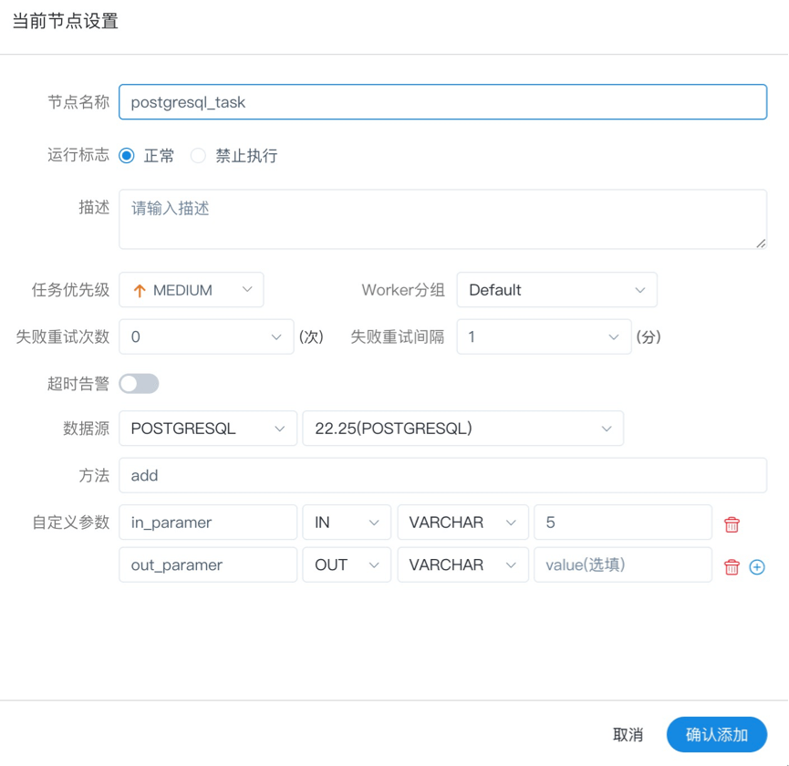

# 저장 프로시저

- 선택한 DataSource에 따라 저장 프로시저를 실행합니다.

> 아래 그림과 같이 'PROCEDURE' 작업 노드에서 캔버스로 드래그합니다.

<p 정렬="중앙">

</p>

## 작업 매개변수

[//]: # (TODO: 웹사이트 템플릿이 이 구문을 지원하면 아래에 주석이 달린 앵커를 사용하세요)
[//]: # (- 기본 매개변수는 [DolphinScheduler 작업 매개변수 부록]&#40;appendix.md#default-task-parameters&#41; `기본 작업 매개변수` 섹션을 참조하세요.)

- 기본 매개변수는 [DolphinScheduler 작업 매개변수 부록](appendix.md) `기본 작업 매개변수` 섹션을 참조하세요.

|**매개변수** |**설명** |
|--------------------------------|-------------------------------------------------------------------------------------------------------------------------------------------------------|
|데이터소스 |저장 프로시저의 DataSource 유형은 MySQL 및 POSTGRESQL을 지원하므로 해당 DataSource를 선택하십시오.|
|방법 |저장 프로시저의 메서드 이름입니다.|
|맞춤 매개변수 |저장 프로시저의 사용자 정의 매개변수 유형은 'IN' 및 'OUT'을 지원하고 데이터 유형은 VARCHAR, INTEGER, LONG, FLOAT, DOUBLE, DATE, TIME, TIMESTAMP 및 BOOLEAN을 지원합니다.|

## 비고

- 준비: 데이터베이스에 저장 프로시저를 만듭니다.  ```
  CREATE PROCEDURE dolphinscheduler.test(in in1 INT, out out1 INT)
  begin
  set out1=in1;
  END
````