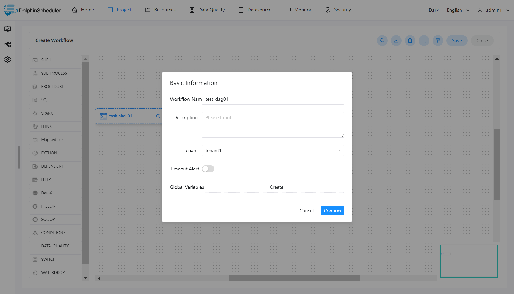
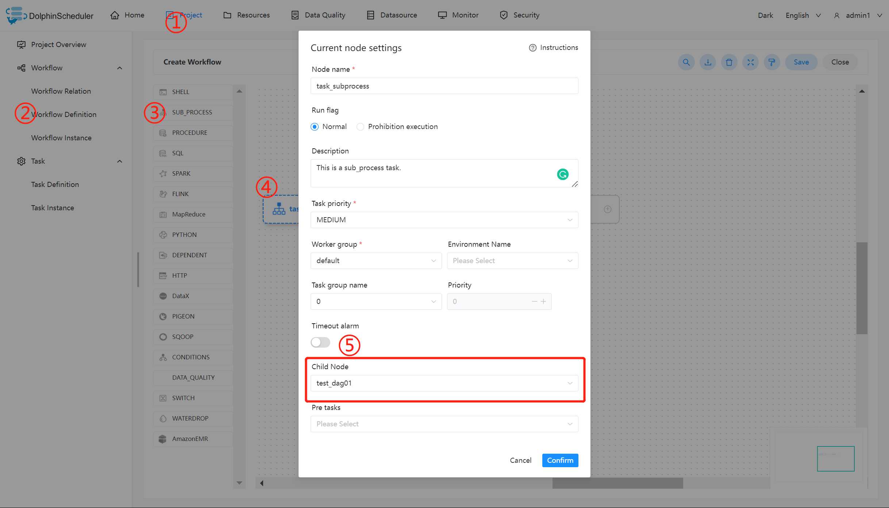
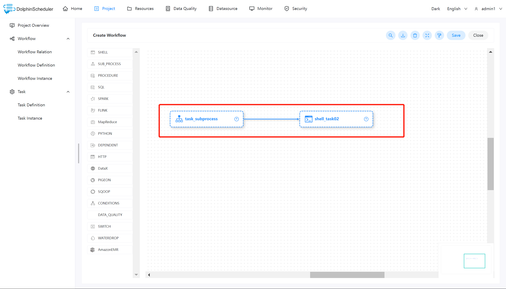

# 하위 워크플로 노드

## 개요

하위 워크플로 노드는 외부 워크플로 정의를 작업 노드로 실행하는 것입니다.

## 작업 생성

- '프로젝트 관리 -> 프로젝트 이름 -> 워크플로 정의'를 클릭하고 '워크플로 만들기' 버튼을 클릭하여 DAG 편집 페이지로 들어갑니다.
- 도구 모음  작업 노드에서 캔버스로 드래그하여 새 SubWorkflow 작업을 만듭니다.

## 작업 매개변수

[//]: # (TODO: 웹사이트 템플릿이 이 구문을 지원하면 아래에 주석이 달린 앵커를 사용하세요)
[//]: # (- 기본 매개변수는 [DolphinScheduler 작업 매개변수 부록]&#40;appendix.md#default-task-parameters&#41; `기본 작업 매개변수` 섹션을 참조하세요.)

- 기본 매개변수는 [DolphinScheduler 작업 매개변수 부록](appendix.md) `기본 작업 매개변수` 섹션을 참조하세요.

|**매개변수** |**설명** |
|---------------|---------------------------------------------------------------------------------------------------------------------------------------------------------------|
|하위 노드 |선택한 하위 워크플로의 워크플로 정의입니다.선택한 하위 워크플로의 워크플로 정의로 이동하려면 오른쪽 상단에 하위 노드를 입력하세요.|

## 작업 예

이 예제는 일반적인 작업 유형을 시뮬레이션합니다. 여기서는 하위 노드 작업을 사용하여 [Shell](shell.md)을 호출하여 "hello"를 인쇄합니다.이는 쉘 작업을 하위 노드로 실행하는 것을 의미합니다.

### 셸 작업 만들기

"hello"를 인쇄하는 셸 작업을 만들고 워크플로를 `test_dag01`로 정의합니다.

## Sub_workflow 작업 생성

sub_workflow를 사용하려면 첫 번째 단계에서 만든 워크플로 `test_dag01`인 하위 노드 작업을 만들어야 합니다.그 후, 아래 그림과 같이 ⑤번 위치에서 해당 하위 노드를 선택합니다.

sub_workflow를 생성한 후 "world"를 인쇄하기 위한 해당 셸 작업을 생성하고 둘을 함께 연결합니다.현재 워크플로를 저장하고 실행하여 예상되는 결과를 얻습니다.

## 참고

'sub_workflow'를 사용하여 하위 노드 작업을 호출하는 경우 정의된 하위 노드가 온라인 상태인지 확인할 필요가 없습니다.