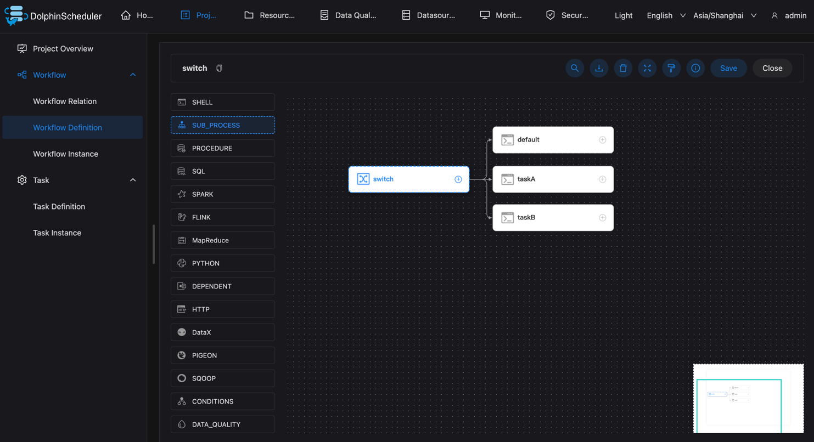
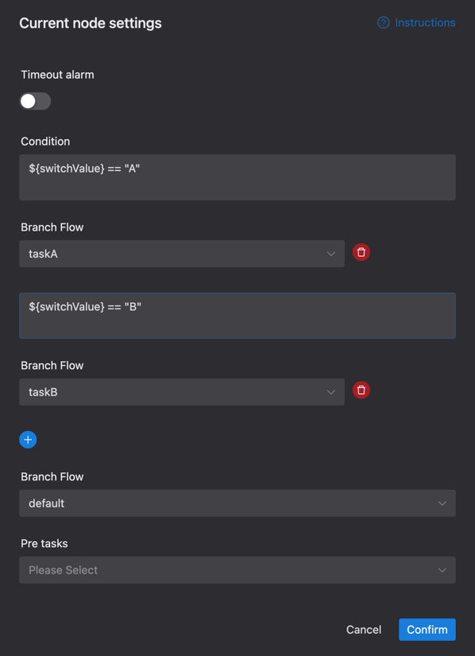
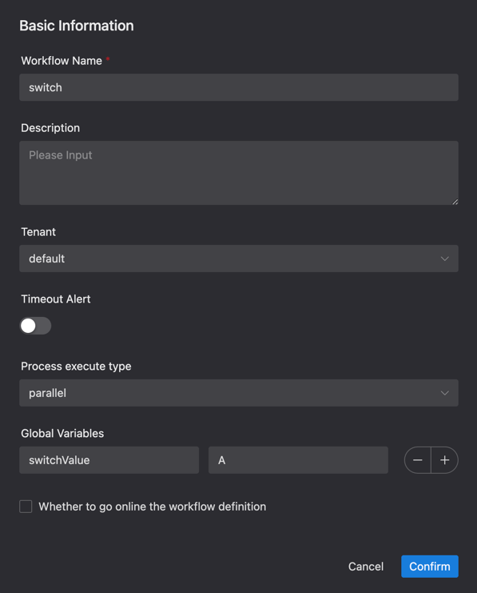
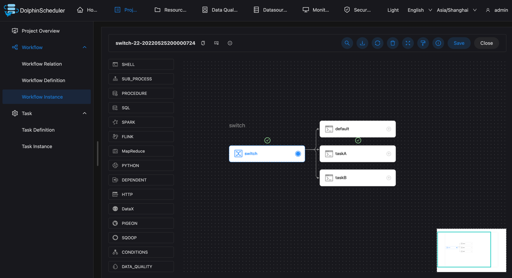

# 스위치

## 개요

스위치는 조건 판단 노드로, [전역 변수](../parameter/global.md)의 값과 사용자가 작성한 표현식 결과에 따라 분기 실행을 결정합니다.

**참고**: javax.script.ScriptEngine.eval을 사용하여 표현식을 실행합니다.

## 작업 생성

- '프로젝트 관리 -> 프로젝트 이름 -> 워크플로 정의'를 클릭한 후, '워크플로 생성' 버튼을 클릭하면 DAG 편집 페이지로 진입합니다.
- 작업을 생성하려면 도구 모음  작업 노드에서 캔버스로 드래그하세요.

**참고**: 전환 작업을 생성한 후 먼저 업스트림과 다운스트림을 구성한 다음 작업 분기의 매개변수를 구성해야 합니다.

## 작업 매개변수

[//]: # (TODO: 웹사이트 템플릿이 이 구문을 지원하면 아래에 주석이 달린 앵커를 사용하세요)
[//]: # (- 기본 매개변수는 [DolphinScheduler 작업 매개변수 부록]&#40;appendix.md#default-task-parameters&#41; `기본 작업 매개변수` 섹션을 참조하세요.)

- 기본 매개변수는 [DolphinScheduler 작업 매개변수 부록](appendix.md) `기본 작업 매개변수` 섹션을 참조하세요.

|**매개변수** |**설명** |
|---------------|---------------------------------------------------------------------------------------------------------------------------------------------------------------------|
|조건 |전환 작업에 대한 여러 조건을 구성할 수 있습니다.조건이 만족되면 구성된 분기를 실행합니다.다양한 비즈니스를 만족시키기 위해 여러 가지 조건을 구성할 수 있습니다.|
|분기 흐름 |기본 분기 흐름은 모든 조건이 충족되지 않으면 이 분기 흐름을 실행합니다.|

## 작업 예

이는 하나의 스위치 작업과 세 개의 셸 작업을 사용하여 설명됩니다.

### 워크플로 만들기

새 스위치 작업과 세 개의 셸 작업 다운스트림을 만듭니다.쉘 작업은 필요하지 않습니다.
다운스트림 작업을 선택하려면 먼저 전환 작업을 다운스트림 작업과 연결하여 관계를 구성해야 합니다.

### 조건 설정

조건과 기본 분기를 구성합니다.조건이 충족되면 지정된 분기가 사용됩니다.조건이 충족되지 않으면 기본 분기가 사용됩니다.
그림에서 변수의 값이 "A"이면 taskA 분기가 실행되고, 변수의 값이 "B"이면 taskB 분기가 실행되며, 둘 다 만족하지 않으면 default가 실행된다.

조건은 전역변수를 사용하며, [전역변수](../parameter/global.md)를 참고하세요.
여기서 설정한 글로벌 변수의 값은 A 입니다.

올바르게 실행되면 taskA가 올바르게 실행됩니다.

### 실행

실행하여 예상대로 작동하는지 확인합니다.지정된 다운스트림 taskA가 예상대로 실행되는 것을 볼 수 있습니다.

