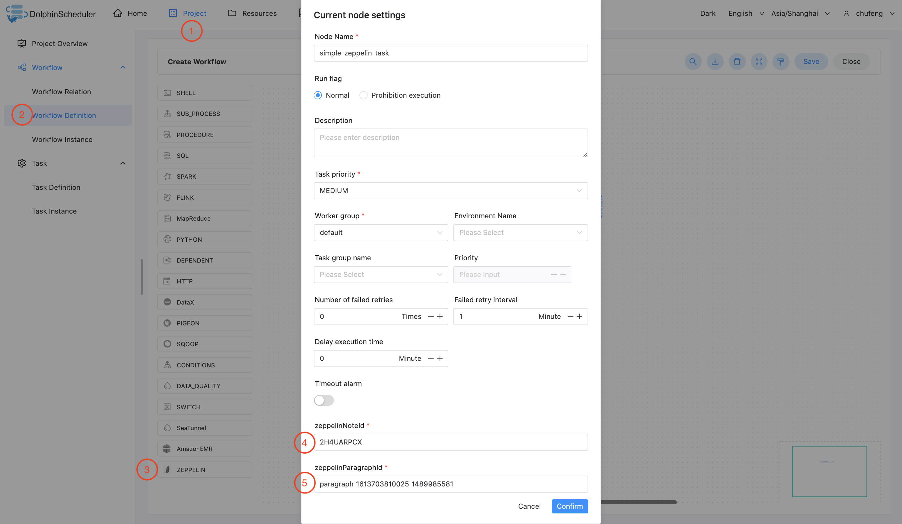
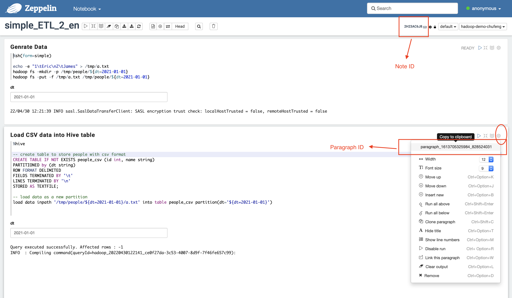

# 아파치 제플린

## 개요

Zeppelin Task를 이용하여 Zeppelin 형태의 Task를 생성하고 Zeppelin Notebook 문단을 실행할 수 있습니다.작업자가 `Zeppelin Task`를 실행하면,
zeppelin 노트북 단락을 트리거하기 위해 `Zeppelin Client API`를 호출합니다.'Apache Zeppelin Notebook'에 대한 자세한 내용을 보려면 [여기](https://zeppelin.apache.org/)를 클릭하세요.

## 작업 생성

- '프로젝트 관리 -> 프로젝트 이름 -> 워크플로 정의'를 클릭한 후, '워크플로 생성' 버튼을 클릭하면 DAG 편집 페이지로 진입합니다.
- 툴바에서 를 캔버스로 드래그합니다.

## 작업 매개변수

[//]: # (TODO: 웹사이트 템플릿이 이 구문을 지원하면 아래에 주석이 달린 앵커를 사용하세요)
[//]: # (- 기본 매개변수는 [DolphinScheduler 작업 매개변수 부록]&#40;appendix.md#default-task-parameters&#41; `기본 작업 매개변수` 섹션을 참조하세요.)

- 기본 매개변수는 [DolphinScheduler 작업 매개변수 부록](appendix.md) `기본 작업 매개변수` 섹션을 참조하세요.

|**매개변수** |**설명** |
|------------------------------------|-------------------------------------------------------------------------------------------------------------------------|
|제플린 노트 ID |Zeppelin 노트북 노트의 고유한 노트 ID입니다.|
|제플린 단락 ID |Zeppelin 노트북 단락의 고유 단락 ID입니다.한 번에 전체 메모를 예약하려면 이 필드를 비워 두세요.|
|Zeppelin 생산 노트 디렉토리 |프로덕션 모드에서 복제된 메모의 디렉터리입니다.|
|제플린 사용자 이름 |zeppelin 서버의 로그인 사용자 이름.|
||
|제플린 비밀번호 |zeppelin 서버의 로그인 비밀번호입니다.|
||
|Zeppelin Rest 엔드포인트 |Zeppelin 서버의 REST 엔드포인트입니다.|
|제플린 매개변수 |zeppelin 동적 양식에 사용되는 json 형식의 매개변수입니다.|

## 프로덕션(클론) 모드

- '프로덕션 모드'를 활성화하려면 선택적 'Zeppelin Production Note Directory' 매개변수를 입력하세요.
- '프로덕션 모드'에서는 대상 노트가 선택한 'Zeppelin Production Note Directory'에 복사됩니다.
'Zeppelin Task Plugin'은 원본 노트 대신 복제된 노트를 실행합니다.실행이 완료되면,
'Zeppelin Task Plugin'은 복제된 노트를 자동으로 삭제합니다.
따라서 'Dolphin Scheduler'에 의해 실행되는 러닝노트를 수정함으로써 안정성을 높입니다.
생산 작업에 영향을 미치지 않습니다.
- 'Zeppelin Production Note Directory'를 비워 두면 'Zeppelin Task Plugin'이 원본 노트를 실행합니다.
- 'Zeppelin Production Note Directory'는 모두 '슬래시'로 시작하고 끝나야 합니다.예를 들어`/production_note_directory/`

## 작업 예

### Zeppelin 단락 작업 예

이 예에서는 Zeppelin 단락 작업 노드를 생성하는 방법을 보여줍니다.

