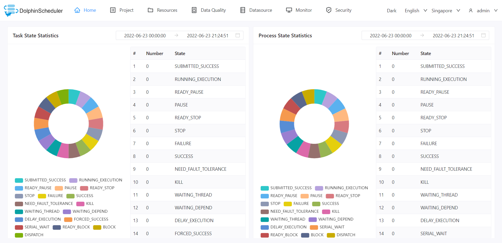

# 关于DolphinScheduler

Apache DolphinScheduler 是一个分布式易扩展的可视化DAG工作流任务调度开源系统。适用于企业级场景，提供了一个可视化操作任务、工作流和全生命周期数据处理过程的解决方案。

Apache DolphinScheduler 旨在解决复杂的大数据任务依赖关系，并为应用程序提供数据和各种 OPS 编排中的关系。 解决数据研发ETL依赖错综复杂，无法监控任务健康状态的问题。
DolphinScheduler 以 DAG（Directed Acyclic Graph，DAG）流式方式组装任务，可以及时监控任务的执行状态，支持重试、指定节点恢复失败、暂停、恢复、终止任务等操作。

