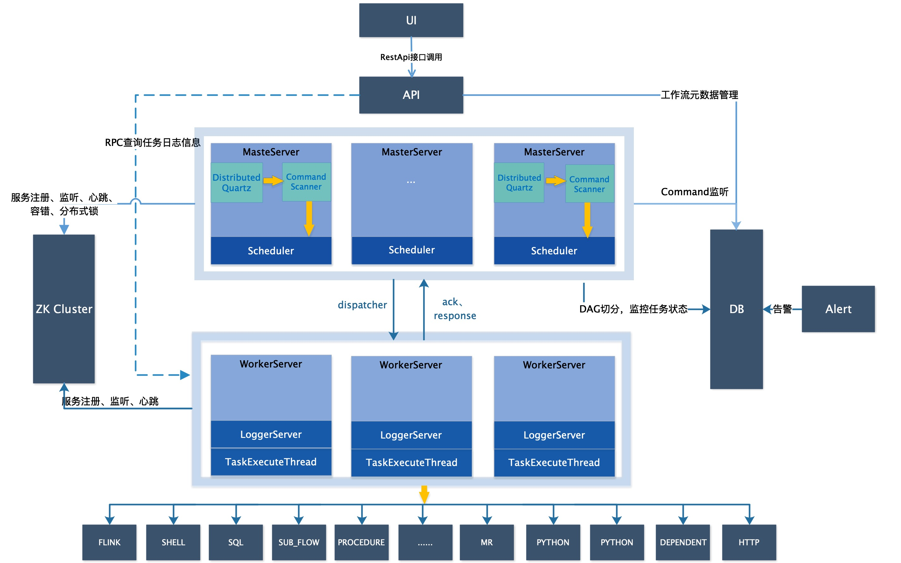
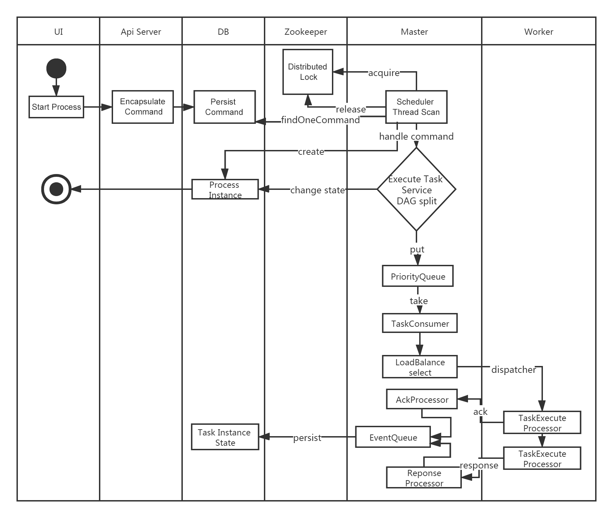
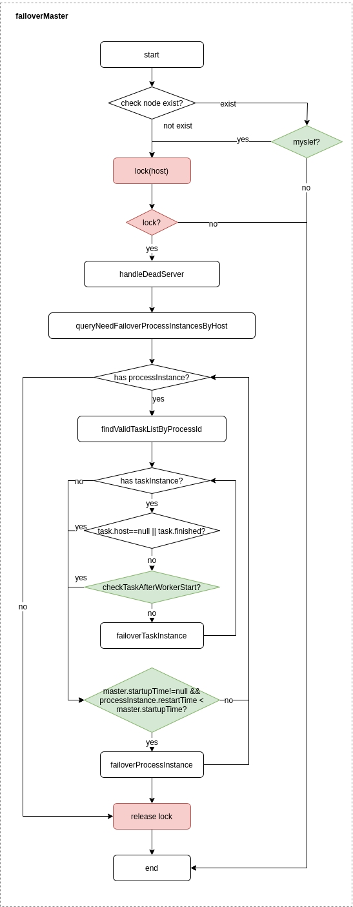
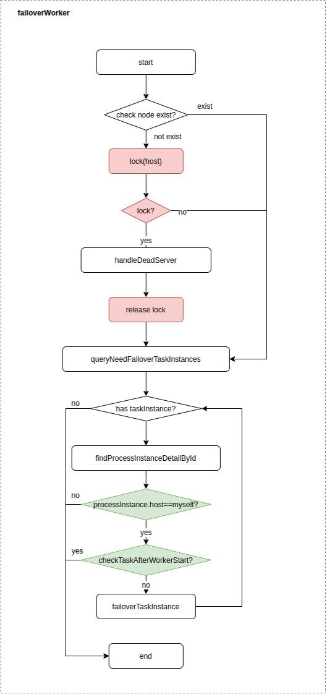

# 系统架构设计

## 系统架构

### 系统架构图

<p align="center">
  
  <p align="center">
        <em>系统架构图</em>
  </p>
</p>

### 启动流程活动图

<p align="center">
  
  <p align="center">
        <em>启动流程活动图</em>
  </p>
</p>

### 架构说明

* **MasterServer**

  MasterServer采用分布式无中心设计理念，MasterServer主要负责 DAG 任务切分、任务提交监控，并同时监听其它MasterServer和WorkerServer的健康状态。
  MasterServer服务启动时向Zookeeper注册临时节点，通过监听Zookeeper临时节点变化来进行容错处理。
  MasterServer基于netty提供监听服务。

  ##### 该服务内主要包含:

  - **DistributedQuartz**分布式调度组件，主要负责定时任务的启停操作，当quartz调起任务后，Master内部会有线程池具体负责处理任务的后续操作；

  - **MasterSchedulerService**是一个扫描线程，定时扫描数据库中的`t_ds_command`表，根据不同的命令类型进行不同的业务操作；

  - **WorkflowExecuteRunnable**主要是负责DAG任务切分、任务提交监控、各种不同事件类型的逻辑处理；

  - **TaskExecuteRunnable**主要负责任务的处理和持久化，并生成任务事件提交到工作流的事件队列；

  - **EventExecuteService**主要负责工作流实例的事件队列的轮询；

  - **StateWheelExecuteThread**主要负责工作流和任务超时、任务重试、任务依赖的轮询，并生成对应的工作流或任务事件提交到工作流的事件队列；

  - **FailoverExecuteThread**主要负责Master容错和Worker容错的相关逻辑；

* **WorkerServer**

  WorkerServer也采用分布式无中心设计理念，WorkerServer主要负责任务的执行和提供日志服务。
  WorkerServer服务启动时向Zookeeper注册临时节点，并维持心跳。
  WorkerServer基于netty提供监听服务。

  ##### 该服务包含：

  - **WorkerManagerThread**主要负责任务队列的提交，不断从任务队列中领取任务，提交到线程池处理；

  - **TaskExecuteThread**主要负责任务执行的流程，根据不同的任务类型进行任务的实际处理；

  - **RetryReportTaskStatusThread**主要负责定时轮询向Master汇报任务的状态，直到Master回复状态的ack，避免任务状态丢失；

* **ZooKeeper**

  ZooKeeper服务，系统中的MasterServer和WorkerServer节点都通过ZooKeeper来进行集群管理和容错。另外系统还基于ZooKeeper进行事件监听和分布式锁。
  我们也曾经基于Redis实现过队列，不过我们希望DolphinScheduler依赖到的组件尽量地少，所以最后还是去掉了Redis实现。

* **AlertServer**

  提供告警服务，通过告警插件的方式实现丰富的告警手段。

* **ApiServer**

  API接口层，主要负责处理前端UI层的请求。该服务统一提供RESTful api向外部提供请求服务。

* **UI**

  系统的前端页面，提供系统的各种可视化操作界面。

### 架构设计思想

#### 一、去中心化vs中心化

##### 中心化思想

中心化的设计理念比较简单，分布式集群中的节点按照角色分工，大体上分为两种角色：

<p align="center">
   
 </p>

- Master的角色主要负责任务分发并监督Slave的健康状态，可以动态的将任务均衡到Slave上，以致Slave节点不至于“忙死”或”闲死”的状态。
- Worker的角色主要负责任务的执行工作并维护和Master的心跳，以便Master可以分配任务给Slave。

中心化思想设计存在的问题：

- 一旦Master出现了问题，则群龙无首，整个集群就会崩溃。为了解决这个问题，大多数Master/Slave架构模式都采用了主备Master的设计方案，可以是热备或者冷备，也可以是自动切换或手动切换，而且越来越多的新系统都开始具备自动选举切换Master的能力,以提升系统的可用性。
- 另外一个问题是如果Scheduler在Master上，虽然可以支持一个DAG中不同的任务运行在不同的机器上，但是会产生Master的过负载。如果Scheduler在Slave上，则一个DAG中所有的任务都只能在某一台机器上进行作业提交，则并行任务比较多的时候，Slave的压力可能会比较大。

##### 去中心化

 <p align="center">
   
 </p>

- 在去中心化设计里，通常没有Master/Slave的概念，所有的角色都是一样的，地位是平等的，全球互联网就是一个典型的去中心化的分布式系统，联网的任意节点设备down机，都只会影响很小范围的功能。
- 去中心化设计的核心设计在于整个分布式系统中不存在一个区别于其他节点的”管理者”，因此不存在单点故障问题。但由于不存在” 管理者”节点所以每个节点都需要跟其他节点通信才得到必须要的机器信息，而分布式系统通信的不可靠性，则大大增加了上述功能的实现难度。
- 实际上，真正去中心化的分布式系统并不多见。反而动态中心化分布式系统正在不断涌出。在这种架构下，集群中的管理者是被动态选择出来的，而不是预置的，并且集群在发生故障的时候，集群的节点会自发的举行"会议"来选举新的"管理者"去主持工作。最典型的案例就是ZooKeeper及Go语言实现的Etcd。
- DolphinScheduler的去中心化是Master/Worker注册心跳到Zookeeper中，Master基于slot处理各自的Command，通过selector分发任务给worker，实现Master集群和Worker集群无中心。

#### 二、容错设计

容错分为服务宕机容错和任务重试，服务宕机容错又分为Master容错和Worker容错两种情况

##### 宕机容错

服务容错设计依赖于ZooKeeper的Watcher机制，实现原理如图：

 <p align="center">
   
 </p>
其中Master监控其他Master和Worker的目录，如果监听到remove事件，则会根据具体的业务逻辑进行流程实例容错或者任务实例容错。

- Master容错流程：

<p align="center">
   
 </p>

容错范围：从host的维度来看，Master的容错范围包括：自身host+注册中心上不存在的节点host，容错的整个过程会加锁；

容错内容：Master的容错内容包括：容错工作流实例和任务实例，在容错前会比较实例的开始时间和服务节点的启动时间，在服务启动时间之后的则跳过容错；

容错后处理：ZooKeeper Master容错完成之后则重新由DolphinScheduler中Scheduler线程调度，遍历 DAG 找到”正在运行”和“提交成功”的任务，对”正在运行”的任务监控其任务实例的状态，对”提交成功”的任务需要判断Task Queue中是否已经存在，如果存在则同样监控任务实例的状态，如果不存在则重新提交任务实例。

- Worker容错流程：

<p align="center">
   
 </p>

容错范围：从工作流实例的维度看，每个Master只负责容错自己的工作流实例；只有在`handleDeadServer`时会加锁；

容错内容：当发送Worker节点的remove事件时，Master只容错任务实例，在容错前会比较实例的开始时间和服务节点的启动时间，在服务启动时间之后的则跳过容错；

容错后处理：Master Scheduler线程一旦发现任务实例为” 需要容错”状态，则接管任务并进行重新提交。

注意：由于” 网络抖动”可能会使得节点短时间内失去和ZooKeeper的心跳，从而发生节点的remove事件。对于这种情况，我们使用最简单的方式，那就是节点一旦和ZooKeeper发生超时连接，则直接将Master或Worker服务停掉。

##### 三、任务失败重试

这里首先要区分任务失败重试、流程失败恢复、流程失败重跑的概念：

- 任务失败重试是任务级别的，是调度系统自动进行的，比如一个Shell任务设置重试次数为3次，那么在Shell任务运行失败后会自己再最多尝试运行3次
- 流程失败恢复是流程级别的，是手动进行的，恢复是从只能**从失败的节点开始执行**或**从当前节点开始执行**
- 流程失败重跑也是流程级别的，是手动进行的，重跑是从开始节点进行

接下来说正题，我们将工作流中的任务节点分了两种类型。

- 一种是业务节点，这种节点都对应一个实际的脚本或者处理语句，比如Shell节点、SQL节点、Spark节点等。

- 还有一种是逻辑节点，这种节点不做实际的脚本或语句处理，只是整个流程流转的逻辑处理，比如依赖节点、子流程节点等。

**业务节点**都可以配置失败重试的次数，当该任务节点失败，会自动重试，直到成功或者超过配置的重试次数。**逻辑节点**不支持失败重试。

如果工作流中有任务失败达到最大重试次数，工作流就会失败停止，失败的工作流可以手动进行重跑操作或者流程恢复操作。

#### 四、任务优先级设计

在早期调度设计中，如果没有优先级设计，采用公平调度设计的话，会遇到先行提交的任务可能会和后继提交的任务同时完成的情况，而不能做到设置流程或者任务的优先级，因此我们对此进行了重新设计，目前我们设计如下：

- 按照**不同流程实例优先级**优先于**同一个流程实例优先级**优先于**同一流程内任务优先级**优先于**同一流程内任务**提交顺序依次从高到低进行任务处理。
  - 具体实现是根据任务实例的json解析优先级，然后把**流程实例优先级_流程实例id_任务优先级_任务id**信息保存在ZooKeeper任务队列中，当从任务队列获取的时候，通过字符串比较即可得出最需要优先执行的任务
    - 其中流程定义的优先级是考虑到有些流程需要先于其他流程进行处理，这个可以在流程启动或者定时启动时配置，共有5级，依次为HIGHEST、HIGH、MEDIUM、LOW、LOWEST。如下图

        <p align="center">
           
         </p>

    - 任务的优先级也分为5级，依次为HIGHEST、HIGH、MEDIUM、LOW、LOWEST。如下图

        <p align="center">
           
         </p>

#### 五、Logback和netty实现日志访问

- 由于Web(UI)和Worker不一定在同一台机器上，所以查看日志不能像查询本地文件那样。有两种方案：
- 将日志放到ES搜索引擎上
- 通过netty通信获取远程日志信息
- 介于考虑到尽可能的DolphinScheduler的轻量级性，所以选择了gRPC实现远程访问日志信息。

 <p align="center">
   
 </p>

- 详情可参考Master和Worker的logback配置，如下示例：

```xml
<conversionRule conversionWord="messsage" converterClass="org.apache.dolphinscheduler.service.log.SensitiveDataConverter"/>
<appender name="TASKLOGFILE" class="ch.qos.logback.classic.sift.SiftingAppender">
    <filter class="org.apache.dolphinscheduler.service.log.TaskLogFilter"/>
    <Discriminator class="org.apache.dolphinscheduler.service.log.TaskLogDiscriminator">
        <key>taskAppId</key>
        <logBase>${log.base}</logBase>
    </Discriminator>
    <sift>
        <appender name="FILE-${taskAppId}" class="ch.qos.logback.core.FileAppender">
            <file>${log.base}/${taskAppId}.log</file>
            <encoder>
                <pattern>
                            [%level] %date{yyyy-MM-dd HH:mm:ss.SSS Z} [%thread] %logger{96}:[%line] - %messsage%n
                </pattern>
                <charset>UTF-8</charset>
            </encoder>
            <append>true</append>
        </appender>
    </sift>
</appender>
```

## 总结

本文从调度出发，初步介绍了大数据分布式工作流调度系统--DolphinScheduler的架构原理及实现思路。未完待续

