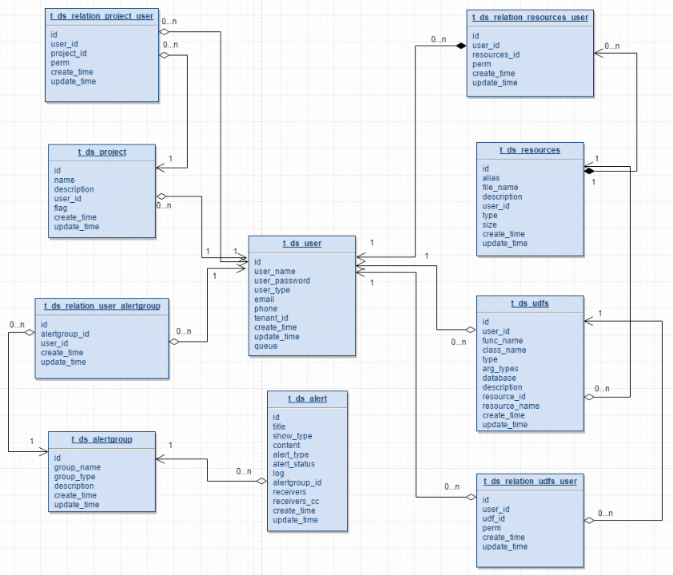

# DolphinScheduler 元数据文档

## 表Schema

详见`dolphinscheduler/dolphinscheduler-dao/src/main/resources/sql`目录下的sql文件

## E-R图

### 用户	队列	数据源

- 一个租户下可以有多个用户； 
- `t_ds_user`中的queue字段存储的是队列表中的`queue_name`信息，`t_ds_tenant`下存的是`queue_id`，在流程定义执行过程中，用户队列优先级最高，用户队列为空则采用租户队列； 
- `t_ds_datasource`表中的`user_id`字段表示创建该数据源的用户，`t_ds_relation_datasource_user`中的`user_id`表示对数据源有权限的用户； 

### 项目	资源	告警

- 一个用户可以有多个项目，用户项目授权通过`t_ds_relation_project_user`表完成project_id和user_id的关系绑定； 
- `t_ds_projcet`表中的`user_id`表示创建该项目的用户，`t_ds_relation_project_user`表中的`user_id`表示对项目有权限的用户； 
- `t_ds_resources`表中的`user_id`表示创建该资源的用户，`t_ds_relation_resources_user`中的`user_id`表示对资源有权限的用户； 
- `t_ds_udfs`表中的`user_id`表示创建该UDF的用户，`t_ds_relation_udfs_user`表中的`user_id`表示对UDF有权限的用户； 

### 项目 - 租户 - 工作流定义 - 定时

- 一个项目可以有多个工作流定义，每个工作流定义只属于一个项目； 
- 一个租户可以被多个工作流定义使用，每个工作流定义必须且只能选择一个租户； 
- 一个工作流定义可以有一个或多个定时的配置； 

### 工作流定义和执行

- 一个工作流定义对应多个任务定义，通过`t_ds_process_task_relation`进行关联，关联的key是`code + version`，当任务的前置节点为空时，对应的`pre_task_node`和`pre_task_version`为0；
- 一个工作流定义可以有多个工作流实例`t_ds_process_instance`，一个工作流实例对应一个或多个任务实例`t_ds_task_instance`；
- `t_ds_relation_process_instance`表存放的数据用于处理流程定义中含有子流程的情况，`parent_process_instance_id`表示含有子流程的主流程实例id，`process_instance_id`表示子流程实例的id，`parent_task_instance_id`表示子流程节点的任务实例id，流程实例表和任务实例表分别对应`t_ds_process_instance`表和`t_ds_task_instance`表；

