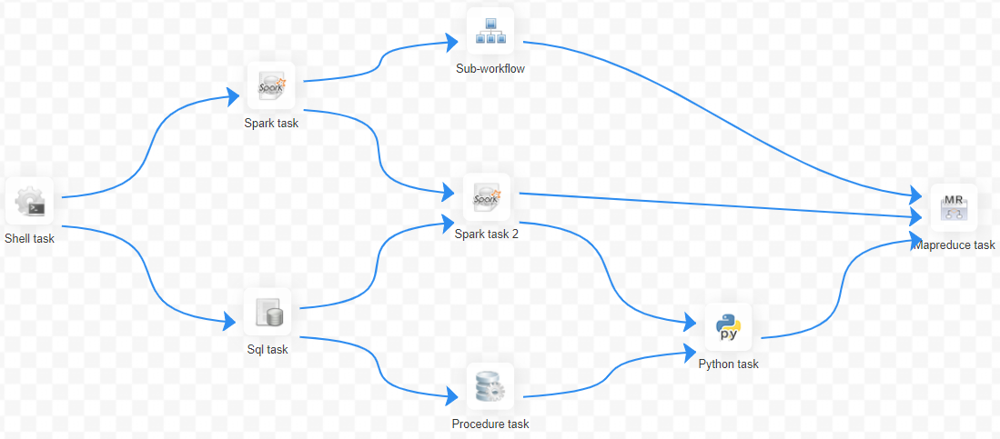
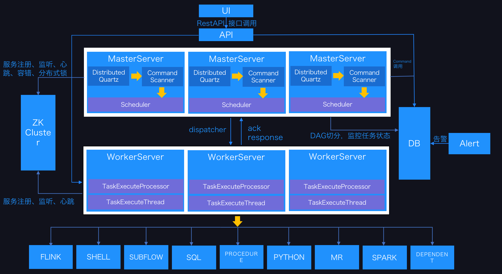
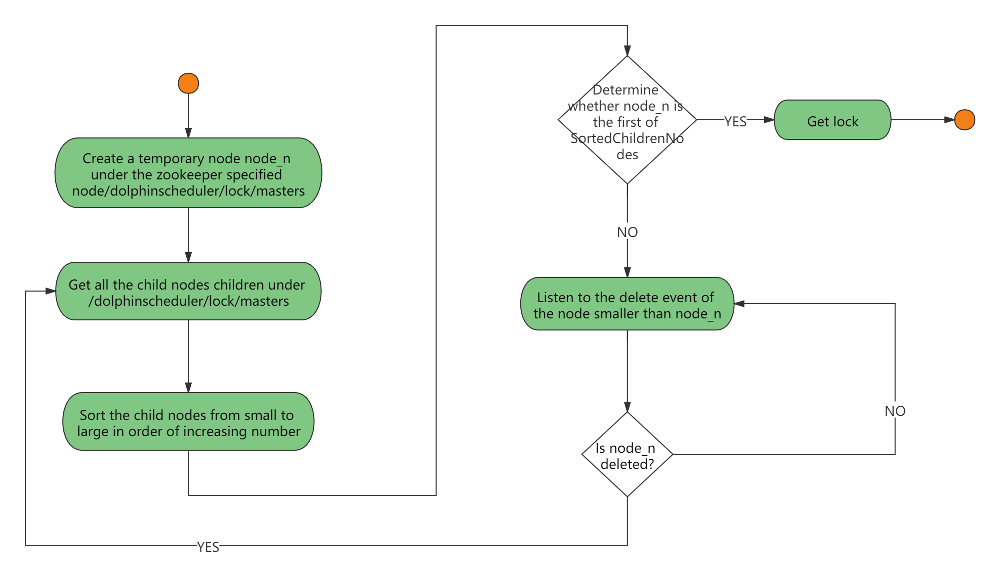
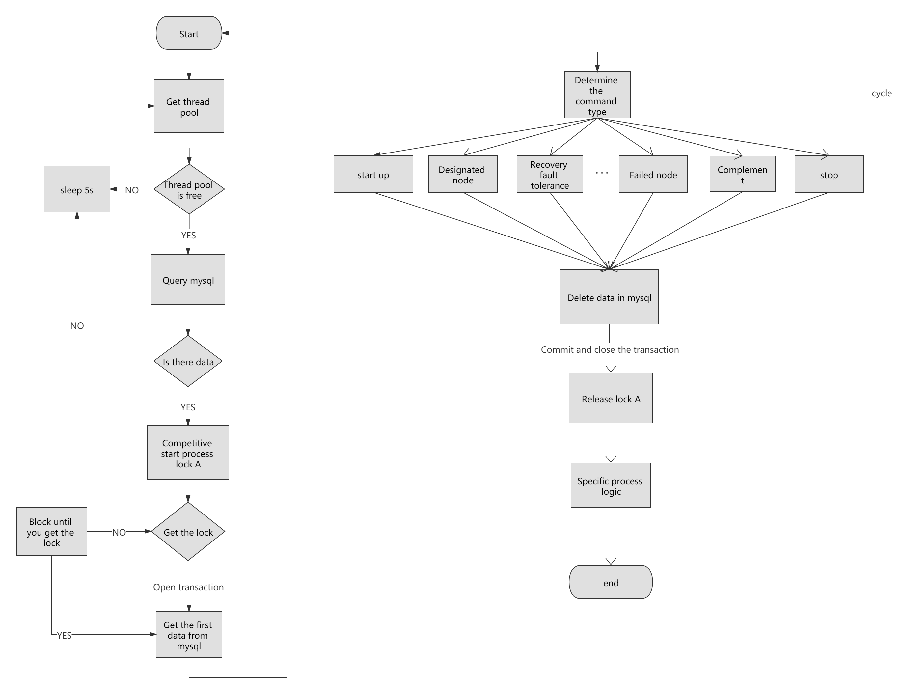
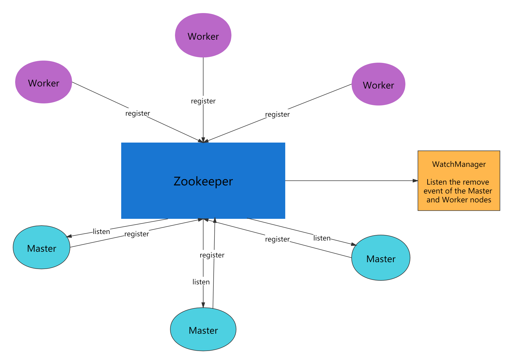
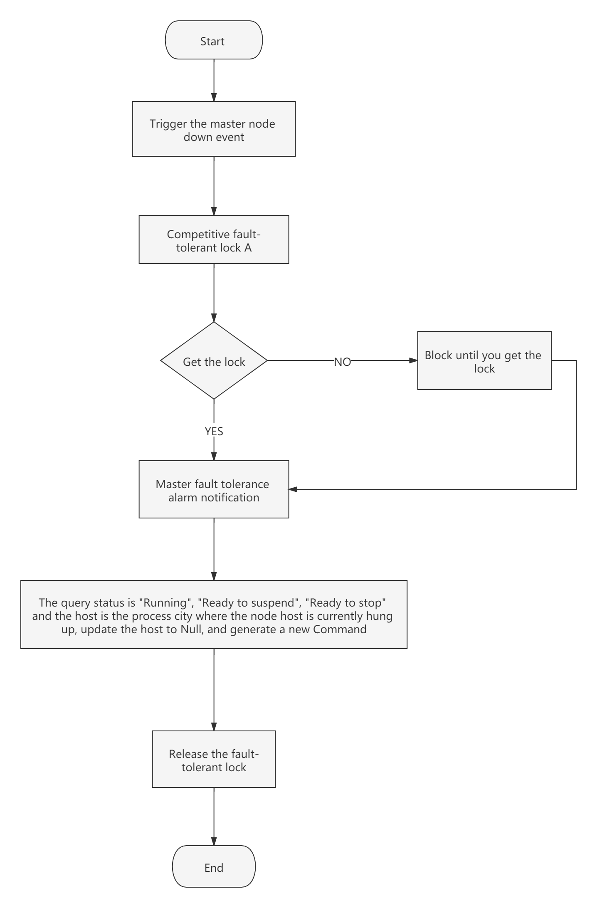
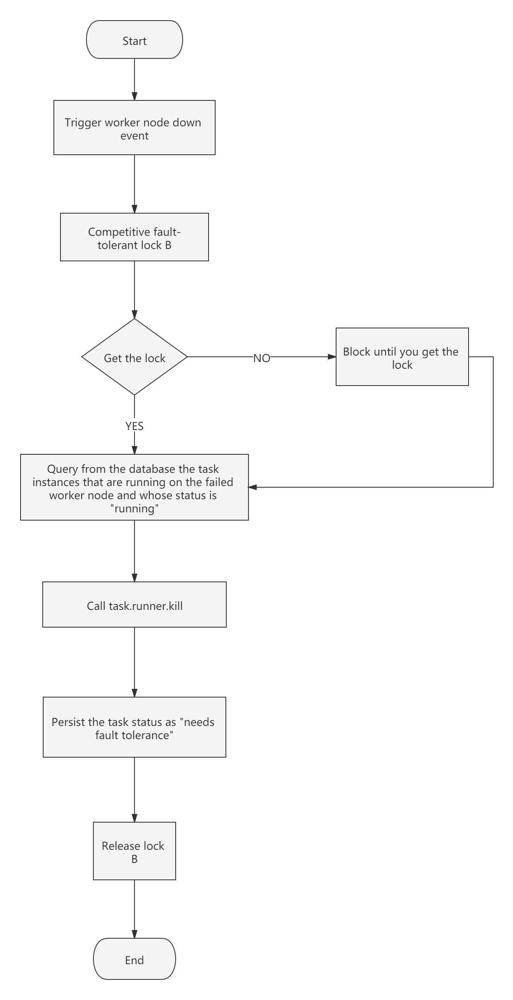

## 系统架构设计

在对调度系统架构说明之前，我们先来认识一下调度系统常用的名词

### 1.名词解释

**DAG：** 全称 Directed Acyclic Graph，简称 DAG。工作流中的 Task 任务以有向无环图的形式组装起来，从入度为零的节点进行拓扑遍历，直到无后继节点为止。举例如下图：

<p align="center">
  
  <p align="center">
        <em>dag示例</em>
  </p>
</p>

**流程定义**：通过拖拽任务节点并建立任务节点的关联所形成的可视化**DAG**

**流程实例**：流程实例是流程定义的实例化，可以通过手动启动或定时调度生成,流程定义每运行一次，产生一个流程实例

**任务实例**：任务实例是流程定义中任务节点的实例化，标识着具体的任务执行状态

**任务类型**： 目前支持有 SHELL、SQL、SUB_PROCESS(子流程)、PROCEDURE、MR、SPARK、PYTHON、DEPENDENT(依赖)，同时计划支持动态插件扩展，注意：其中子 **SUB_PROCESS** 也是一个单独的流程定义，是可以单独启动执行的

**调度方式：** 系统支持基于 cron 表达式的定时调度和手动调度。命令类型支持：启动工作流、从当前节点开始执行、恢复被容错的工作流、恢复暂停流程、从失败节点开始执行、补数、定时、重跑、暂停、停止、恢复等待线程。其中 **恢复被容错的工作流** 和 **恢复等待线程** 两种命令类型是由调度内部控制使用，外部无法调用

**定时调度**：系统采用 **quartz** 分布式调度器，并同时支持 cron 表达式可视化的生成

**依赖**：系统不单单支持 **DAG** 简单的前驱和后继节点之间的依赖，同时还提供**任务依赖**节点，支持**流程间的自定义任务依赖**

**优先级** ：支持流程实例和任务实例的优先级，如果流程实例和任务实例的优先级不设置，则默认是先进先出

**邮件告警**：支持 **SQL 任务** 查询结果邮件发送，流程实例运行结果邮件告警及容错告警通知

**失败策略**：对于并行运行的任务，如果有任务失败，提供两种失败策略处理方式，**继续**是指不管并行运行任务的状态，直到流程失败结束。**结束**是指一旦发现失败任务，则同时 Kill 掉正在运行的并行任务，流程失败结束

**补数**：补历史数据，支持**区间并行和串行**两种补数方式

### 2.系统架构

#### 2.1 系统架构图

<p align="center">
  
  <p align="center">
        <em>系统架构图</em>
  </p>
</p>

#### 2.2 架构说明

- **MasterServer**

  MasterServer 采用分布式无中心设计理念，MasterServer 主要负责 DAG 任务切分、任务提交监控，并同时监听其它 MasterServer 和 WorkerServer 的健康状态。
  MasterServer 服务启动时向 Zookeeper 注册临时节点，通过监听 Zookeeper 临时节点变化来进行容错处理。

  ##### 该服务内主要包含:

  - **Distributed Quartz**分布式调度组件，主要负责定时任务的启停操作，当 quartz 调起任务后，Master 内部会有线程池具体负责处理任务的后续操作

  - **MasterSchedulerThread**是一个扫描线程，定时扫描数据库中的 **command** 表，根据不同的**命令类型**进行不同的业务操作

  - **MasterExecThread**主要是负责 DAG 任务切分、任务提交监控、各种不同命令类型的逻辑处理

  - **MasterTaskExecThread**主要负责任务的持久化

- **WorkerServer**

  WorkerServer 也采用分布式无中心设计理念，WorkerServer 主要负责任务的执行和提供日志服务。WorkerServer 服务启动时向 Zookeeper 注册临时节点，并维持心跳。

  ##### 该服务包含：

  - **FetchTaskThread**主要负责不断从**Task Queue**中领取任务，并根据不同任务类型调用**TaskScheduleThread**对应执行器。
- **ZooKeeper**

  ZooKeeper 服务，系统中的 MasterServer 和 WorkerServer 节点都通过 ZooKeeper 来进行集群管理和容错。另外系统还基于 ZooKeeper 进行事件监听和分布式锁。
  我们也曾经基于 Redis 实现过队列，不过我们希望 DolphinScheduler 依赖到的组件尽量地少，所以最后还是去掉了 Redis 实现。

- **Task Queue**

  提供任务队列的操作，目前队列也是基于 Zookeeper 来实现。由于队列中存的信息较少，不必担心队列里数据过多的情况，实际上我们压测过百万级数据存队列，对系统稳定性和性能没影响。

- **Alert**

  提供告警相关接口，接口主要包括两种类型的告警数据的存储、查询和通知功能。其中通知功能又有**邮件通知**和**SNMP(暂未实现)**两种。

- **API**

  API 接口层，主要负责处理前端 UI 层的请求。该服务统一提供 RESTful api 向外部提供请求服务。
  接口包括工作流的创建、定义、查询、修改、发布、下线、手工启动、停止、暂停、恢复、从该节点开始执行等等。

- **UI**

  系统的前端页面，提供系统的各种可视化操作界面，详见 [快速开始](https://dolphinscheduler.apache.org/zh-cn/docs/3.1.2/about/introduction) 部分。

#### 2.3 架构设计思想

##### 一、去中心化 vs 中心化

###### 中心化思想

中心化的设计理念比较简单，分布式集群中的节点按照角色分工，大体上分为两种角色：

<p align="center">
   
 </p>

- Master 的角色主要负责任务分发并监督 Slave 的健康状态，可以动态的将任务均衡到 Slave 上，以致 Slave 节点不至于“忙死”或”闲死”的状态。
- Worker 的角色主要负责任务的执行工作并维护和 Master 的心跳，以便 Master 可以分配任务给 Slave。

中心化思想设计存在的问题：

- 一旦 Master 出现了问题，则群龙无首，整个集群就会崩溃。为了解决这个问题，大多数 Master/Slave 架构模式都采用了主备 Master 的设计方案，可以是热备或者冷备，也可以是自动切换或手动切换，而且越来越多的新系统都开始具备自动选举切换 Master 的能力,以提升系统的可用性。
- 另外一个问题是如果 Scheduler 在 Master 上，虽然可以支持一个 DAG 中不同的任务运行在不同的机器上，但是会产生 Master 的过负载。如果 Scheduler 在 Slave 上，则一个 DAG 中所有的任务都只能在某一台机器上进行作业提交，则并行任务比较多的时候，Slave 的压力可能会比较大。

###### 去中心化

 <p align="center"
   
 </p>

- 在去中心化设计里，通常没有 Master/Slave 的概念，所有的角色都是一样的，地位是平等的，全球互联网就是一个典型的去中心化的分布式系统，联网的任意节点设备 down 机，都只会影响很小范围的功能。
- 去中心化设计的核心设计在于整个分布式系统中不存在一个区别于其他节点的”管理者”，因此不存在单点故障问题。但由于不存在” 管理者”节点所以每个节点都需要跟其他节点通信才得到必须要的机器信息，而分布式系统通信的不可靠性，则大大增加了上述功能的实现难度。
- 实际上，真正去中心化的分布式系统并不多见。反而动态中心化分布式系统正在不断涌出。在这种架构下，集群中的管理者是被动态选择出来的，而不是预置的，并且集群在发生故障的时候，集群的节点会自发的举行"会议"来选举新的"管理者"去主持工作。最典型的案例就是 ZooKeeper 及 Go 语言实现的 Etcd。
- DolphinScheduler 的去中心化是 Master/Worker 注册到 Zookeeper 中，实现 Master 集群和 Worker 集群无中心，并使用 Zookeeper 分布式锁来选举其中的一台 Master 或 Worker 为“管理者”来执行任务。

##### 二、分布式锁实践

DolphinScheduler 使用 ZooKeeper 分布式锁来实现同一时刻只有一台 Master 执行 Scheduler，或者只有一台 Worker 执行任务的提交。

1. 获取分布式锁的核心流程算法如下

 <p align="center">
   
 </p>

2. DolphinScheduler 中 Scheduler 线程分布式锁实现流程图：

 <p align="center">
   
 </p>

##### 三、线程不足循环等待问题

- 如果一个 DAG 中没有子流程，则如果 Command 中的数据条数大于线程池设置的阈值，则直接流程等待或失败。
- 如果一个大的 DAG 中嵌套了很多子流程，如下图则会产生“死等”状态：

 <p align="center">
   
 </p>
上图中MainFlowThread等待SubFlowThread1结束，SubFlowThread1等待SubFlowThread2结束， SubFlowThread2等待SubFlowThread3结束，而SubFlowThread3等待线程池有新线程，则整个DAG流程不能结束，从而其中的线程也不能释放。这样就形成的子父流程循环等待的状态。此时除非启动新的Master来增加线程来打破这样的”僵局”，否则调度集群将不能再使用。

对于启动新 Master 来打破僵局，似乎有点差强人意，于是我们提出了以下三种方案来降低这种风险：

1. 计算所有 Master 的线程总和，然后对每一个 DAG 需要计算其需要的线程数，也就是在 DAG 流程执行之前做预计算。因为是多 Master 线程池，所以总线程数不太可能实时获取。
2. 对单 Master 线程池进行判断，如果线程池已经满了，则让线程直接失败。
3. 增加一种资源不足的 Command 类型，如果线程池不足，则将主流程挂起。这样线程池就有了新的线程，可以让资源不足挂起的流程重新唤醒执行。

注意：Master Scheduler 线程在获取 Command 的时候是 FIFO 的方式执行的。

于是我们选择了第三种方式来解决线程不足的问题。

##### 四、容错设计

容错分为服务宕机容错和任务重试，服务宕机容错又分为 Master 容错和 Worker 容错两种情况

###### 1. 宕机容错

服务容错设计依赖于 ZooKeeper 的 Watcher 机制，实现原理如图：

 <p align="center">
   
 </p>
其中Master监控其他Master和Worker的目录，如果监听到remove事件，则会根据具体的业务逻辑进行流程实例容错或者任务实例容错。

- Master 容错流程图：

 <p align="center">
   
 </p>
ZooKeeper Master容错完成之后则重新由DolphinScheduler中Scheduler线程调度，遍历 DAG 找到”正在运行”和“提交成功”的任务，对”正在运行”的任务监控其任务实例的状态，对”提交成功”的任务需要判断Task Queue中是否已经存在，如果存在则同样监控任务实例的状态，如果不存在则重新提交任务实例。

- Worker 容错流程图：

 <p align="center">
   
 </p>

Master Scheduler 线程一旦发现任务实例为” 需要容错”状态，则接管任务并进行重新提交。

注意：由于” 网络抖动”可能会使得节点短时间内失去和 ZooKeeper 的心跳，从而发生节点的 remove 事件。对于这种情况，我们使用最简单的方式，那就是节点一旦和 ZooKeeper 发生超时连接，则直接将 Master 或 Worker 服务停掉。

###### 2.任务失败重试

这里首先要区分任务失败重试、流程失败恢复、流程失败重跑的概念：

- 任务失败重试是任务级别的，是调度系统自动进行的，比如一个 Shell 任务设置重试次数为 3 次，那么在 Shell 任务运行失败后会自己再最多尝试运行 3 次
- 流程失败恢复是流程级别的，是手动进行的，恢复是从只能**从失败的节点开始执行**或**从当前节点开始执行**
- 流程失败重跑也是流程级别的，是手动进行的，重跑是从开始节点进行

接下来说正题，我们将工作流中的任务节点分了两种类型。

- 一种是业务节点，这种节点都对应一个实际的脚本或者处理语句，比如 Shell 节点，MR 节点、Spark 节点、依赖节点等。

- 还有一种是逻辑节点，这种节点不做实际的脚本或语句处理，只是整个流程流转的逻辑处理，比如子流程节点等。

每一个**业务节点**都可以配置失败重试的次数，当该任务节点失败，会自动重试，直到成功或者超过配置的重试次数。**逻辑节点**不支持失败重试。但是逻辑节点里的任务支持重试。

如果工作流中有任务失败达到最大重试次数，工作流就会失败停止，失败的工作流可以手动进行重跑操作或者流程恢复操作

##### 五、任务优先级设计

在早期调度设计中，如果没有优先级设计，采用公平调度设计的话，会遇到先行提交的任务可能会和后继提交的任务同时完成的情况，而不能做到设置流程或者任务的优先级，因此我们对此进行了重新设计，目前我们设计如下：

- 按照**不同流程实例优先级**优先于**同一个流程实例优先级**优先于**同一流程内任务优先级**优先于**同一流程内任务**提交顺序依次从高到低进行任务处理。
  - 具体实现是根据任务实例的 json 解析优先级，然后把**流程实例优先级*流程实例 id*任务优先级\_任务 id**信息保存在 ZooKeeper 任务队列中，当从任务队列获取的时候，通过字符串比较即可得出最需要优先执行的任务
    - 其中流程定义的优先级是考虑到有些流程需要先于其他流程进行处理，这个可以在流程启动或者定时启动时配置，共有 5 级，依次为 HIGHEST、HIGH、MEDIUM、LOW、LOWEST。如下图

        <p align="center">
           
         </p>

    - 任务的优先级也分为 5 级，依次为 HIGHEST、HIGH、MEDIUM、LOW、LOWEST。如下图

        <p align="center">
           
         </p>

##### 六、Logback 和 gRPC 实现日志访问

- 由于 Web(UI)和 Worker 不一定在同一台机器上，所以查看日志不能像查询本地文件那样。有两种方案：
- 将日志放到 ES 搜索引擎上
- 通过 gRPC 通信获取远程日志信息
- 介于考虑到尽可能的 DolphinScheduler 的轻量级性，所以选择了 gRPC 实现远程访问日志信息。

 <p align="center">
   
 </p>

- 我们使用自定义 Logback 的 FileAppender 和 Filter 功能，实现每个任务实例生成一个日志文件。
- FileAppender 主要实现如下：

```java
/**
 * task log appender
 */
public class TaskLogAppender extends FileAppender<ILoggingEvent> {

    ...

   @Override
   protected void append(ILoggingEvent event) {

       if (currentlyActiveFile == null){
           currentlyActiveFile = getFile();
       }
       String activeFile = currentlyActiveFile;
       // thread name： taskThreadName-processDefineId_processInstanceId_taskInstanceId
       String threadName = event.getThreadName();
       String[] threadNameArr = threadName.split("-");
       // logId = processDefineId_processInstanceId_taskInstanceId
       String logId = threadNameArr[1];
       ...
       super.subAppend(event);
   }
}
```

以/流程定义 id/流程实例 id/任务实例 id.log 的形式生成日志

- 过滤匹配以 TaskLogInfo 开始的线程名称：

- TaskLogFilter 实现如下：

```java
/**
*  task log filter
*/
public class TaskLogFilter extends Filter<ILoggingEvent> {

   @Override
   public FilterReply decide(ILoggingEvent event) {
       if (event.getThreadName().startsWith("TaskLogInfo-")){
           return FilterReply.ACCEPT;
       }
       return FilterReply.DENY;
   }
}
```

### 总结

本文从调度出发，初步介绍了大数据分布式工作流调度系统--DolphinScheduler 的架构原理及实现思路。未完待续
