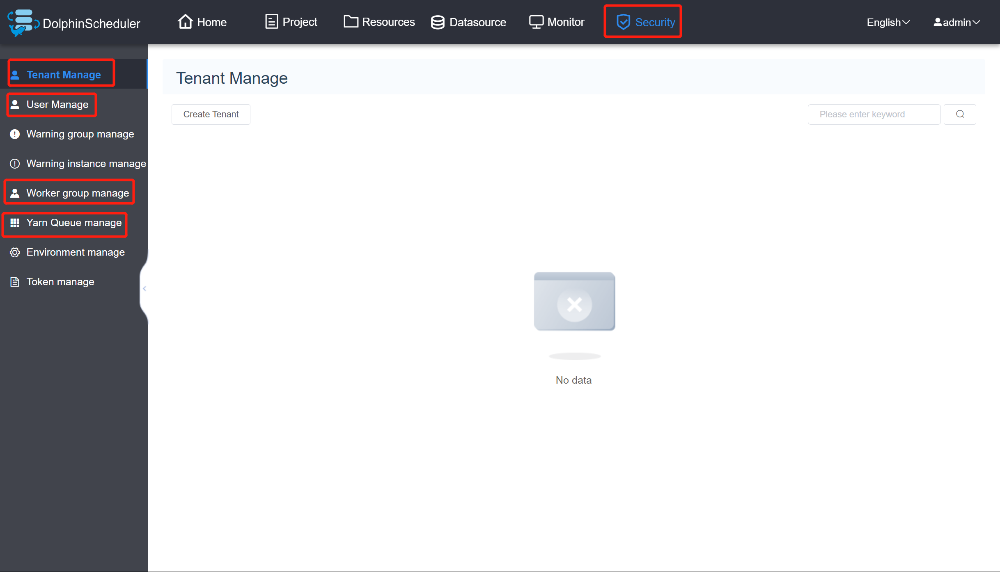
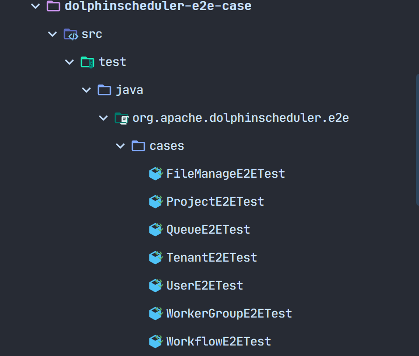
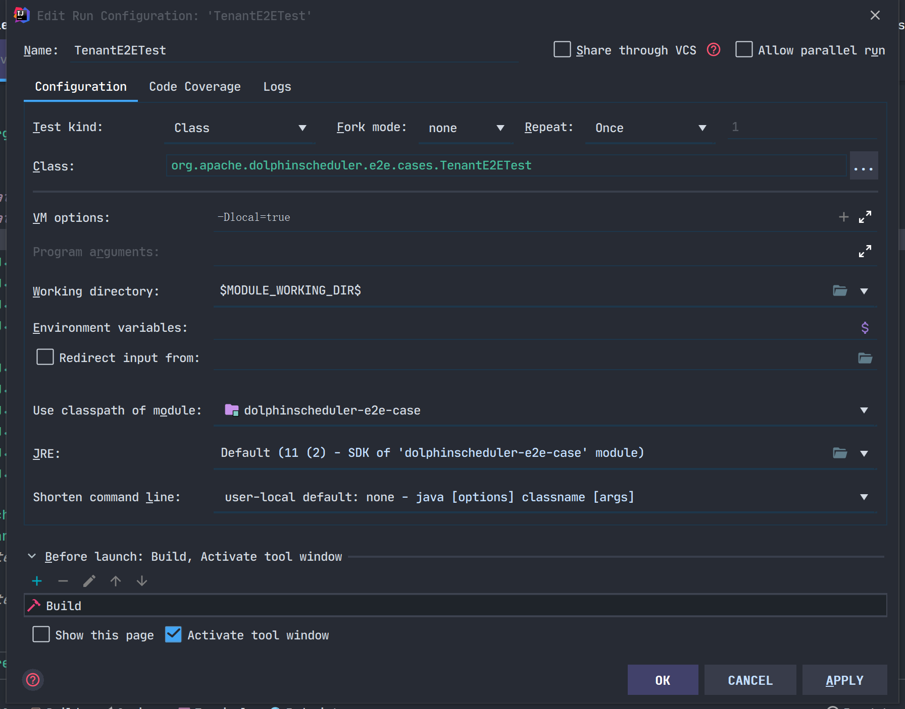
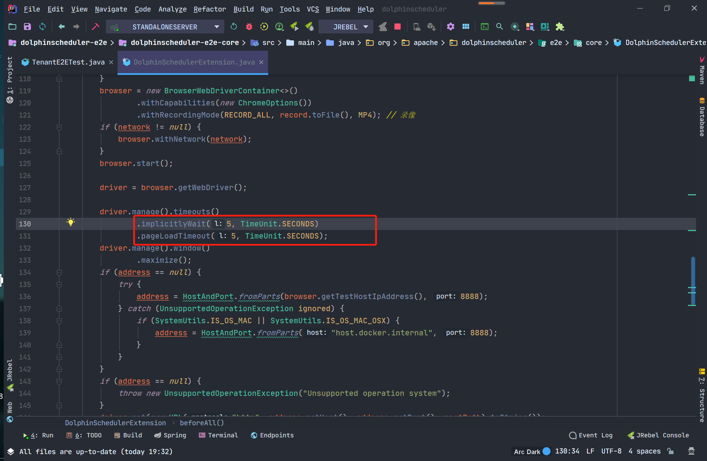
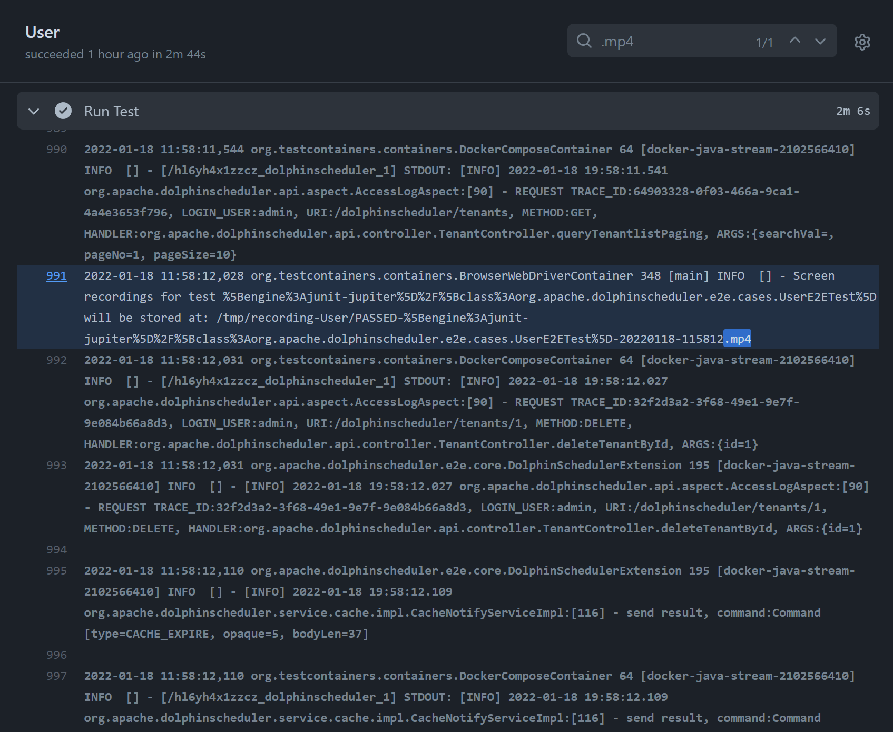

# DolphinScheduler — E2E 自动化测试

## 一、前置知识：

### 1、E2E 测试与单元测试的区别

E2E，是“End to End”的缩写，可以翻译成“端到端”测试。它模仿用户，从某个入口开始，逐步执行操作，直到完成某项工作。与单元测试不同，后者通常需要测试参数、参数类型、参数值、参数数量、返回值、抛出错误等，目的在于保证特定函数能够在任何情况下都稳定可靠完成工作。单元测试假定只要所有函数都正常工作，那么整个产品就能正常工作。

相对来说，E2E 测试并没有那么强调要覆盖全部使用场景，它关注的**一个完整的操作链是否能够完成**。对于 Web 前端来说，还关注**界面布局、内容信息是否符合预期**。

比如，登陆界面的 E2E 测试，关注用户是否能够正常输入，正常登录；登陆失败的话，是否能够正确显示错误信息。至于输入不合法的内容是否处理，并不是所关注的重点。

### 2、Selenium 测试框架

[Selenium](https://www.selenium.dev) 是一种开源测试工具，用于在 Web 浏览器上执行自动化测试。该框架使用 WebDriver 通过浏览器的原生组件，转化 Web Service 的命令为浏览器 native 的调用来完成操作。简单来说，就是模拟浏览器，对于页面的元素进行选择操作。

WebDriver 是一个 API 和协议，它定义了一个语言中立的接口，用于控制 web 浏览器的行为。 每个浏览器都有一个特定的 WebDriver 实现，称为驱动程序。驱动程序是负责委派给浏览器的组件，并处理与 Selenium 和浏览器之间的通信。

Selenium 框架通过一个面向用户的界面将所有这些部分连接在一起， 该界面允许透明地使用不同的浏览器后端， 从而实现跨浏览器和跨平台自动化。

## 二、E2E 测试

### 1、E2E-Pages

DolphinScheduler 的 E2E 测试使用 docker-compose 部署，当前测试的为单机模式，主要用于检验一些例如“增删改查”基本功能，后期如需做集群验证，例如不同服务之间的协作，或者各个服务之间的通讯机制，可参考 `deploy/docker/docker-compose.yml`来配置。

对于 E2E 测试（前端这一块），使用 [页面模型](https://www.selenium.dev/documentation/guidelines/page_object_models/) 的形式，主要为每一个页面建立一个对应的模型。下面以登录页为例：

```java
package org.apache.dolphinscheduler.e2e.pages;

import org.apache.dolphinscheduler.e2e.pages.common.NavBarPage;
import org.apache.dolphinscheduler.e2e.pages.security.TenantPage;

import org.openqa.selenium.WebElement;
import org.openqa.selenium.remote.RemoteWebDriver;
import org.openqa.selenium.support.FindBy;
import org.openqa.selenium.support.ui.ExpectedConditions;
import org.openqa.selenium.support.ui.WebDriverWait;

import lombok.Getter;
import lombok.SneakyThrows;

@Getter
public final class LoginPage extends NavBarPage {
    @FindBy(id = "inputUsername")
    private WebElement inputUsername;

    @FindBy(id = "inputPassword")
    private WebElement inputPassword;

    @FindBy(id = "btnLogin")
    private WebElement buttonLogin;

    public LoginPage(RemoteWebDriver driver) {
        super(driver);
    }

    @SneakyThrows
    public TenantPage login(String username, String password) {
        inputUsername().sendKeys(username);
        inputPassword().sendKeys(password);
        buttonLogin().click();

        new WebDriverWait(driver, 10)
            .until(ExpectedConditions.urlContains("/#/security"));

        return new TenantPage(driver);
    }
}
```

在测试过程中，我们只针对所需要关注的元素进行测试，而非页面中的所有元素，所以在登陆页面只对用户名、密码和登录按钮这些元素进行声明。通过 Selenium 测试框架所提供的 FindBy 接口来查找 Vue 文件中对应的 id 或 class。

此外，在测试过程中，并不会直接去操作元素，一般选择封装对应的方法，以达到复用的效果。例如想要登录的话，直接传入用户名和密码，通过 `public TenantPage login()` 方法去操作所传入的元素，从而达到实现登录的效果，即当用户完成登录之后，跳转到安全中心（默认进入到租户管理页面）。

在安全中心页面（SecurityPage）提供了 goToTab 方法，用于测试对应侧栏的跳转，主要包括：租户管理（TenantPage）、用户管理（UserPage）、工作组管理（WorkerGroupPage）和队列管理（QueuePage）。这些页面的实现方式同理，主要测试表单的输入、增加和删除按钮是否能够返回出对应的页面。

```java
public <T extends SecurityPage.Tab> T goToTab(Class<T> tab) {
       if (tab == TenantPage.class) {
           WebElement menuTenantManageElement = new WebDriverWait(driver, 60)
                   .until(ExpectedConditions.elementToBeClickable(menuTenantManage));
           ((JavascriptExecutor)driver).executeScript("arguments[0].click();", menuTenantManageElement);
           return tab.cast(new TenantPage(driver));
       }
       if (tab == UserPage.class) {
           WebElement menUserManageElement = new WebDriverWait(driver, 60)
                   .until(ExpectedConditions.elementToBeClickable(menUserManage));
           ((JavascriptExecutor)driver).executeScript("arguments[0].click();", menUserManageElement);
           return tab.cast(new UserPage(driver));
       }
       if (tab == WorkerGroupPage.class) {
           WebElement menWorkerGroupManageElement = new WebDriverWait(driver, 60)
                   .until(ExpectedConditions.elementToBeClickable(menWorkerGroupManage));
           ((JavascriptExecutor)driver).executeScript("arguments[0].click();", menWorkerGroupManageElement);
           return tab.cast(new WorkerGroupPage(driver));
       }
       if (tab == QueuePage.class) {
           menuQueueManage().click();
           return tab.cast(new QueuePage(driver));
       }
       throw new UnsupportedOperationException("Unknown tab: " + tab.getName());
   }
```



对于导航栏选项的跳转，在`org/apache/dolphinscheduler/e2e/pages/common/NavBarPage.java` 中提供了 goToNav 的方法。当前支持的页面为：项目管理（ProjectPage）、安全中心（SecurityPage）和资源中心（ResourcePage）。

```java
    public <T extends NavBarItem> T goToNav(Class<T> nav) {
        if (nav == ProjectPage.class) {
            WebElement projectTabElement = new WebDriverWait(driver, 60)
                .until(ExpectedConditions.elementToBeClickable(projectTab));
            ((JavascriptExecutor)driver).executeScript("arguments[0].click();", projectTabElement);
            return nav.cast(new ProjectPage(driver));
        }

        if (nav == SecurityPage.class) {
            WebElement securityTabElement = new WebDriverWait(driver, 60)
                .until(ExpectedConditions.elementToBeClickable(securityTab));
            ((JavascriptExecutor)driver).executeScript("arguments[0].click();", securityTabElement);
            return nav.cast(new SecurityPage(driver));
        }

        if (nav == ResourcePage.class) {
            WebElement resourceTabElement = new WebDriverWait(driver, 60)
                .until(ExpectedConditions.elementToBeClickable(resourceTab));
            ((JavascriptExecutor)driver).executeScript("arguments[0].click();", resourceTabElement);
            return nav.cast(new ResourcePage(driver));
        }

        throw new UnsupportedOperationException("Unknown nav bar");
    }
```

### 2、E2E-Cases

当前所支持的 E2E 测试案例，主要包括：文件管理、项目管理、队列管理、租户管理、用户管理、Worker 分组管理和工作流测试。



下面以租户管理测试为例，前文已经说明，我们使用 docker-compose 进行部署，所以每个测试案例，都需要以注解的形式引入对应的文件。

使用 Selenium 所提供的 RemoteWebDriver 来加载浏览器。在每个测试案例开始之前都需要进行一些准备工作。比如：登录用户、跳转到对应的页面（根据具体的测试案例而定）。

```java
@BeforeAll
public static void setup() {
    new LoginPage(browser)
            .login("admin", "dolphinscheduler123") // 登录进入租户界面
            .goToNav(SecurityPage.class) // 安全中心
            .goToTab(TenantPage.class)
    ;
}
```

在完成准备工作之后，就是正式的测试案例编写。我们使用 @Order() 注解的形式，用于模块化，确认测试顺序。在进行测试之后，使用断言来判断测试是否成功，如果断言返回 true，则表示创建租户成功。可参考创建租户的测试代码：

```java
    @Test
    @Order(10)
    void testCreateTenant() {
        final TenantPage page = new TenantPage(browser);
        page.create(tenant);

        await().untilAsserted(() -> assertThat(page.tenantList())
                .as("Tenant list should contain newly-created tenant")
                .extracting(WebElement::getText)
                .anyMatch(it -> it.contains(tenant)));
    }
```

其余的都是类似的情况，可参考具体的源码来理解。

https://github.com/apache/dolphinscheduler/tree/dev/dolphinscheduler-e2e/dolphinscheduler-e2e-case/src/test/java/org/apache/dolphinscheduler/e2e/cases

## 三、补充

在本地运行的时候，首先需要启动相应的本地服务，可以参考该页面: [环境搭建](./development-environment-setup.md)

在本地运行 E2E 测试的时候，可以配置 `-Dlocal=true` 参数，用于连接本地，方便对于 UI 界面的更改。

如果是`M1`芯片的机器，可以使用`-Dm1_chip=true` 参数,用于配置使用`ARM64`支持的容器。



在本地运行过程中，如果出现连接超时，可增大加载时间，建议 30 及其以上。



测试的运行过程将会以 MP4 的文件格式存在。


