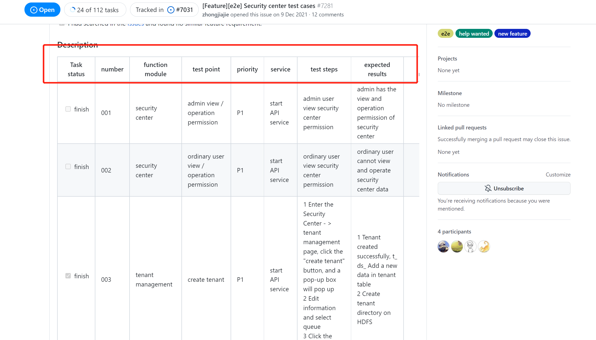

# DolphinScheduler E2E 测试参与指南

E2E 测试的主要目的是通过模拟真实的用户场景，验证被测系统及其组件的集成性和数据完整性，从而可以扩展测试范围，确保系统的健康稳定，在一定程度上减少测试工作量和成本。简单来说，E2E 测试就是把程序当做黑盒子，以用户的视角对真实系统的访问行为进行仿真，对测试的输入（用户行为/模拟数据），看能否得到预期得到的结果。因此，社区决定为 DolphinScheduler 增加 E2E 自动化测试。

当前社区的 E2E 测试尚未达到完全覆盖，因此编写此文档，目的在于引导更多的同学参与进来。

### 如何寻找对应的 issue ？

当前社区把 E2E 需要测试的页面已经列出相关的 issue，主要分为 Project Management、Resource Center、DataSource、Security Center 四个页面。

贡献者可以通过 GitHub 然后搜索 [apace/dolphinscheduler](https://github.com/apache/dolphinscheduler)，然后在 [issue](https://github.com/apache/dolphinscheduler/issues?q=is%3Aissue+is%3Aopen+e2e+test+cases) 列表中搜索 `e2e test cases` 即可找到对应的任务。如下图：

在每个对应的 issue 中，我们都列出需要测试的内容和期望的结果，可以在 Description 中看见。进入当前页面之后，可以根据自身所感兴趣的选择对应的 issue，例如参与 Security Center 的测试，在对应的 issue 下留言自己所想测试的案例即可。

- Task status：若该测试已经完成，则视为 finish，作为贡献者需要寻找尚未完成的测试。
- number：测试案例的序号。
- function module：需要测试的功能模块，一个功能模块包含多个测试案例。
- test point：具体的需要测试的案例。例如页面中的按钮点击操作，页面跳转的功能。
- priority：测试案例的优先级，**推荐寻找优先级高的案例**。
- service：测试过程中所需要启动的服务。
- test steps：每个测试案例需要操作的测试步骤。
- expected results：所期望的测试结果。
- actual results：实际测试的结果。
- remarks：测试过程中需要的注意点。

### 如何编写测试代码？

在认领对应的任务之后，下一步就进入到编写代码的关键。很多同学可能对于 E2E 测试代码并不是很熟悉，因此可以参考该页面：[e2e-test](../e2e-test.md)。

### 如何提交 Pull Request ？

参与开源社区的形式多种多样，其中不限于 issue、pull request 和翻译等等。在参与 E2E 测试的过程，首先要求贡献者了解简单的提交 pull request 的流程，可参考：[Pull Request](./pull-request.md)。
