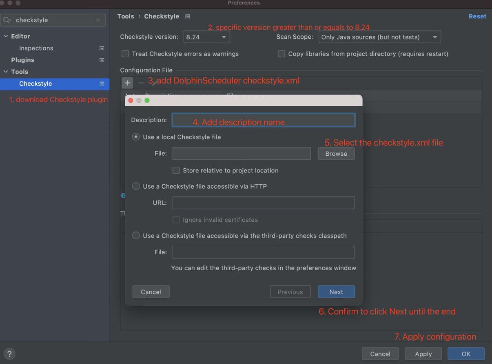
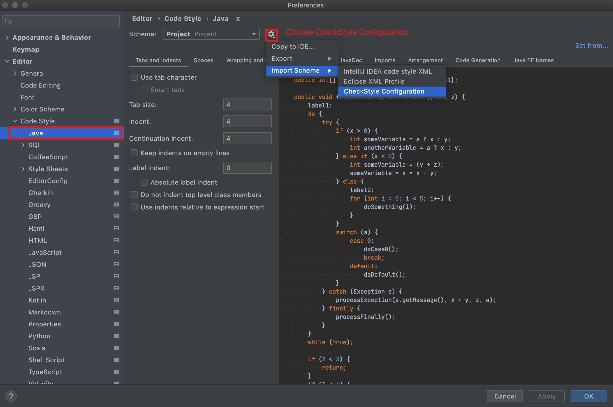

# Pull Request 须知

## 前言
Pull Request 本质上是一种软件的合作方式，是将涉及不同功能的代码，纳入主干的一种流程。这个过程中，可以进行讨论、审核和修改代码。

在 Pull Request 中尽量不讨论代码的实现方案，代码及其逻辑的大体实现方案应该尽量在
Issue 或者邮件列表中被讨论确定，在 Pull Request 中我们尽量只关注代码的格式以及代码规范等信息，从而避免实现方式的意见不同而导致
waste time。

## 规范

### Pull Request 标题

标题格式：[`Pull Request 类型`-`Issue 号`][`模块名`] `Pull Request 描述`

其中`Pull Request 类型`和`Issue 类型`的对应关系如下：

<table>
    <thead>
        <tr>
            <th style="width: 10%; text-align: center;">Issue 类型</th>
            <th style="width: 20%; text-align: center;">Pull Request 类型</th>
            <th style="width: 20%; text-align: center;">样例（假设 Issue 号为 3333）</th>
        </tr>
    </thead>
    <tbody>
        <tr>
            <td style="text-align: center;">Feature</td>
            <td style="text-align: center;">Feature</td>
            <td style="text-align: center;">[Feature-3333][server] Implement xxx</td>
        </tr>
        <tr>
            <td style="text-align: center;">Bug</td>
            <td style="text-align: center;">Fix</td>
            <td style="text-align: center;">[Fix-3333][server] Fix xxx</td>
        </tr>
        <tr>
            <td style="text-align: center;">Improvement</td>
            <td style="text-align: center;">Improvement</td>
            <td style="text-align: center;">[Improvement-3333][alert] Improve the performance of xxx</td>
        </tr>
        <tr>
            <td style="text-align: center;">Test</td>
            <td style="text-align: center;">Test</td>
            <td style="text-align: center;">[Test-3333][api] Add the e2e test of xxx</td>
        </tr>
        <tr>
            <td style="text-align: center;">Sub-Task</td>
            <td style="text-align: center;">Sub-Task 对应的父类型</td>
            <td style="text-align: center;">[Feature-3333][server] Implement xxx</td>
        </tr>
    </tbody>
</table>

其中 `Issue 号`是指当前 Pull Request 对应要解决的 Issue 号，`模块名`同 Issue 的模块名。

### Pull Request 分支名

分支名格式：`Pull Request 类型`-`Issue 号`，举例：Feature-3333。

### Pull Request 内容

请参阅到 commit message 篇。

### Pull Request Code Style

当你向 DolphinScheduler 提交 pull request 的时候 code-style 是你不得不考虑的问题。我们在 CI 中使用 Checkstyle [参考](https://checkstyle.sourceforge.io/)来保持代码风格的统一，它是一种帮助开发者编写遵循编码规范的 Java 代码开发工具。如果你的 pull request 没有通过 Checkstyle 的检测，那它将不会被合并到主库中。你可以在提交 pull request 前使用 Checkstyle 来检测或者格式化你的代码。如下的步骤将引领你配置并激活 Checkstyle

1. 准备 Checkstyle 配置文件：你可以点击[这里](https://github.com/apache/dolphinscheduler/blob/3.0.6/style/checkstyle.xml)手动下载，但是我们更加推荐在 DolphinScheduler 代码库中找到它。当你将代码库克隆下来后，你可以在路径 `style/checkstyle.xml` 下找到配置文件
2. 下载 Intellij IDEA Checkstyle 插件：通过关键字**CheckStyle-IDEA**或者通过[这个页面](https://plugins.jetbrains.com/plugin/1065-checkstyle-idea)安装均可。如果你不清楚如何安装Intellij IDEA插件，可以参考[这个连接](https://www.jetbrains.com/help/idea/managing-plugins.html#install_plugin_from_repo)
3. 配置并激活 Checkstyles 以及 Intellij IDEA 代码风格：当完成上面几步后，你就可以配置并激活他们了。你可以在路径`Preferences -> Tool -> Checkstyle`中找到 Checkstyle，请参照下图完成其配置

    

截止目前，Checkstyle 插件已经配置完成了，当有代码或者文件不符合风格时就会显示在 Checkstyle 中。但强烈建议同时配置 Intellij IDEA 的代码风格，完成配置后可以使用 Intellij IDEA 自动格式化功能。你可以在路径`Preferences -> Editor -> Code Style -> Java`找到配置，请参照下图完成其配置

    

1. 在提交 pull request 前格式化你的代码：完成上面全部后，你可以使用快捷键`Command + L`(Mac用户) or `Ctrl+L`(Windows用户)在 Intellij IDEA 完成自动格式化。格式化代码的最佳时间是将你的修改提交到本地 git 版本库之前

### 相关问题

- 怎样处理一个 Pull Request 对应多个 Issue 的场景。

    首先 Pull Request 和 Issue 一对多的场景是比较少的。Pull Request 和 Issue 一对多的根本原因就是出现了多个
    Issue 需要做大体相同的一件事情的场景，通常针对这种场景有两种解决方法：第一种就是把多个功能相同的 Issue 合并到同一个 Issue 上，然后把其他的
    Issue 进行关闭；第二种就是多个 Issue 大体上是在做一个功能，但是存在一些细微的差别，这类场景下可以把每个 Issue 的职责划分清楚，每一个
    Issue 的类型都标记为 Sub-Task，然后将这些 Sub-Task 类型的 Issue 关联到一个总 Issue 上，在提交
    Pull Request 时，每个 Pull Request 都只关联一个 Sub-Task 的 Issue。
    
    尽量把一个 Pull Request 作为最小粒度。如果一个 Pull Request 只做一件事，Contributor 容易完成，Pull Request 影响的范围也会更加清晰，对 reviewer 的压力也会小。