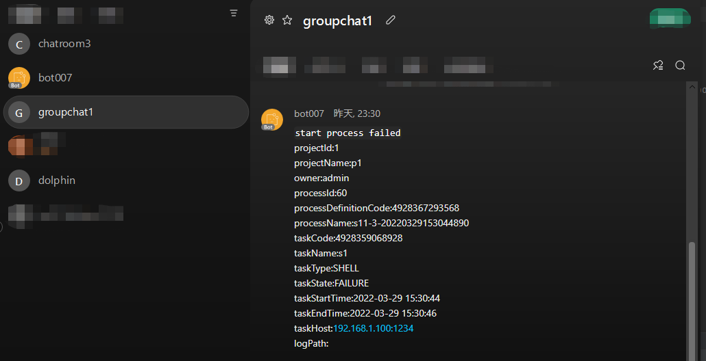

# WebexTeams

如果您需要使用到Webex Teams进行告警，请在告警实例管理里创建告警实例，选择 WebexTeams 插件。
你可以选择机器人私聊通知或聊天室通知。
WebexTeams的配置样例如下:

## 参数配置

* botAccessToken

  > 在创建机器人时，获得的访问令牌

* roomID

  > 接受消息的room ID(只支持一个ID)

* toPersonId

  > 接受消息的用户ID(只支持一个ID)

* toPersonEmail

  > 接受消息的用户邮箱(只支持一个邮箱)

* atSomeoneInRoom

  > 如果消息目的地为room，被@人的用户邮箱，多个邮箱用英文逗号分隔

* destination

  > 消息目的地，一条消息只支持一个目的地

## 创建一个机器人

访问[官网My-Apps](https://developer.webex.com/docs/api/v1/rooms/create-a-room)来创建一个机器人，点击`Create a New APP` 然后选择 `Create a Bot`，填入机器人信息后获取`bot username` 和 `bot ID`以备以下步骤使用。

## 创建一个房间

访问[官网开发者APIs](https://developer.webex.com/docs/api/v1/rooms/create-a-room)来创建一个房间，填入房间名称后获取`id`(room ID) 和 `creatorId`以备以下步骤使用。

### 邀请机器人到房间

通过机器人的Email(bot username)将机器人添加至房间。

## 发送私聊消息

通过这种方式，你可以通过`用户邮箱`或`用户`对一个用户私聊窗口发送告警，填入`用户` 或 `用户邮箱`(推荐) 和 `访问令牌`并选择`描述` `personEmail` 或 `personId`。
`用户邮箱`是用户注册Email地址。
`用户`我们可以从新建房间返回的`creatorId`中获取。

### 私聊告警样例

## 发送群聊消息

通过这种方式，你可以通过`房间`向一个房间发送告警，填入`房间` 和 `访问令牌`并选择`描述` `roomId`。
`房间`我们可以从新建房间API返回的`id`中获取。

### 群聊告警消息样例

[WebexTeams申请机器人文档](https://developer.webex.com/docs/bots)
[WebexTeamsMessage开发文档](https://developer.webex.com/docs/api/v1/messages/create-a-message)
