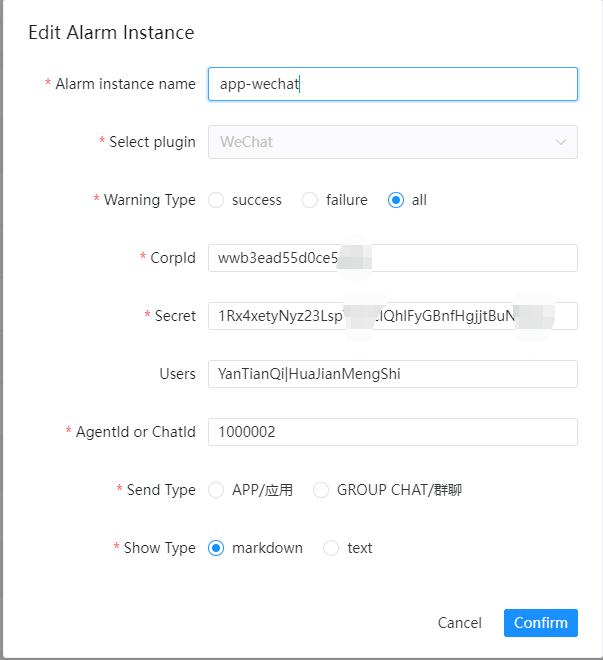
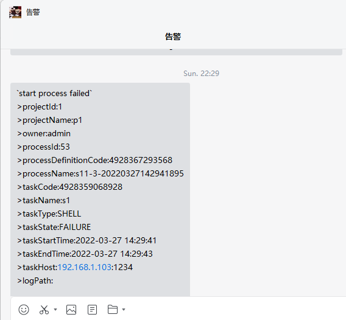
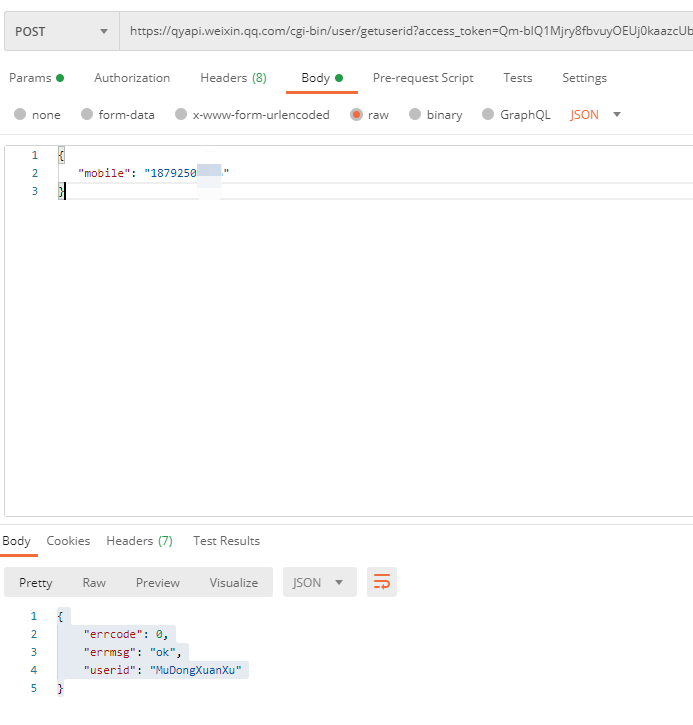
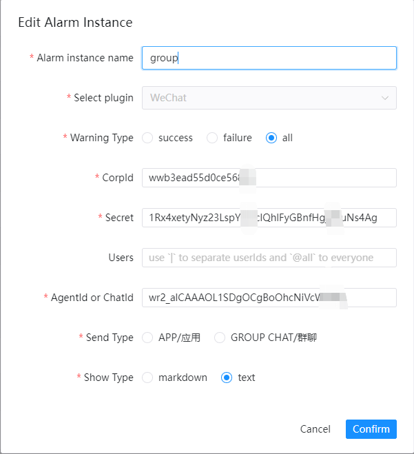
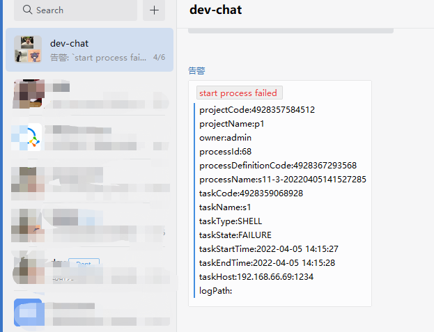

# 企业微信

如果您需要使用到企业微信进行告警，请在告警实例管理里创建告警实例，选择 WeChat 插件。企业微信的配置样例如下：

## 发送类型

其中`send.type`分别对应向企业微信自定义应用发送和向企业微信API创建的群聊发送消息。

### 应用

应用指将告警结果通过企业微信的自定义应用进行通知，支持向特定用户发送消息和对所有人发送消息。目前还不支持部门和标签，欢迎提PR贡献代码。
下图是应用告警配置的示例:

下图是`应用``MARKDOWN`告警消息的示例:

下图是`应用``TEXT`告警消息的示例:

#### 前置

向企业微信应用发送消息之前需要在企业微信中创建自定义应用，请在[应用页面](https://work.weixin.qq.com/wework_admin/frame#apps) 进行创建,获取应用的`AgentId`并将可见范围设为根。

#### 向指定用户发消息

企业微信应用支持向特定用户发送消息和对所有人发送消息，分别为使用`|`分隔多个userId和使用`@all`向所有人发送信息。
获取用户的userId请参考[官方文档](https://developer.work.weixin.qq.com/document/path/95402)根据手机号获取userId。
下图是获取userId接口的示例:

#### 参考文档

应用：https://work.weixin.qq.com/api/doc/90000/90135/90236

### 群聊

群聊指将告警结果通过企业微信API创建的群聊进行通知，会向该群聊下的所有人发送消息，不支持向特定用户发送消息。
下图是群聊告警配置的示例:

下图是`群聊``MARKDOWN`告警消息的示例:

下图是`群聊``TEXT`告警消息的示例:

#### 前置

向企业微信群聊发送消息之前需要通过企业微信的API创建群聊，请参考[官方文档](https://developer.work.weixin.qq.com/document/path/90245) 进行创建群聊并获取`chatid`。
其中获取用户的userId请参考[官方文档](https://developer.work.weixin.qq.com/document/path/95402)根据手机号获取userId。
下图是创建新聊天群组和获取userId接口的示例:

#### 参考文档

群聊：https://work.weixin.qq.com/api/doc/90000/90135/90248
