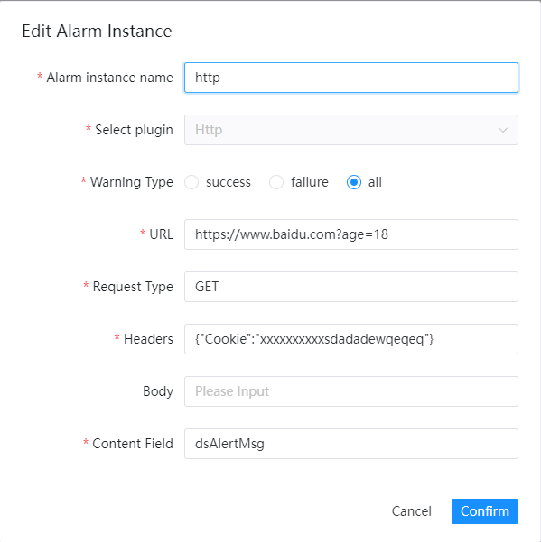
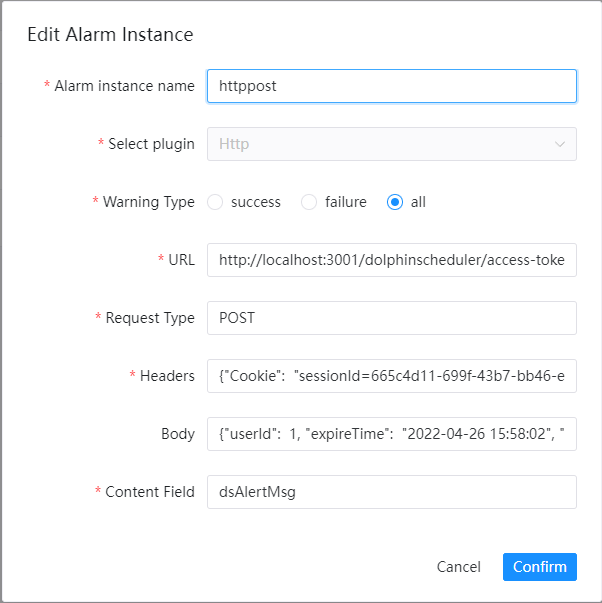

# HTTP告警

如果您需要使用到`Http`（GET或POST）进行告警，请在告警实例管理里创建告警实例，选择`Http`插件。

## 参数配置

* URL

  > 访问的`Http`连接URL,需要包含协议、Host、路径，如果是GET方法可以添加参数

* 请求方式

  > 选择该请求为POST或GET方法

* 请求头

  > `Http`请求的完整请求头，以JSON为格式

* 请求体

  > `Http`请求的完整请求体，以JSON为格式，GET方法不需要写该参数

* 内容字段

  > 放置本次告警告警信息的字段名称

## 发送类型

其中`Request Type`分别对应使用`POST`方法和`GET`方法进行`Http`告警。

### GET Http告警

GET `Http`告警指将告警结果作为参数通过`Http` GET方法进行请求。
下图是GET告警配置的示例:

### POST Http告警

POST `Http`告警指将告警结果作为`BODY`参数通过`Http`POST方法进行请求。
下图是POST告警配置的示例:

