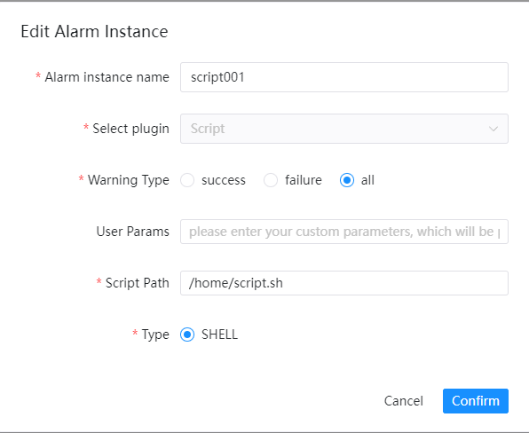

# Script脚本

如果您需要使用到`Shell`脚本进行告警，请在告警实例管理里创建告警实例，选择`Script`插件。`Script`的配置样例如下:

参数配置

* 自定义参数

  > 用户自定义的参数将被传入脚本执行

* 脚本路径

  > 脚本在服务器上的文件位置，只支持.sh后缀的文件

* 脚本类型

  > 支持`Shell`脚本

**_注意：_**
1.请注意脚本的读写权限与执行租户的关系
2.脚本告警会执行对应shell脚本，平台不会校验脚本内容和是否被篡改，需要高度信任该shell脚本，并且信任用户不会滥用此功能
