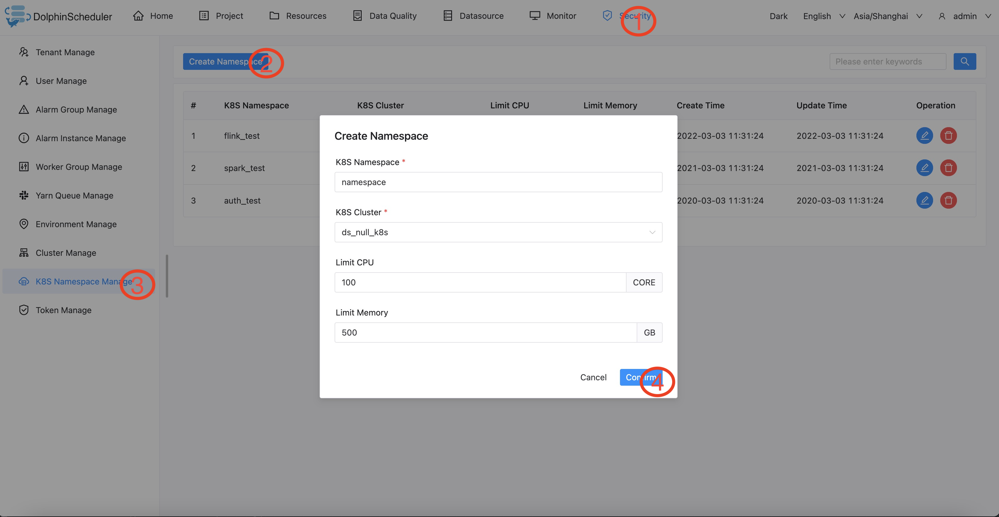

# 权限管理
用户分为三种以及他们的权限如下：
* 超级管理员：管理租户、管理用户、管理项目、管理worker、管理集群空间、管理队列、管理数据源，默认用户名/密码：admin/dolphinscheduler123
* 项目管理员：管理租户工作流、管理租户告警组及告警实例、提交作业、管理租户文件资源、管理租户UDF
* 普通使用者：编辑作业、管理自建的文件资源以及自建的UDF

从以上角色以及权限来说，资源大概分为三大类：
* 基础资源：租户、用户、项目、数据源
* 与任务运行相关资源：worker、队列、集群空间、环境
* 与任务定义相关资源：工作流、告警组以及告警实例，文件、UDF

基础资源以及任务运行相关资源必须是超级管理员管理，这两类资源对于项目管理员、普通使用者来说有限只读的，并且项目管理员、普通使用者只能操作与任务定义相关资源

具体映射关系如下
* 项目归属于租户，一个项目可以被一个租户管理，一个租户可以管理多个项目
* 租户下可以有多个项目管理员

## 创建队列

- 队列是在执行 spark、mapreduce 等程序，需要用到“队列”参数时使用的。
- 超级管理员进入安全中心 -> 队列管理页面，点击“创建队列”按钮，创建队列。


## 添加租户

- 租户对应的是 Linux 的用户，用于 worker 提交作业所使用的用户。如果 linux 没有这个用户，则会导致任务运行失败。你可以通过修改 `worker.properties` 配置文件中参数 `worker.tenant.auto.create=true` 实现当 linux 用户不存在时自动创建该用户。`worker.tenant.auto.create=true` 参数会要求 worker 可以免密运行 `sudo` 命令
- 租户编码：**租户编码是 Linux上 的用户，唯一，不能重复**
- 超级管理员进入安全中心->租户管理页面，点击“创建租户”按钮，创建租户。


## 创建用户

- 创建用户时可以指定用户为项目管理员
- 进入安全中心->用户管理页面，点击“创建用户”按钮，创建用户。


### 编辑用户信息

- 超级管理员进入安全中心->用户管理页面，点击"编辑"按钮，编辑用户信息。
- 普通用户登录后，点击用户名下拉框中的用户信息，进入用户信息页面，点击"编辑"按钮，编辑用户信息。

### 修改用户密码

- 超级管理员进入安全中心->用户管理页面，点击"编辑"按钮，编辑用户信息时，输入新密码修改用户密码。
- 普通用户登录后，点击用户名下拉框中的用户信息，进入修改密码页面，输入密码并确认密码后点击"编辑"按钮，则修改密码成功。

## 创建告警组

* 告警组是在启动时设置的参数，在流程结束以后会将流程的状态和其他信息以邮件形式发送给告警组。
* 项目管理员进入安全中心->告警组管理页面，点击“创建告警组”按钮，创建告警组。这个告警组属于项目管理员所在的租户，任何此租户下的人员都可以使用它来告警


## 创建项目
* 只有超级管理员才可以创建项目
* 在创建目之前必须有可供选择的租户


## 令牌管理

> 由于后端接口有登录检查，令牌管理提供了一种可以通过调用接口的方式对系统进行各种操作。
> - 管理员进入安全中心->令牌管理页面，点击“创建令牌”按钮，选择失效时间与用户，点击"生成令牌"按钮，点击"提交"按钮，则选择用户的token创建成功。


- 普通用户登录后，点击用户名下拉框中的用户信息，进入令牌管理页面，选择失效时间，点击"生成令牌"按钮，点击"提交"按钮，则该用户创建 token 成功。

- 调用示例：

```java
    /**
     * test token
     */
    public  void doPOSTParam()throws Exception{
        // create HttpClient
        CloseableHttpClient httpclient = HttpClients.createDefault();

        // create http post request
        HttpPost httpPost = new HttpPost("http://127.0.0.1:12345/escheduler/projects/create");
        httpPost.setHeader("token", "123");
        // set parameters
        List<NameValuePair> parameters = new ArrayList<NameValuePair>();
        parameters.add(new BasicNameValuePair("projectName", "qzw"));
        parameters.add(new BasicNameValuePair("desc", "qzw"));
        UrlEncodedFormEntity formEntity = new UrlEncodedFormEntity(parameters);
        httpPost.setEntity(formEntity);
        CloseableHttpResponse response = null;
        try {
            // execute
            response = httpclient.execute(httpPost);
            // response status code 200
            if (response.getStatusLine().getStatusCode() == 200) {
                String content = EntityUtils.toString(response.getEntity(), "UTF-8");
                System.out.println(content);
            }
        } finally {
            if (response != null) {
                response.close();
            }
            httpclient.close();
        }
    }
```

## Worker 分组
* 只有超级管理员才能创建worker分组
* 将worker分组分配给租户，对应租户便可以在提交任务时选择worker分组


## 环境管理（后续将补充分配给租户）

* 在线配置 worker 运行环境，一个 worker 可以指定多个环境，每个环境等价于 dolphinscheduler_env.sh 文件.

* 默认环境为dolphinscheduler_env.sh文件.

* 在任务执行时,可以将任务分配给指定 worker 分组，根据 worker 分组选择对应的环境，最终由该组中的 worker 节点执行环境后执行该任务.

> 创建/更新 环境（后续将补充分配给租户）

- 环境配置等价于dolphinscheduler_env.sh文件内配置


> 使用环境

- 在工作流定义中创建任务节点选择 worker 分组和 worker 分组对应的环境，任务执行时 worker 会先执行环境在执行任务.


> 注意: 当无法在任务定义或工作流运行对话框中使用你想要使用的环境时，请检查您已经选择worker，并且您要使用的环境已经关联到您选择的worker中

## 集群管理（后续将补充分配给租户）

> 创建/更新 集群

- 每个工作流可以绑定零到若干个集群用来支持多集群，目前先用于k8s。

> 使用集群

- 创建和授权后，k8s命名空间和工作流会增加关联集群的功能。每一个集群会有独立的工作流和任务实例独立运行。


## 命名空间管理（后续将补充分配给租户）

> 创建/更新 k8s集群

- 先把k8s集群连接的配置录入 database 的表 `t_ds_k8s`给批次使用后续移除，namespace的创建现在通过下拉选择集群.

> 创建/更新 namespace

- 创建和授权后，在相关k8s任务选择命名空间时下拉可选，如果k8s集群名字是`ds_null_k8s`是测试模式，不会真正操作集群.


