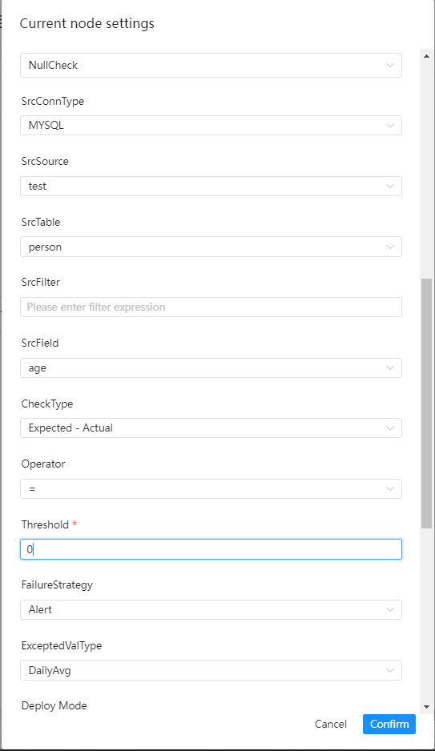
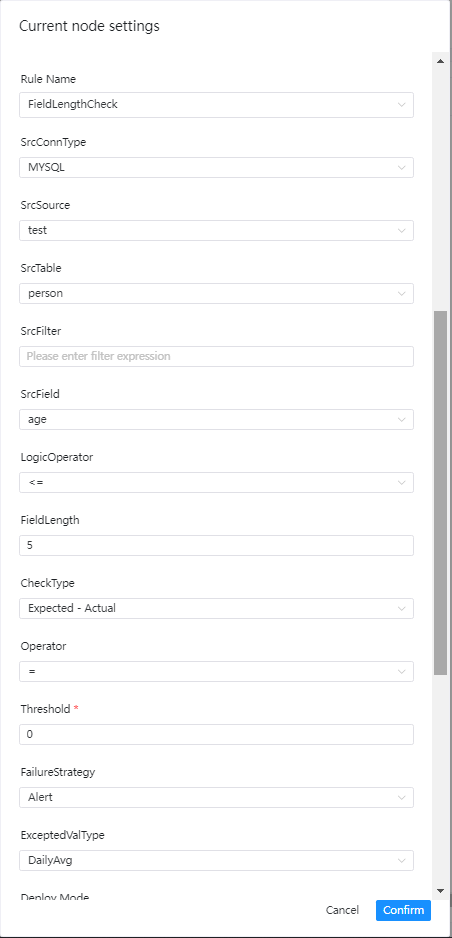
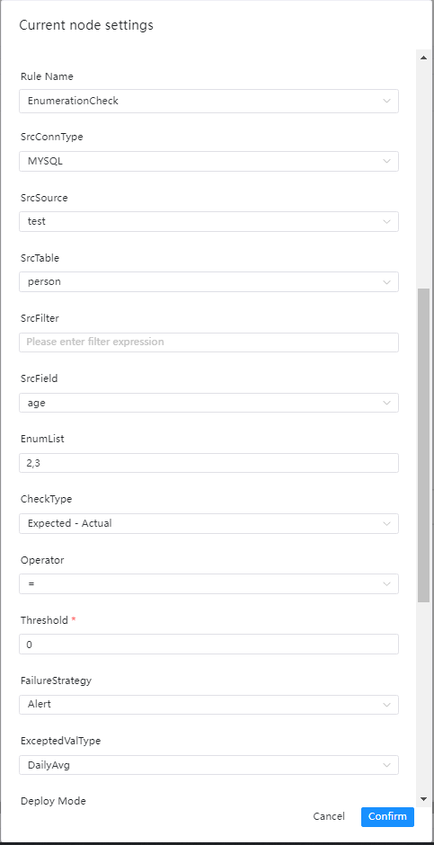
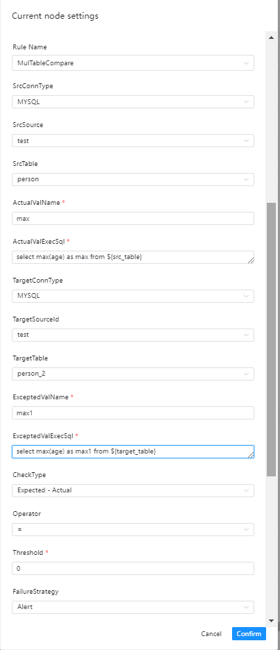
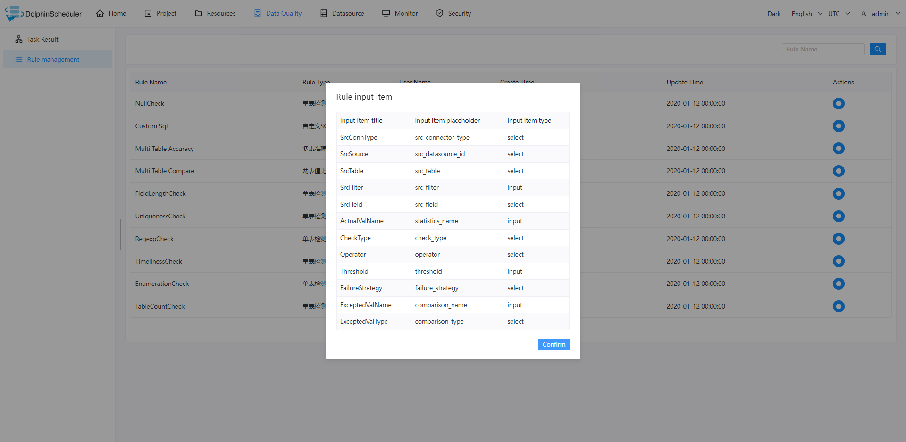

# 概述

## 任务类型介绍

数据质量任务是用于检查数据在集成、处理过程中的数据准确性。本版本的数据质量任务包括单表检查、单表自定义SQL检查、多表准确性以及两表值比对。数据质量任务的运行环境为Spark2.4.0，其他版本尚未进行过验证，用户可自行验证。

- 数据质量任务的执行逻辑如下：

> 用户在界面定义任务，用户输入值保存在`TaskParam`中
> 运行任务时，`Master`会解析`TaskParam`，封装`DataQualityTask`所需要的参数下发至`Worker。
> Worker`运行数据质量任务，数据质量任务在运行结束之后将统计结果写入到指定的存储引擎中，当前数据质量任务结果存储在`dolphinscheduler`的`t_ds_dq_execute_result`表中
> `Worker`发送任务结果给`Master`，`Master`收到`TaskResponse`之后会判断任务类型是否为`DataQualityTask`，如果是的话会根据`taskInstanceId`从`t_ds_dq_execute_result`中读取相应的结果，然后根据用户配置好的检查方式，操作符和阈值进行结果判断，如果结果为失败的话，会根据用户配置好的的失败策略进行相应的操作，告警或者中断
>
  ## 注意事项

添加配置信息：`<server-name>/conf/common.properties`

```properties
data-quality.jar.name=dolphinscheduler-data-quality-dev-SNAPSHOT.jar
```

- 这里的`data-quality.jar.name`请根据实际打包的名称来填写。
- 如果单独打包`data-quality`的话，记得修改包名和`data-quality.jar.name`一致。
- 如果是老版本升级使用，运行之前需要先执行`SQL`更新脚本进行数据库初始化。
- 当前 `dolphinscheduler-data-quality-dev-SNAPSHOT.jar` 是瘦包，不包含任何 `JDBC` 驱动。
  如果有 `JDBC` 驱动需要，可以在`节点设置` `选项参数`处设置 `--jars` 参数，
  如：`--jars /lib/jars/mysql-connector-java-8.0.16.jar`。
- 当前只测试了`MySQL`、`PostgreSQL`和`HIVE`数据源，其他数据源暂时未测试过。
- `Spark`需要配置好读取`Hive`元数据，`Spark`不是采用`JDBC`的方式读取`Hive`。

## 检查逻辑详解

- 校验公式：[校验方式][操作符][阈值]，如果结果为真，则表明数据不符合期望，执行失败策略
- 校验方式：
  - [Expected-Actual][期望值-实际值]
  - [Actual-Expected][实际值-期望值]
  - [Actual/Expected][实际值/期望值]x100%
  - [(Expected-Actual)/Expected][(期望值-实际值)/期望值]x100%
- 操作符：=、>、>=、<、<=、!=
- 期望值类型
  - 固定值
  - 日均值
  - 周均值
  - 月均值
  - 最近7天均值
  - 最近30天均值
  - 源表总行数
  - 目标表总行数
- 例子
  - 校验方式为：[Actual-Expected][实际值-期望值]
  - [操作符]：>
  - [阈值]：0
  - 期望值类型：固定值=9。

  假设实际值为10，操作符为 >, 期望值为9，那么结果 10 -9 > 0 为真，那就意味列为空的行数据已经超过阈值，任务被判定为失败

# 任务操作指南

## 单表检查之空值检查

### 检查介绍

空值检查的目标是检查出指定列为空的行数，可将为空的行数与总行数或者指定阈值进行比较，如果大于某个阈值则判定为失败
- 计算指定列为空的SQL语句如下：

```sql
SELECT COUNT(*) AS miss FROM ${src_table} WHERE (${src_field} is null or ${src_field} = '') AND (${src_filter})
```

- 计算表总行数的SQL如下：

  ```sql
  SELECT COUNT(*) AS total FROM ${src_table} WHERE (${src_filter})
  ```

### 界面操作指南


- 源数据类型：选择MySQL、PostgreSQL等
- 源数据源：源数据类型下对应的数据源
- 源数据表：下拉选择验证数据所在表
- 源过滤条件：如标题，统计表总行数的时候也会用到，选填
- 源表检查列：下拉选择检查列名
- 校验方式：
- [Expected-Actual][期望值-实际值]
- [Actual-Expected][实际值-期望值]
- [Actual/Expected][实际值/期望值]x100%
- [(Expected-Actual)/Expected][(期望值-实际值)/期望值]x100%
- 校验操作符：=，>、>=、<、<=、！=
- 阈值：公式中用于比较的值
- 失败策略
- 告警：数据质量任务失败了，DolphinScheduler任务结果为成功，发送告警
- 阻断：数据质量任务失败了，DolphinScheduler任务结果为失败，发送告警
- 期望值类型：在下拉菜单中选择所要的类型

## 单表检查之及时性检查

### 检查介绍

及时性检查用于检查数据是否在预期时间内处理完成，可指定开始时间、结束时间来界定时间范围，如果在该时间范围内的数据量没有达到设定的阈值，那么会判断该检查任务为失败

### 界面操作指南


- 源数据类型：选择MySQL、PostgreSQL等
- 源数据源：源数据类型下对应的数据源
- 源数据表：下拉选择验证数据所在表
- 源过滤条件：如标题，统计表总行数的时候也会用到，选填
- 源表检查列：下拉选择检查列名
- 起始时间：某个时间范围的开始时间
- 结束时间：某个时间范围的结束时间
- 时间格式：设置对应的时间格式
- 校验方式：
- [Expected-Actual][期望值-实际值]
- [Actual-Expected][实际值-期望值]
- [Actual/Expected][实际值/期望值]x100%
- [(Expected-Actual)/Expected][(期望值-实际值)/期望值]x100%
- 校验操作符：=，>、>=、<、<=、！=
- 阈值：公式中用于比较的值
- 失败策略
- 告警：数据质量任务失败了，DolphinScheduler任务结果为成功，发送告警
- 阻断：数据质量任务失败了，DolphinScheduler任务结果为失败，发送告警
- 期望值类型：在下拉菜单中选择所要的类型

## 单表检查之字段长度校验

### 检查介绍

字段长度校验的目标是检查所选字段的长度是否满足预期，如果有存在不满足要求的数据，并且行数超过阈值则会判断任务为失败

### 界面操作指南


- 源数据类型：选择MySQL、PostgreSQL等
- 源数据源：源数据类型下对应的数据源
- 源数据表：下拉选择验证数据所在表
- 源过滤条件：如标题，统计表总行数的时候也会用到，选填
- 源表检查列：下拉选择检查列名
- 逻辑操作符：=，>、>=、<、<=、！=
- 字段长度限制：如标题
- 校验方式：
- [Expected-Actual][期望值-实际值]
- [Actual-Expected][实际值-期望值]
- [Actual/Expected][实际值/期望值]x100%
- [(Expected-Actual)/Expected][(期望值-实际值)/期望值]x100%
- 校验操作符：=，>、>=、<、<=、！=
- 阈值：公式中用于比较的值
- 失败策略
- 告警：数据质量任务失败了，DolphinScheduler任务结果为成功，发送告警
- 阻断：数据质量任务失败了，DolphinScheduler任务结果为失败，发送告警
- 期望值类型：在下拉菜单中选择所要的类型

## 单表检查之唯一性校验

### 检查介绍

唯一性校验的目标是检查字段是否存在重复的情况，一般用于检验primary key是否有重复，如果存在重复且达到阈值，则会判断检查任务为失败

### 界面操作指南


- 源数据类型：选择MySQL、PostgreSQL等
- 源数据源：源数据类型下对应的数据源
- 源数据表：下拉选择验证数据所在表
- 源过滤条件：如标题，统计表总行数的时候也会用到，选填
- 源表检查列：下拉选择检查列名
- 校验方式：
- [Expected-Actual][期望值-实际值]
- [Actual-Expected][实际值-期望值]
- [Actual/Expected][实际值/期望值]x100%
- [(Expected-Actual)/Expected][(期望值-实际值)/期望值]x100%
- 校验操作符：=，>、>=、<、<=、！=
- 阈值：公式中用于比较的值
- 失败策略
- 告警：数据质量任务失败了，DolphinScheduler任务结果为成功，发送告警
- 阻断：数据质量任务失败了，DolphinScheduler任务结果为失败，发送告警
- 期望值类型：在下拉菜单中选择所要的类型

## 单表检查之正则表达式校验

### 检查介绍

正则表达式校验的目标是检查某字段的值的格式是否符合要求，例如时间格式、邮箱格式、身份证格式等等，如果存在不符合格式的数据并超过阈值，则会判断任务为失败

### 界面操作指南


- 源数据类型：选择MySQL、PostgreSQL等
- 源数据源：源数据类型下对应的数据源
- 源数据表：下拉选择验证数据所在表
- 源过滤条件：如标题，统计表总行数的时候也会用到，选填
- 源表检查列：下拉选择检查列名
- 正则表达式：如标题
- 校验方式：
- [Expected-Actual][期望值-实际值]
- [Actual-Expected][实际值-期望值]
- [Actual/Expected][实际值/期望值]x100%
- [(Expected-Actual)/Expected][(期望值-实际值)/期望值]x100%
- 校验操作符：=，>、>=、<、<=、！=
- 阈值：公式中用于比较的值
- 失败策略
- 告警：数据质量任务失败了，DolphinScheduler任务结果为成功，发送告警
- 阻断：数据质量任务失败了，DolphinScheduler任务结果为失败，发送告警
- 期望值类型：在下拉菜单中选择所要的类型

## 单表检查之枚举值校验

### 检查介绍

枚举值校验的目标是检查某字段的值是否在枚举值的范围内，如果存在不在枚举值范围里的数据并超过阈值，则会判断任务为失败

### 界面操作指南


- 源数据类型：选择MySQL、PostgreSQL等
- 源数据源：源数据类型下对应的数据源
- 源数据表：下拉选择验证数据所在表
- 源表过滤条件：如标题，统计表总行数的时候也会用到，选填
- 源表检查列：下拉选择检查列名
- 枚举值列表：用英文逗号,隔开
- 校验方式：
- [Expected-Actual][期望值-实际值]
- [Actual-Expected][实际值-期望值]
- [Actual/Expected][实际值/期望值]x100%
- [(Expected-Actual)/Expected][(期望值-实际值)/期望值]x100%
- 校验操作符：=，>、>=、<、<=、！=
- 阈值：公式中用于比较的值
- 失败策略
- 告警：数据质量任务失败了，DolphinScheduler任务结果为成功，发送告警
- 阻断：数据质量任务失败了，DolphinScheduler任务结果为失败，发送告警
- 期望值类型：在下拉菜单中选择所要的类型

## 单表检查之表行数校验

### 检查介绍

表行数校验的目标是检查表的行数是否达到预期的值，如果行数未达标，则会判断任务为失败

### 界面操作指南


- 源数据类型：选择MySQL、PostgreSQL等
- 源数据源：源数据类型下对应的数据源
- 源数据表：下拉选择验证数据所在表
- 源过滤条件：如标题，统计表总行数的时候也会用到，选填
- 源表检查列：下拉选择检查列名
- 校验方式：
- [Expected-Actual][期望值-实际值]
- [Actual-Expected][实际值-期望值]
- [Actual/Expected][实际值/期望值]x100%
- [(Expected-Actual)/Expected][(期望值-实际值)/期望值]x100%
- 校验操作符：=，>、>=、<、<=、！=
- 阈值：公式中用于比较的值
- 失败策略
- 告警：数据质量任务失败了，DolphinScheduler任务结果为成功，发送告警
- 阻断：数据质量任务失败了，DolphinScheduler任务结果为失败，发送告警
- 期望值类型：在下拉菜单中选择所要的类型

## 单表检查之自定义SQL检查

### 检查介绍

### 界面操作指南


- 源数据类型：选择MySQL、PostgreSQL等
- 源数据源：源数据类型下对应的数据源
- 源数据表：下拉选择要验证数据所在表
- 实际值名：为统计值计算SQL中的别名，如max_num
- 实际值计算SQL: 用于输出实际值的SQL、
- 注意点：该SQL必须为统计SQL，例如统计行数，计算最大值、最小值等
- select max(a) as max_num from ${src_table}，表名必须这么填
- 源过滤条件：如标题，统计表总行数的时候也会用到，选填
- 校验方式：
- 校验操作符：=，>、>=、<、<=、！=
- 阈值：公式中用于比较的值
- 失败策略
- 告警：数据质量任务失败了，DolphinScheduler任务结果为成功，发送告警
- 阻断：数据质量任务失败了，DolphinScheduler任务结果为失败，发送告警
- 期望值类型：在下拉菜单中选择所要的类型

## 多表检查之准确性检查

### 检查介绍

准确性检查是通过比较两个表之间所选字段的数据记录的准确性差异，例子如下
- 表test1

| c1 | c2 |
|:--:|:--:|
| a  | 1  |
| b  | 2  |

- 表test2

| c21 | c22 |
|:---:|:---:|
|  a  |  1  |
|  b  |  3  |

如果对比c1和c21中的数据，则表test1和test2完全一致。 如果对比c2和c22则表test1和表test2中的数据则存在不一致了。

### 界面操作指南


- 源数据类型：选择MySQL、PostgreSQL等
- 源数据源：源数据类型下对应的数据源
- 源数据表：下拉选择要验证数据所在表
- 源过滤条件：如标题，统计表总行数的时候也会用到，选填
- 目标数据类型：选择MySQL、PostgreSQL等
- 目标数据源：源数据类型下对应的数据源
- 目标数据表：下拉选择要验证数据所在表
- 目标过滤条件：如标题，统计表总行数的时候也会用到，选填
- 检查列：
- 分别填写 源数据列，操作符，目标数据列
- 校验方式：选择想要的校验方式
- 操作符：=，>、>=、<、<=、！=
- 失败策略
- 告警：数据质量任务失败了，DolphinScheduler任务结果为成功，发送告警
- 阻断：数据质量任务失败了，DolphinScheduler任务结果为失败，发送告警
- 期望值类型：在下拉菜单中选择所要的类型，这里只适合选择SrcTableTotalRow、TargetTableTotalRow和固定值

## 两表检查之值比对

### 检查介绍

两表值比对允许用户对两张表自定义不同的SQL统计出相应的值进行比对，例如针对源表A统计出某一列的金额总值sum1，针对目标表统计出某一列的金额总值sum2，将sum1和sum2进行比较来判定检查结果

### 界面操作指南


- 源数据类型：选择MySQL、PostgreSQL等
- 源数据源：源数据类型下对应的数据源
- 源数据表：要验证数据所在表
- 实际值名：为实际值计算SQL中的别名，如max_age1
- 实际值计算SQL: 用于输出实际值的SQL、
- 注意点：该SQL必须为统计SQL，例如统计行数，计算最大值、最小值等
- select max(age) as max_age1 from ${src_table} 表名必须这么填
- 目标数据类型：选择MySQL、PostgreSQL等
- 目标数据源：源数据类型下对应的数据源
- 目标数据表：要验证数据所在表
- 期望值名：为期望值计算SQL中的别名，如max_age2
- 期望值计算SQL: 用于输出期望值的SQL、
- 注意点：该SQL必须为统计SQL，例如统计行数，计算最大值、最小值等
- select max(age) as max_age2 from ${target_table} 表名必须这么填
- 校验方式：选择想要的校验方式
- 操作符：=，>、>=、<、<=、！=
- 失败策略
- 告警：数据质量任务失败了，DolphinScheduler任务结果为成功，发送告警
- 阻断：数据质量任务失败了，DolphinScheduler任务结果为失败，发送告警

## 任务结果查看


## 规则查看

### 规则列表


### 规则详情


