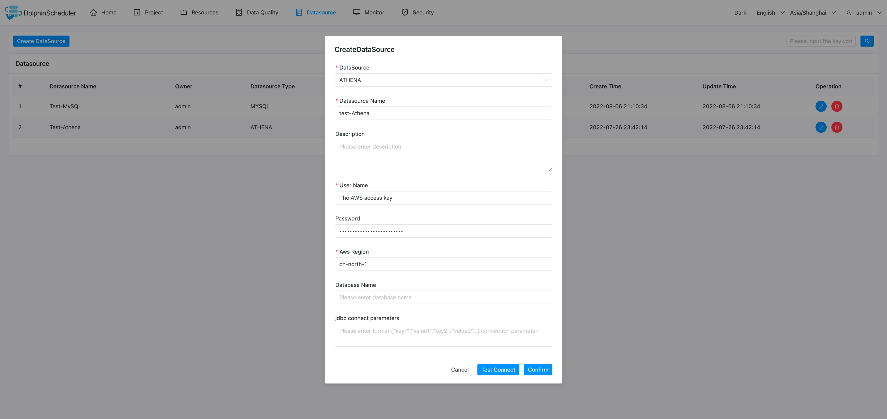

# AWS Athena 数据源

- 数据源：选择 ATHENA
- 数据源名称：输入数据源的名称
- 描述：输入数据源的描述
- 用户名：设置连接 AWS 的 access key
- 密码：设置连接 AWS 的 secret access key
- AwsRegion: 设置连接 AWS 的区域
- 数据库名：输入连接 ATHENA 的数据库名称
- Jdbc 连接参数：用于 ATHENA 连接的参数设置，以 JSON 形式填写

## 是否原生支持

- 否，使用前需请参考 [数据源配置](../howto/datasource-setting.md) 中的 "数据源中心" 章节激活数据源。
- JDBC驱动配置参考文档 [athena-connect-with-jdbc](https://docs.amazonaws.cn/athena/latest/ug/connect-with-jdbc.html)
- 驱动下载链接 [SimbaAthenaJDBC-2.0.31.1000/AthenaJDBC42.jar](https://s3.cn-north-1.amazonaws.com.cn/athena-downloads-cn/drivers/JDBC/SimbaAthenaJDBC-2.0.31.1000/AthenaJDBC42.jar)

