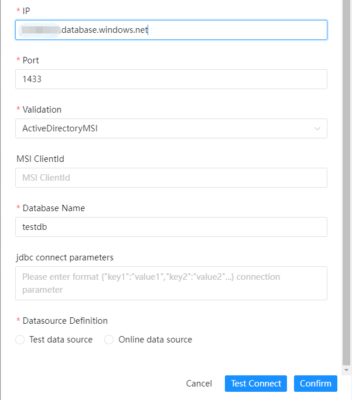
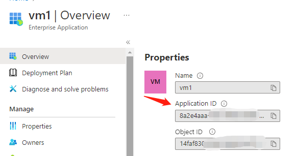
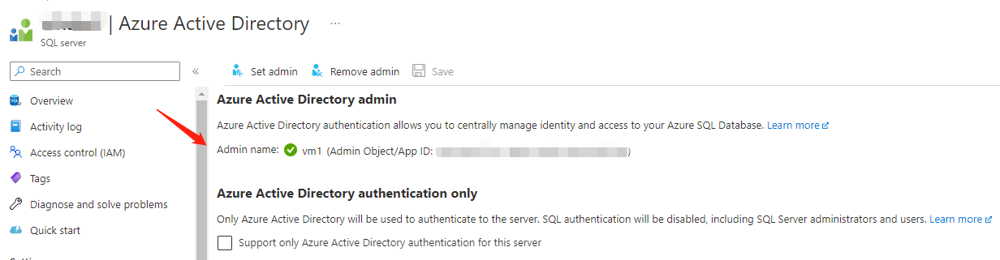
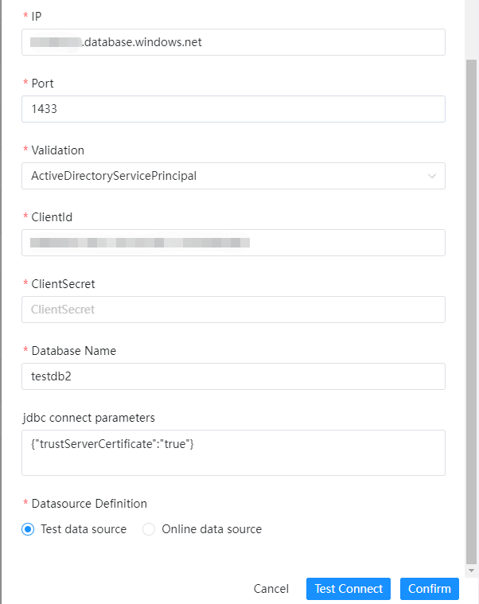

# AZURE SQL 数据源

## 模式

### SqlPassword

使用数据库服务器的用户名和密码验证。
- 数据源：选择 AZURE SQL
- 数据源名称：输入数据源的名称
- 描述：输入数据源的描述
- IP 主机名：输入连接 AZURE SQL 的 HOST 或 IP ，例如：xxx.database.windows.net
- 端口：输入连接 AZURE SQL 的端口，默认1433
- 验证模式：输入 AZURE SQL 的连接模式，目前支持：SqlPassword,ActiveDirectoryPassword,ActiveDirectoryMSI,ActiveDirectoryServicePrincipal,accessToken.
- 用户名：设置连接 AZURE SQL 的用户名
- 密码：设置连接 AZURE SQL 的密码
- 数据库名：输入连接 AZURE SQL 的数据库名称
- Jdbc 连接参数：用于 AZURE SQL 连接的参数设置，以 JSON 形式填写
以下仅对差异化属性进行说明。

### ActiveDirectoryPassword

采用Azure AD账号名和密码验证。
前置条件：设置AD账号为数据库AD管理员。

- Azure AD用户名：Azure AD 的账号名，例如：xx@xx.onmicrosoft.com
- 密码：Azure AD 的密码

### ActiveDirectoryMSI

采用AZURE内部服务器验证。
前置条件：先设置内部服务器为数据库AD管理员再进行请求，MSIClientId是服务器的id，是不必要的。

- MSIClientId：选择ActiveDirectoryMSI模式下的内部资源（例如 Azure 虚拟机、应用服务或与 Azure Active Directory 联合的函数应用）的clientId

### ActiveDirectoryServicePrincipal

采用应用的应用程序(客户端) ID和密钥进行验证。
前置条件：先设置应用为数据库AD管理员,同时给应用设置客户端密码，最终使用两者新建数据源。

- clientId： ActiveDirectoryServicePrincipal模式下，应用的应用程序(客户端) ID
- clientSecret：ActiveDirectoryServicePrincipal模式下，应用的应用程序客户端密码

### accessToken

采用应用的应用程序(客户端) ID和密钥去请求临时token，然后仅采用token进行连接，非jdbc连接。

- clientId： accessToken模式下，应用的应用程序(客户端) ID
- clientSecret：accessToken模式下，应用的应用程序客户端密码
- OAuth 2.0 令牌终结点：accessToken模式下，应用的OAuth 2.0 令牌终结点(v2)

## 是否原生支持

是，数据源不需要任务附加操作即可使用。
