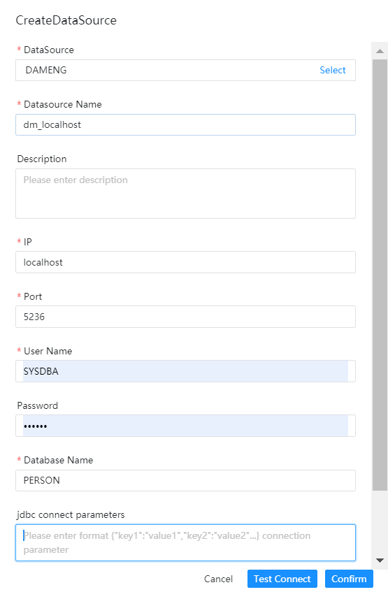

# DAMENG数据源

- 数据源：选择 DAMENG
- 数据源名称：输入数据源的名称
- 描述：输入数据源的描述
- IP 主机名：输入连接 DAMENG 的 IP
- 端口：输入连接 DAMENG 的端口
- 用户名：设置连接 DAMENG 的用户名
- 密码：设置连接 DAMENG 的密码
- 数据库名：输入连接 DAMENG 的 schema
- Jdbc 连接参数：用于 DAMENG 连接的参数设置，以 JSON 形式填写

## 是否原生支持

否，使用前需请参考 [数据源配置](../howto/datasource-setting.md) 中的 "数据源中心" 章节激活数据源。
