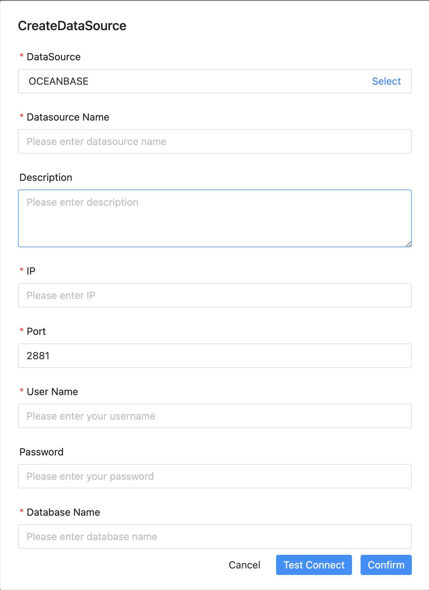

# OceanBase 数据源

- 数据源：选择 OCEANBASE
- 数据源名称：输入数据源的名称
- 描述：输入数据源的描述
- IP 主机名：输入连接 OceanBase 的 IP
- 端口：输入连接 OceanBase 的端口
- 用户名：设置连接 OceanBase 的用户名
- 密码：设置连接 OceanBase 的密码
- 数据库名：输入连接 OceanBase 的数据库名称
- 兼容模式：输入连接 OceanBase 的兼容模式
- Jdbc 连接参数：用于 OceanBase 连接的参数设置，以 JSON 形式填写

## 是否原生支持

否，使用前需要先引入 OceanBase 的 JDBC 驱动 [oceanbase-client](https://mvnrepository.com/artifact/com.oceanbase/oceanbase-client)，请参考 [数据源配置](../howto/datasource-setting.md) 中的 "数据源中心" 章节。

OceanBase 数据源的兼容模式可以是 'mysql' 或 'oracle'，如果你只使用 mysql 模式，你也可以选择将 OceanBase 数据源当作 MySQL 数据源来使用，请参考 [MySQL 数据源](mysql.md)

