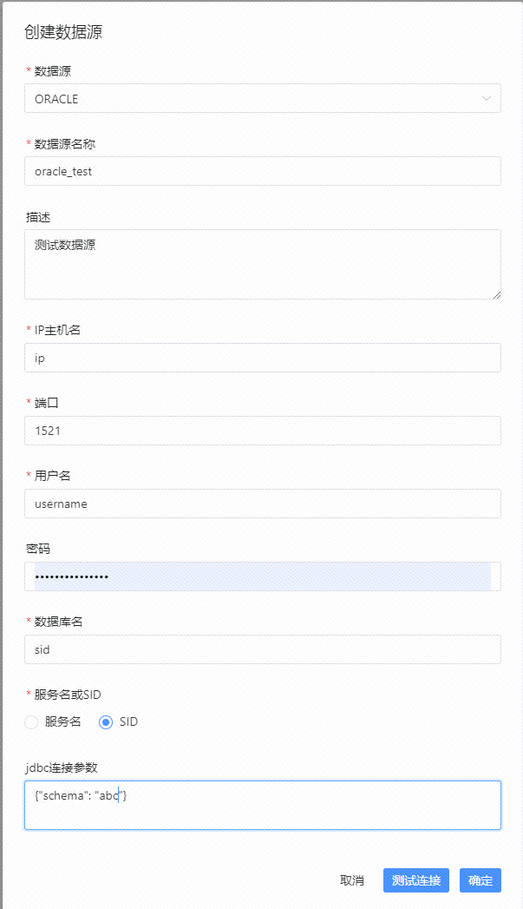

# Oracle数据源

- 数据源：选择 ORACLE
- 数据源名称：输入数据源的名称
- 描述：输入数据源的描述
- IP 主机名：输入连接 ORACLE 的 IP
- 端口：输入连接 ORACLE 的端口
- 用户名：设置连接 ORACLE 的用户名
- 密码：设置连接 ORACLE 的密码
- 数据库名：输入连接 ORACLE 的 ServiceName 或 SID
- Jdbc 连接参数：用于 ORACLE 连接的参数设置，以 JSON 形式填写
  - 比如 `{"schema": "abc"}` 指定使用 `username` 用户下的 `abc` 数据库

