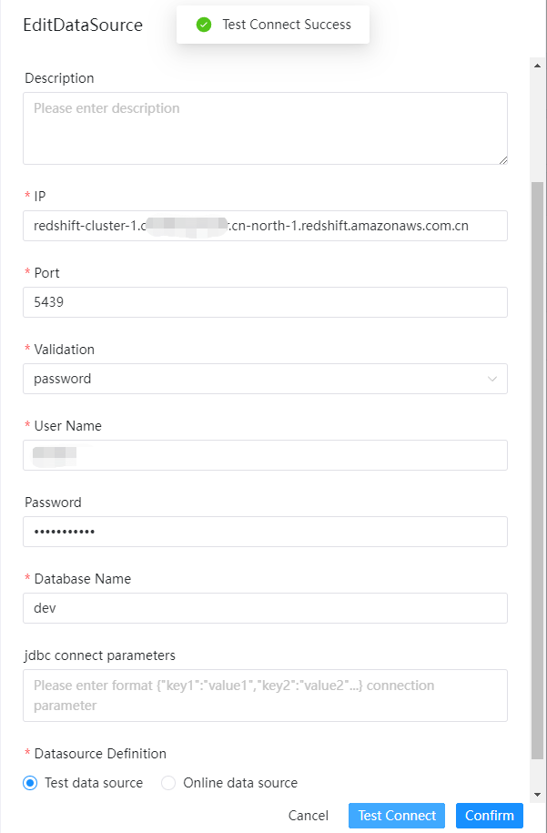
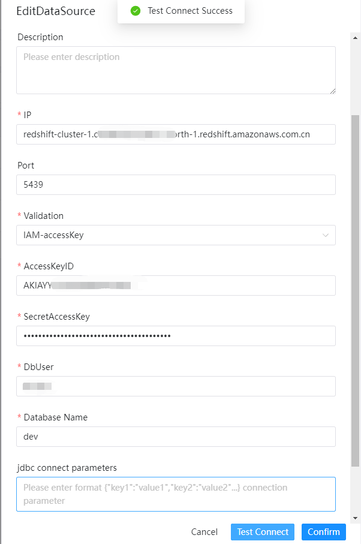

# Amazon Redshift

## 数据源参数

使用数据库服务器的用户名和密码验证。
- 数据源：选择 AZURE Redshift
- 数据源名称：输入数据源的名称
- 描述：输入数据源的描述
- IP 主机名：输入连接 Redshift 的 HOST 或 IP ，例如：cluster-name.xxx.region.redshift.amazonaws.com.cn
- 端口：输入连接 Redshift 的端口，默认5439
- 验证模式：输入 Redshift 的连接模式，目前支持：Password,IAM-accessKey
- 用户名：设置连接 Redshift 的用户名
- 密码：设置连接 Redshift 的密码
- 数据库名：输入连接 Redshift 的数据库名称
- Jdbc 连接参数：用于 Redshift 连接的参数设置，以 JSON 形式填写
- AccessKeyID：IAM-accessKey模式下的access key ID
- SecretAccessKey：IAM-accessKey模式下的secret access key

### 验证: Password

使用Redshift数据库的用户名和密码验证。

### 验证: IAM-accessKey

使用 cluster ID, AWS Region, port(可选) and IAM信息来登录。

## 是否原生支持

是，数据源不需要任务附加操作即可使用。

参考更多关于Redshift相关的JDBC文档[校验模式](https://docs.aws.amazon.com/redshift/latest/mgmt/generating-iam-credentials-configure-jdbc-odbc.html)
